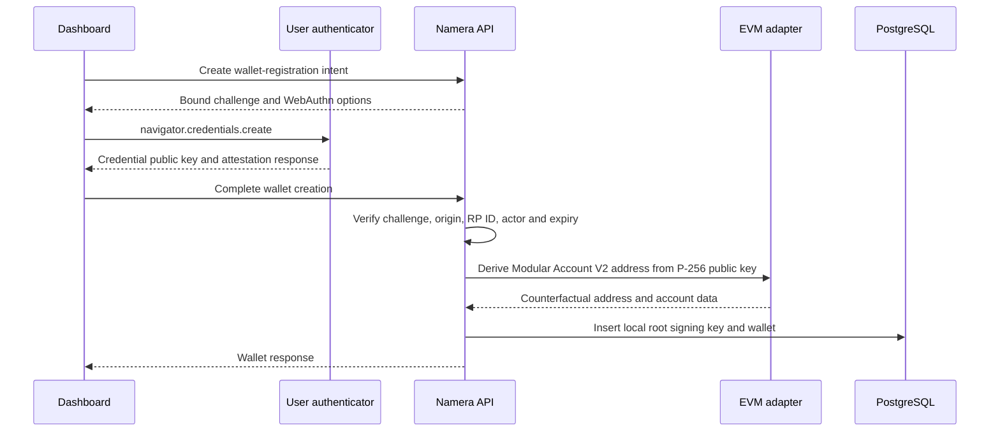
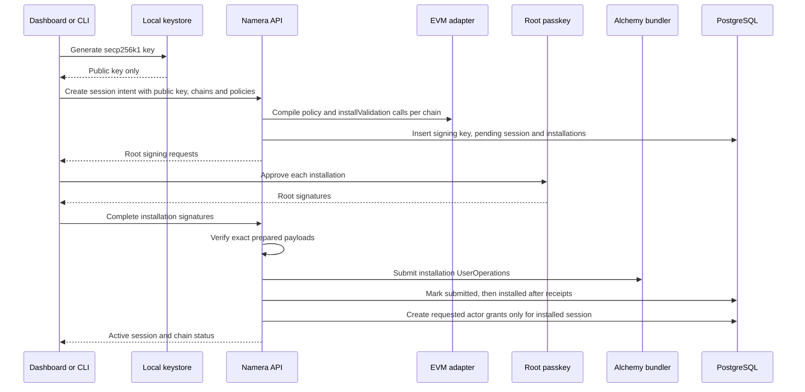

# Signing architecture migration

Status: proposed pre-production replacement. Namera is still in development, so this plan assumes the database can be wiped and the schema and migrations can be regenerated. It deliberately contains no legacy-row migration, compatibility mode, or dual-read path.

This document describes the migration from root-key signing with offchain session-key grants to Alchemy Modular Account V2 wallets whose routine operations are signed by mandatory onchain session keys. Namera-managed Google Cloud KMS signing remains implemented for a possible future product mode, but the initial launch enables only user-local root and session signing.

This design reduces the authority Namera holds at launch. It is a technical design, not a legal conclusion. Counsel must review the implemented system, including transaction relaying, sponsorship, recovery, administrative access, and product claims.

## Decision summary

The target model is:

- A `wallet` is the provider-neutral onchain account.
- A `signing_key` describes one public signing identity and whether its private material is Namera-managed or user-local.
- Every wallet has exactly one root signing key for the first release.
- Root keys create the account, install and revoke session validations, and perform recovery or account administration.
- Every routine execution or smart-account signature must use a cryptographic onchain session key.
- Every session key references its own signing key. Initial session signing uses secp256k1.
- Session-key policy is one immutable logical policy envelope. The policy registry declares which parts are enforced by the wallet, by Namera, or by both.
- Namera uses AND semantics: Namera policy evaluation must allow the operation and the onchain account must validate it.
- API keys, CLI OAuth authorizations, MCP OAuth authorizations, actors, and `session_key_grant` remain the actor-authorization layer.
- Local keys are generated and retained on the user's device. The server stores only normalized public material.
- Managed keys remain behind a server-side disabled product capability at launch. Hiding the option in the dashboard is not sufficient.

Initial launch configuration:

```ts
{
  walletRootCustody: ["local"],
  sessionKeyCustody: ["local"],
  sessionKeyAlgorithms: ["secp256k1"],
  managedSigningEnabled: false,
  remoteMcpMutationEnabled: false
}
```

## Goals

- Preserve the current Alchemy Modular Account V2 wallet implementation.
- Keep GCP KMS support available in code for a later reviewed managed mode.
- Make possession of a session signing key necessary for routine wallet operations.
- Make onchain session-key permissions the wallet's security boundary.
- Keep Namera policies for richer simulation, billing, sponsorship, risk, velocity, and organization rules.
- Preserve actor grants so an API key, CLI authorization, or MCP authorization can only use explicitly assigned session keys.
- Give the SDK one high-level execution and signing interface despite local and managed signing ceremonies differing internally.
- Keep namespace-specific account, signature, UserOperation, and policy compilation logic in `packages/evm` rather than `packages/application`.
- Preserve billing, idempotency, state reservations, reconciliation, auditing, notifications, and telemetry.

## Non-goals for the first release

- Migrating existing database rows or KMS keys.
- Supporting customer-managed cloud KMS providers.
- Supporting arbitrary imported root private keys.
- Supporting multiple root owners or multisig recovery.
- Supporting P-256 session keys. The model permits them later, but beta uses secp256k1 sessions.
- Making a remote hosted MCP server read a local key.
- Treating API-only policy as an unbypassable wallet restriction.
- Enabling managed signing in production before a separate legal and security review.

## Current architecture

### Persistence

The core model after the account-creation slice is:

```text
core.signing_key ──< core.wallet ──< core.session_key ──< core.session_key_grant
                                         │
                                         ├──< core.session_key_policy_state
                                         └──< core.session_key_policy_reservation

core.wallet_key (legacy, no longer referenced by wallet creation)
```

`core.signing_key` stores purpose, custody, algorithm, public key, status, and
discriminated public/provider metadata. `core.wallet.signing_key_id` references
the root owner with a tenant-safe composite foreign key. Local passkey rows store
only credential metadata and public material. The legacy `core.wallet_key` table
remains temporarily for later session and signer cleanup.

`core.session_key` currently contains metadata, immutable JSONB policies, a canonical policy hash, and revocation state. It contains no public key, signing-key reference, validator entity, or onchain installation state.

`core.session_key_grant` maps an actor to an offchain session-key policy envelope. API keys and CLI/MCP OAuth authorizations resolve active grants during authentication. This layer correctly answers which actor may use which delegation and should remain.

### Wallet creation

`packages/application/src/wallet/create.ts` now:

1. applies a custody-specific preliminary resource limit check;
2. verifies a tenant-bound WebAuthn ceremony or creates a managed P-256 key
   through `WalletKeys`;
3. passes only the normalized P-256 public key into the EVM adapter;
4. derives an Alchemy Modular Account V2 counterfactual address;
5. locks billing and repeats the custody-specific capacity check;
6. atomically consumes a local ceremony and persists the signing key, wallet,
   audit events, notification, and email job.

The public request uses a discriminated `passkey` or `namera-managed` owner.
Passkey creation accepts a real browser registration response and Namera never
receives private passkey material. Managed creation accepts only the protection
level; algorithm and account implementation remain server-owned.

### Session-key creation

`packages/application/src/session-key/create.ts` currently validates and materializes an immutable offchain policy envelope, hashes it, persists it, and emits audit and notification records. No cryptographic key is generated and no validation module is installed onchain.

Revocation marks the database record and grants revoked. It does not uninstall an onchain validator because none exists.

### Execution

The current execution path:

1. loads the wallet and its root `signing_key`;
2. reconstructs the Modular Account V2 with a `WalletKeys`-backed root owner;
3. prepares and simulates a UserOperation;
4. searches the authenticated actor's active `session_key_grant` candidates;
5. evaluates and reserves the selected candidate's offchain policies and billing meters;
6. signs the UserOperation with a Namera-managed root key;
7. submits it to Alchemy, waits for a receipt, then settles or reconciles.

The selected session key determines policy and audit attribution but contributes
no cryptographic authorization. Local-root wallets intentionally return signer
unavailable until the mandatory onchain session-key flow is implemented.

### Smart-account signatures

The current signature path similarly chooses an actor grant and evaluates signature policies, but `evm.sign` ultimately signs through the wallet's root key. Session keys only gate access at the API layer.

### Client boundaries

- The SDK makes a single `execute` or `sign` HTTP request and generates an idempotency key internally.
- The CLI uses that SDK and has no signing keystore.
- The current MCP implementation runs in `apps/server` as a remote MCP endpoint. It invokes the same application operations and therefore cannot access files on a user's computer.
- The dashboard creates managed or real passkey-root wallets and policy-only
  session keys, but has no onchain installation flow yet.

### Current policy semantics

All policies are evaluated in Namera. The registry provides deterministic ordering, applicability, cardinality, state initialization, reservation, settlement, and release. The database already supports stateful concurrent reservations owned by executions or signature operations. These parts should be retained.

Current policy types:

| Policy                   | Current enforcement | Stateful         |
| ------------------------ | ------------------- | ---------------- |
| `evm.time-window`        | Namera API          | No               |
| `evm.chain-allowlist`    | Namera API          | No               |
| `evm.gas-budget`         | Namera API          | Yes              |
| `evm.native-spend-limit` | Namera API          | Period-dependent |
| `evm.signature`          | Namera API          | No               |

## Target trust model

### Signing-key custody

Custody and cryptographic algorithm are orthogonal:

```ts
type SigningKeyCustody = "namera-managed" | "local";
type SigningKeyAlgorithm = "p256" | "secp256k1";
type SigningKeyPurpose = "wallet-root" | "session";
```

`local` means the private key is controlled by the user-side runtime. It does not mean the existing server-local development provider. The current provider named `local` must be renamed conceptually to `server-file-dev` or treated only as the development implementation of `namera-managed`; otherwise the persistence model will confuse two different trust boundaries.

At launch:

- wallet root: local P-256 passkey;
- session signer: local secp256k1 key;
- Namera stores public keys only;
- Namera cannot produce either signature;
- managed root and managed session modes are rejected by server product policy.

Future managed mode may use GCP KMS for a P-256 root or a supported managed session algorithm. A user-controlled root that can revoke a Namera-managed session reduces blast radius, but Namera still has operational signing capability and that mode requires separate review.

### Authority layers

An operation through Namera must pass all four independent layers:

1. **Actor authentication:** API key or OAuth credential resolves an active actor.
2. **Actor grant:** an active `session_key_grant` connects that actor to the requested session key.
3. **Namera policy:** every applicable API-enforced policy allows the prepared operation and all stateful reservations succeed.
4. **Onchain validation:** the UserOperation or ERC-1271 signature is produced by the installed session signer and accepted by Modular Account V2 and its hooks.

No layer can grant authority denied by another. Onchain acceptance is necessary but not sufficient for Namera submission. Namera acceptance is not sufficient without a valid session signature.

### Bypass boundary

A user who possesses a local session private key may submit through another bundler. Such a submission bypasses Namera API policies, billing, audit, and sponsorship controls, but it cannot bypass onchain validation hooks.

Consequences:

- Security-critical wallet restrictions must be onchain.
- API-only policies must be described as “enforced by Namera” rather than “enforced by the wallet.”
- Namera sponsorship is available only after API policy and billing approval.
- Making API-only policy unbypassable would require an onchain equivalent or an additional Namera-controlled co-signing condition. The latter changes the trust and legal posture and is not part of beta.

## Target persistence model

The existing database can be replaced directly. Regenerate the development baseline migration after changing schemas.

### `core.signing_key`

Replaces `core.wallet_key`. It describes public signing identity and managed-provider location without assuming the key belongs to a wallet root.

| Column            | Required | Description                                                                           |
| ----------------- | -------- | ------------------------------------------------------------------------------------- |
| `id`              | Yes      | UUIDv7 signing-key identity.                                                          |
| `organization_id` | Yes      | Tenant boundary.                                                                      |
| `custody`         | Yes      | `local` or `namera-managed`.                                                          |
| `purpose`         | Yes      | `wallet-root` or `session`. Prevents accidental reuse across roles.                   |
| `algorithm`       | Yes      | Initially `p256` or `secp256k1`.                                                      |
| `public_key_hex`  | Yes      | Canonical public key encoding used for account derivation and signature verification. |
| `status`          | Yes      | `active`, `disabled`, or terminal `destroyed`.                                        |
| `data`            | Yes      | Custody-discriminated passkey, local-key, or managed-provider metadata.               |
| `created_at`      | Yes      | Creation timestamp.                                                                   |
| `updated_at`      | Yes      | Lifecycle timestamp.                                                                  |

Required constraints:

- Primary key `id`.
- Unique (`id`, `organization_id`) for tenant-safe references.
- Unique (`organization_id`, `algorithm`, `public_key_hex`) to prevent duplicate registration of one key.
- Foreign key `organization_id` to organization with `ON DELETE RESTRICT`.
- Check: local custody accepts only `passkey` or `local-key` data.
- Check: Namera-managed custody accepts only `gcp-kms` or the development
  `local-provider` locator.
- Check: passkey metadata is valid only for a P-256 wallet-root key.
- Check: destroyed status is terminal.
- Index (`organization_id`, `purpose`, `status`).

Private material is never a column. A local key has no server provider locator. A managed key stores only the KMS reference required by `WalletKeys`.

### `core.wallet`

Keep the table and namespace-specific JSONB account data. Wallets now reference
their root through `signing_key_id`.

| Changed column   | Required | Description                                                                           |
| ---------------- | -------- | ------------------------------------------------------------------------------------- |
| `signing_key_id` | Yes      | Root owner used for account creation, session installation, revocation, and recovery. |

Required constraints:

- Composite FK (`signing_key_id`, `organization_id`) to `signing_key`.
- Application/repository invariant: referenced key purpose is `wallet-root`.
- Application/repository invariant: account validator and signing algorithm match.
- Preserve namespace-discriminated account reconstruction data and checksum-aware address verification.
- Preserve organization, creator, metadata, status, ENS, and account implementation behavior.

For the initial single-root model, a direct FK is simpler than a `wallet_owner` join table. Introduce a join table only when multiple simultaneous root owners are actually supported.

### `core.session_key`

Keep the table, but make it a cryptographic onchain delegation.

| Column                | Required | Description                                                            |
| --------------------- | -------- | ---------------------------------------------------------------------- |
| `id`                  | Yes      | Session-key identity.                                                  |
| `organization_id`     | Yes      | Tenant boundary.                                                       |
| `wallet_id`           | Yes      | Controlled account.                                                    |
| `signing_key_id`      | Yes      | Cryptographic key installed as a validation entity.                    |
| `created_by_actor_id` | Yes      | Creator.                                                               |
| `namespace`           | Yes      | Initially `eip155`.                                                    |
| `metadata`            | Yes      | Display name, logo, and description.                                   |
| `policies`            | Yes      | Immutable normalized logical policy envelope.                          |
| `policy_hash`         | Yes      | Canonical hash of semantic policy input and enforcement plan.          |
| `signature_enabled`   | Yes      | Whether the validation may produce ERC-1271 signatures. Default false. |
| `status`              | Yes      | `pending`, `active`, `revoking`, `revoked`, or `failed`.               |
| `revoked_at`          | No       | Terminal revocation timestamp after onchain outcome is known.          |
| `revoked_by_actor_id` | No       | Revoking actor.                                                        |
| `created_at`          | Yes      | Creation timestamp.                                                    |

Required constraints:

- Composite FK to wallet and organization.
- Composite FK (`signing_key_id`, `organization_id`) to `signing_key`.
- Unique (`signing_key_id`, `organization_id`): one cryptographic session key belongs to one logical session.
- Application/repository invariant: signing key purpose is `session`.
- A session is eligible on a chain only when its status is active and its chain installation is installed.
- Revocation must revoke actor grants immediately in Namera, while the UI separately reports whether onchain revocation is pending.

### `core.session_key_installation`

Add this table because Modular Account V2 validation state is chain-specific.

| Column                          | Required | Description                                                                            |
| ------------------------------- | -------- | -------------------------------------------------------------------------------------- |
| `id`                            | Yes      | Installation identity.                                                                 |
| `organization_id`               | Yes      | Tenant boundary.                                                                       |
| `session_key_id`                | Yes      | Logical session key.                                                                   |
| `wallet_id`                     | Yes      | Redundant tenant-safe wallet binding used by constraints and queries.                  |
| `namespace`                     | Yes      | `eip155`.                                                                              |
| `chain_id`                      | Yes      | CAIP-2 chain identifier.                                                               |
| `validator_module`              | Yes      | Installed validation module address and version discriminator.                         |
| `entity_id`                     | Yes      | Non-root Modular Account validation entity ID.                                         |
| `is_global`                     | Yes      | Must be false for beta.                                                                |
| `is_user_op_validation`         | Yes      | True for operational sessions.                                                         |
| `is_signature_validation`       | Yes      | True only for explicitly signature-enabled sessions.                                   |
| `selectors`                     | Yes      | Account selectors available to the validation, normally execute and executeBatch only. |
| `compiled_policy`               | Yes      | Versioned namespace-owned JSONB encoding of installed hooks and initialization data.   |
| `configuration_hash`            | Yes      | Hash binding signer, validator configuration, hooks, and logical policy hash.          |
| `install_user_operation_hash`   | No       | Installation UserOperation when submitted.                                             |
| `install_transaction_hash`      | No       | Confirmed installation transaction.                                                    |
| `uninstall_user_operation_hash` | No       | Revocation UserOperation when submitted.                                               |
| `uninstall_transaction_hash`    | No       | Confirmed revocation transaction.                                                      |
| `status`                        | Yes      | `pending`, `submitted`, `installed`, `revoking`, `revoked`, or `failed`.               |
| `installed_at`                  | No       | Confirmation timestamp.                                                                |
| `revoked_at`                    | No       | Confirmation timestamp.                                                                |
| `created_at`                    | Yes      | Creation timestamp.                                                                    |
| `updated_at`                    | Yes      | Lifecycle timestamp.                                                                   |

Required constraints and indexes:

- Unique (`organization_id`, `session_key_id`, `chain_id`).
- Unique (`organization_id`, `wallet_id`, `chain_id`, `entity_id`).
- Composite FK (`session_key_id`, `wallet_id`, `organization_id`) to session key.
- Check: `entity_id` is not the root entity, currently zero.
- Check: `is_global = false` for beta product configuration.
- Partial index (`organization_id`, `wallet_id`, `chain_id`) where status is installed.
- Index (`status`, `updated_at`) for installation/revocation reconciliation.

### Tables retained

Keep these tables and adapt their joins to the new session/signing relationships:

- `session_key_grant` for actor authorization;
- `session_key_policy_state` for committed API-policy accumulators;
- `session_key_policy_reservation` for concurrent operation reservations;
- `execution_submission`, `execution`, and reconciliation leases;
- `signature_operation` and signature billing reservations;
- audit, notification, email-job, OAuth, API-key, billing, and telemetry persistence.

Execution and signature records should continue referencing both the selected grant and logical session key. They should additionally preserve the signing-key ID and chain installation ID used, either as typed columns or immutable operation data, so historical attribution remains stable after revocation.

## Policy model

### One logical policy envelope

Do not expose two independently editable lists named “onchain policies” and “API policies.” They will drift and produce confusing contradictions. Store one logical policy envelope on the session key. The EVM policy registry owns an enforcement plan for each policy type.

```ts
type PolicyEnforcement = "onchain" | "api" | "both";

type PolicyDefinition = {
  id: PolicyId;
  type: string;
  appliesTo: "execution" | "signature" | "both";
  enforcement: PolicyEnforcement;
  configuration: unknown;
};
```

`enforcement` must be validated against registry capabilities. A caller cannot claim `onchain` when no equivalent onchain module exists. For fixed product semantics, the registry may derive enforcement rather than accepting it from the request.

The session creation workflow performs two outputs from the same decoded policy set:

1. an API evaluation plan consumed by the existing deterministic policy engine;
2. a chain-specific compiled installation plan consumed by the EVM session installation service.

The canonical `policy_hash` includes semantic policy configuration and the selected enforcement plan. `configuration_hash` additionally includes chain, signer, validator entity, selectors, module addresses, module versions, and encoded hook installation data.

### AND semantics

For a Namera-mediated operation:

```text
actor grant active
AND session active on requested chain
AND every API-applicable policy allows
AND billing and reservations succeed
AND local/managed session signature verifies
AND onchain validator and hooks accept
```

An onchain module accepting an operation does not override an API denial. An API allow does not override an onchain denial. An API-policy failure should occur before signing where possible so the local client is not asked to authorize an operation Namera will reject.

### Initial enforcement map

| Existing policy          | Target enforcement               | Notes                                                                                                                                                                                                                |
| ------------------------ | -------------------------------- | -------------------------------------------------------------------------------------------------------------------------------------------------------------------------------------------------------------------- |
| `evm.time-window`        | Both                             | Install an onchain time-range hook and retain API evaluation for early deterministic errors and signature workflows.                                                                                                 |
| `evm.chain-allowlist`    | Both                             | Only create installations on allowed chains; retain API checking. The set of installed chains is the onchain execution boundary.                                                                                     |
| `evm.native-spend-limit` | API, with optional onchain floor | Current day/week/month reset semantics do not necessarily match a cumulative onchain native-token hook. Compile only a semantically safe lifetime ceiling; do not label unlike semantics as equivalent.              |
| `evm.gas-budget`         | API                              | Fiat/period gas accounting, sponsorship reservation, and settlement remain in Namera. A paymaster guard may restrict which paymaster is usable but is not a budget equivalent.                                       |
| `evm.signature`          | API plus validator capability    | The policy controls message versus typed-data access in Namera. `is_signature_validation` is enabled only when the session may produce ERC-1271 signatures; it does not by itself distinguish semantic payload type. |

Add explicit registry metadata for `apiSupport`, `onchainCompiler`, and `equivalence`. A policy compiled to a weaker but useful onchain ceiling must be marked `defense-in-depth`, not `equivalent`.

### Signature warning

Alchemy Modular Account V2 separates UserOperation and ERC-1271 signature validation. Signature validation should default to false. Enabling it may allow the holder of a local session key to sign outside Namera. Execution hooks do not automatically restrict arbitrary message hashes. Beta should create signature-enabled sessions explicitly and present that capability clearly.

## Target workflows

### Local passkey wallet creation



The server stores the credential identifier and normalized public key but no passkey secret. The counterfactual wallet may remain undeployed until the first root-signed session installation UserOperation.

Managed wallet creation retains the current provider-first workflow behind the disabled capability. It creates a managed signing key through `WalletKeys`, constructs the same namespace-owned account, and persists the managed provider locator.

### Local session-key creation and installation



If one chain fails, keep per-chain status truthful. The session may be usable only on installed chains. Do not create an active grant that implies unsupported chain authority.

Managed session creation follows the same installation lifecycle, but Namera creates the session signing key through GCP KMS and can produce session operation signatures after installation. This mode remains disabled at launch.

### Local execution

```mermaid
sequenceDiagram
  participant Agent
  participant SDK as SDK/local MCP
  participant Store as Local keystore
  participant API as Namera API
  participant EVM as EVM adapter
  participant DB as PostgreSQL
  participant Bundler as Alchemy bundler
  Agent->>SDK: Execute wallet calls
  SDK->>Store: Resolve available session signer
  SDK->>API: Prepare calls with session key ID and idempotency key
  API->>DB: Validate actor grant and installed session
  API->>EVM: Prepare and simulate session-key UserOperation
  API->>DB: Reserve policy and billing; persist unsigned submission
  API-->>SDK: Exact signing payload and submission ID
  SDK->>Store: Sign exact UserOperation hash
  Store-->>SDK: Raw session signature
  SDK->>API: Complete submission with signature
  API->>API: Verify signer, payload, expiry and one-time challenge
  API->>EVM: Assemble validator envelope and signed UserOperation
  API->>Bundler: Submit
  API->>DB: Mark submitted and settle or schedule reconciliation
  API-->>SDK: Submitted or confirmed response
  SDK-->>Agent: Result
```

The server must never accept a caller-supplied arbitrary UserOperation. It persists the canonical prepared operation, accepts only the raw signature needed for that operation, rechecks every integrity field already checked by `packages/evm/src/execution/sign.ts`, verifies the signature against the selected session public key, and then assembles the onchain validation envelope.

Preparation owns the existing policy and billing reservations. An uncompleted local-signing challenge expires and is released by the same recovery worker pattern used for abandoned submissions.

For managed custody, the same application workflow calls the managed signing service after preparation and immediately continues completion. The public SDK does not expose KMS details.

### Local smart-account signing

Message and typed-data signing also becomes a two-phase operation:

1. Namera authenticates the actor and selects the explicitly available signature-enabled session.
2. Namera evaluates API signature policies and reserves signature billing.
3. `packages/evm` creates the exact replay-safe payload required by the installed validation entity.
4. The local signer signs that payload.
5. Namera verifies the raw signature and builds the ERC-1271 envelope.
6. Namera marks the signature operation successful and returns the smart-account signature.

Signature verification remains read-only and does not need local private material.

### Revocation

Revocation has separate service and wallet states:

1. Immediately revoke all actor grants and mark the session `revoking`. Namera will no longer prepare operations.
2. Prepare onchain uninstall operations for every installed chain.
3. Obtain root signatures. Local roots require user/passkey approval; managed roots may sign server-side when enabled.
4. Submit and reconcile uninstall UserOperations.
5. Mark each installation revoked after confirmation.
6. Mark the logical session revoked when all installations are revoked.
7. Disable or destroy managed session material according to retention policy. For a local key, instruct the client to delete its keystore entry only after onchain revocation is confirmed.

Until onchain uninstall confirms, the local private key may still work through another bundler. The dashboard must not represent an API-only revocation as complete wallet revocation.

## HTTP and application contract changes

### Wallet routes

Add a passkey registration ceremony rather than accepting an unverified public key:

- `POST /wallets/creation-intents` creates a short-lived, actor-bound challenge.
- `POST /wallets` completes either a local passkey creation intent or, when enabled, a managed creation request.

The public wallet response should expose:

- root custody;
- root algorithm;
- managed protection level only when applicable;
- implementation, validator, address, metadata, ENS name and status.

Remove the assumption that every response has a software/HSM protection level.

### Session-key routes

Replace one-step policy-only creation with an intent/installation lifecycle:

- `POST /session-keys` registers public key, custody, requested chains, signature capability, policies, and intended actor grants; returns pending installation work.
- `GET /session-keys/:id` includes signing metadata and per-chain installations.
- `POST /session-keys/:id/installations/:chainId/complete` accepts a root signature for the exact prepared install operation.
- `POST /session-keys/:id/revoke` starts service revocation and returns required root-signing work.
- `POST /session-keys/:id/installations/:chainId/revoke/complete` completes an onchain uninstall.

For local session creation, accept a normalized public key only. Never accept local private material.

### Execution routes

Split the transport into explicit phases while keeping a high-level SDK method:

- `POST /executions/prepare`
- `POST /executions/:submissionId/complete`
- existing submission status and confirmed execution reads remain.

`prepare` accepts or internally resolves a session key available to the client. For local custody, explicit `sessionKeyId` is the least ambiguous contract. The CLI and local MCP wrapper can choose it without exposing the choice to the language model.

The response is discriminated:

```ts
type PrepareExecutionResponse =
  | {
      signingMode: "local";
      submissionId: ExecutionSubmissionId;
      sessionKeyId: SessionKeyId;
      algorithm: "secp256k1";
      payload: Hex;
      expiresAt: Date;
    }
  | {
      signingMode: "managed";
      status: "submitted" | "confirmed";
      // existing execution response fields
    };
```

The managed branch may call prepare, managed sign, and complete internally. It exists for future use but is rejected by launch capability policy.

### Signature routes

Add equivalent preparation and completion endpoints:

- `POST /signatures/prepare`
- `POST /signatures/:operationId/complete`
- keep `POST /signatures/verify`.

Return an exact domain-tagged payload. The completion endpoint accepts only a signature over the stored payload and is one-time/idempotent.

### Idempotency and replay protection

- The SDK generates one idempotency key for the complete logical operation and reuses it across automatic retries.
- Preparation binds organization, actor, grant, session key, chain, wallet, calls or signature payload, sponsorship, policy hash, installation configuration hash, and expiry.
- Completion is accepted only for the actor and operation that created the preparation.
- Signature payloads are domain-separated by operation type.
- A completed or expired signing challenge cannot be reused.
- Existing submission reconciliation continues after external submission ambiguity.

## Client-side signing and storage

### Shared SDK contract

The SDK owns orchestration but not filesystem policy:

```ts
interface SessionSigner {
  readonly sessionKeyId: SessionKeyId;
  readonly algorithm: "secp256k1" | "p256";
  sign(payload: Uint8Array): Promise<Uint8Array>;
}

interface SessionSignerResolver {
  availableForWallet(walletId: WalletId): Promise<ReadonlyArray<SessionKeyId>>;
  get(sessionKeyId: SessionKeyId): Promise<SessionSigner>;
}
```

`client.executions.execute(request)` performs prepare, resolves the returned local signer, signs, and completes. Callers that need manual custody integration may call prepare/complete directly. The SDK never assumes Node filesystem access.

### CLI keystore

The CLI owns a versioned encrypted keystore service. It should follow platform data directories rather than hard-coding one cross-platform path:

```text
macOS:   ~/Library/Application Support/namera/keys/<organization>/<session-key>.json
Linux:   ${XDG_DATA_HOME:-~/.local/share}/namera/keys/<organization>/<session-key>.json
Windows: %LOCALAPPDATA%\namera\keys\<organization>\<session-key>.json
```

Each file contains only:

- format version;
- session-key and organization identifiers;
- algorithm and public key;
- KDF parameters, salt, nonce and ciphertext;
- creation timestamp and optional display metadata.

The encrypted plaintext contains the private key. Use an authenticated encryption mode and a password-derived or OS-keychain-held encryption key. Writes must be atomic; directories and files must use restrictive permissions where supported. Do not place the decryption secret beside the ciphertext. Never print private material in normal pretty/JSON/NDJSON output.

Suggested commands:

- `namera session-key create --custody local`
- `namera session-key list --local`
- `namera session-key doctor <id>` verifies local public key against server metadata.
- `namera session-key revoke <id>` performs root-authorized onchain revocation.
- `namera session-key remove-local <id>` deletes local material only after a clear warning and confirmation.
- an explicit encrypted backup/export command may be added later; loss of local material otherwise means creating a replacement and revoking the old session.

### MCP

The current MCP endpoint is hosted in `apps/server`; it cannot read the CLI keystore. Add a local MCP runtime that supports both local and future Namera-managed session keys through the same tools:

```sh
namera mcp serve
```

The runtime has two distinct authentication boundaries:

```text
Agent host
   │ MCP over stdio
   ▼
namera mcp serve
   │ OAuth access token
   ▼
Namera API
   │
   ├── local session  → local encrypted keystore signs
   └── managed session → Namera managed signer signs
```

#### Agent host to local MCP

The initial local MCP uses stdio. The agent host launches the process directly:

```json
{
  "command": "namera",
  "args": ["mcp", "serve"]
}
```

Do not add an OAuth exchange between the host and its stdio child process. MCP OAuth protects HTTP transports; a stdio process receives its Namera profile and credential-store location from its local process environment. If a future local HTTP transport is added, bind it only to loopback and implement the applicable MCP HTTP authorization and DNS-rebinding protections.

#### Local MCP to Namera

The local process is a public OAuth client acting on behalf of the user. Use Authorization Code with PKCE and a loopback redirect for the primary desktop flow. The existing device authorization flow may remain as a fallback where opening a loopback callback is unavailable.

The OAuth implementation must provide:

- authorization-server and protected-resource metadata discovery;
- PKCE using `S256`;
- exact loopback redirect URI validation and `state` verification;
- resource/audience binding to the Namera API rather than token passthrough;
- short-lived access tokens and rotating refresh tokens;
- secure OS-appropriate token storage, separate from signing-key ciphertext;
- scopes such as `mcp:read` and `mcp:execute` plus the existing organization and session-key grants;
- refresh, revocation, logout, organization switching, and expired-authorization handling.

The OAuth token authenticates the actor and loads `session_key_grant` rows. It is not a wallet signature and cannot replace the onchain session-key signature.

#### Unified signing dispatch

The process:

- authenticates to Namera with the OAuth flow above;
- exposes the existing compact MCP tool set;
- uses the SDK and CLI keystore internally;
- never exposes private keys or raw signing payloads to the model;
- presents wallet-level tool inputs while selecting a usable granted session internally;
- completes managed sessions through Namera without reading local key material;
- completes local sessions by signing the exact prepared payload in the local keystore.

The SDK receives a discriminated signing requirement:

```ts
type SigningRequirement =
  | {
      type: "local";
      submissionId: ExecutionSubmissionId;
      sessionKeyId: SessionKeyId;
      algorithm: "secp256k1" | "p256";
      payload: Hex;
      expiresAt: Date;
    }
  | {
      type: "managed";
      submissionId: ExecutionSubmissionId;
      sessionKeyId: SessionKeyId;
      status: "signing" | "submitted" | "confirmed";
    };
```

For a local requirement, the SDK resolves the session key from the CLI keystore, signs, and calls the completion endpoint. For a managed requirement, Namera invokes the managed signing provider and the MCP waits for or polls the resulting submission. Routine operations always use the session key; the wallet root is never used as a fallback.

Root custody and session custody are independent. The architecture supports all four combinations even though beta enables only the first:

| Wallet root   | Session signer  | Routine signing path  |
| ------------- | --------------- | --------------------- |
| Local passkey | Local session   | Local MCP keystore    |
| Managed root  | Local session   | Local MCP keystore    |
| Local passkey | Managed session | Namera managed signer |
| Managed root  | Managed session | Namera managed signer |

#### Session selection

The server must not select an arbitrary local session and only then discover that its private key is unavailable. The local MCP privately supplies the IDs of locally available sessions, while the server already knows which managed sessions it can sign with. This availability information is SDK transport data, not a model-facing tool parameter.

Selection order must be deterministic:

1. an explicit profile default for the wallet, when configured;
2. an eligible actor-granted local session present in the keystore;
3. an eligible actor-granted managed session, only when managed signing is enabled;
4. otherwise a stable `LOCAL_SIGNER_REQUIRED` or `NO_AUTHORIZED_SESSION_KEY` failure.

Do not silently change from a preferred local session to managed custody. The trust model and possibly billing differ. Require an explicit profile preference or a user-approved fallback policy.

The MCP model continues to call wallet-level tools such as `execute_transaction` and `sign`; it does not choose custody, pass a file path, submit private material, or handle raw signing payloads.

#### Local and hosted MCP products

For beta:

- local MCP may execute and sign with local sessions and is already compatible with the future managed branch;
- remote hosted MCP may list, read, simulate, verify, and inspect status;
- remote hosted MCP mutation returns a stable `LOCAL_SIGNER_REQUIRED` error unless a future managed session is enabled.

A cloud ChatGPT connector cannot directly access a file on the user's computer. Supporting autonomous remote mutation later requires a user-side online signing bridge, customer-hosted signer, or reviewed managed mode.

The intended product split is therefore:

| MCP runtime                   | Local session    | Managed session   | Availability requirement      |
| ----------------------------- | ---------------- | ----------------- | ----------------------------- |
| `namera mcp serve` over stdio | Yes              | Yes, when enabled | User process running          |
| Hosted Namera MCP             | No direct access | Yes, when enabled | Namera service running        |
| Hosted MCP plus signer bridge | Yes              | Yes               | User-controlled signer online |

Add stable MCP error mapping for `LOCAL_SIGNER_REQUIRED`, `LOCAL_SIGNER_NOT_FOUND`, `SIGNING_REQUEST_EXPIRED`, `SESSION_KEY_NOT_INSTALLED`, `SIGNATURE_REJECTED`, and `MANAGED_SIGNING_DISABLED`. Tool errors must remain actionable without disclosing keystore paths, provider references, signatures, or arbitrary internal failures.

### Dashboard

The dashboard owns:

- real WebAuthn passkey registration for local roots;
- display of custody, algorithm, signing capability and chain installation state;
- local session public-key registration when initiated from a browser-supported local signer;
- root passkey approval for session installation and revocation;
- truthful pending/partial/revoking states;
- warning that deleting local material does not revoke onchain authority;
- warning that API-only policy is enforced by Namera, not by external bundlers.

## Package-by-package migration

### `packages/protocol`

1. Rename wallet-key domain models and identifiers to signing-key equivalents.
2. Add custody, purpose, algorithm, conditional provider metadata and lifecycle schemas.
3. Update wallet persistence and DTO schemas for `rootSigningKeyId` and custody-aware presentation.
4. Extend session-key schemas with `signingKeyId`, signature capability, lifecycle, and installation summaries.
5. Add session-key-installation persistence models.
6. Split execution and signature preparation/completion DTOs.
7. Add typed expected errors for local signer required, signing challenge expiry, signer mismatch, installation unavailable, installation mismatch, and onchain revocation pending.
8. Keep actor grant DTOs and policy/state/reservation schemas, extending policy enforcement metadata.

### `packages/database`

1. Replace `wallet_key` with `signing_key` and update relations.
2. Change wallet FK to `root_signing_key_id`.
3. Add session signing-key FK and lifecycle columns.
4. Add `session_key_installation`, constraints, indexes, relations and repository.
5. Update wallet views to return the root signing key.
6. Update session/grant queries to require an installed chain when selecting operation candidates.
7. Store signing-key and installation attribution on execution/signature operations.
8. Extend cleanup/reconciliation queries for expired local-signing preparations and pending install/uninstall operations.
9. Regenerate migrations from the new schema after wiping the development database.

### `packages/wallet-keys`

1. Rename the service concept to managed signing keys, or make its contract explicit that it only operates Namera-managed provider material.
2. Preserve GCP KMS creation, signing, disable and destroy implementations.
3. Rename the current server-local development provider so it cannot be confused with user-local custody.
4. Do not add client filesystem private keys to this server package.
5. Keep provider data opaque and keep chain-specific signature envelopes in `packages/evm`.

### `packages/evm`

1. Separate root-account reconstruction used for administration from session-account reconstruction used for routine operations.
2. Add secp256k1 session signer adapters for local raw signatures and managed digest signing.
3. Add Modular Account V2 install/uninstall preparation, encoding, receipt parsing and chain reconciliation.
4. Add a policy compiler registry that maps logical policies to chain-specific hooks and records equivalence strength.
5. Prepare UserOperations using the selected session validation entity rather than the root entity.
6. Return exact signing payloads without reading storage or providers.
7. Verify returned raw signatures and assemble validation envelopes.
8. Support ERC-1271 session signatures only for installations configured with signature validation.
9. Keep Alchemy clients, simulations, sponsorship and submission entirely within the EVM adapter.

### `packages/application`

1. Orchestrate local passkey versus managed root creation without importing WebAuthn browser APIs or GCP clients.
2. Replace one-step session creation with pending creation, installation preparation, confirmation and activation.
3. Split execution into prepare/reserve and complete/submit while retaining current lifecycle and reconciliation semantics.
4. Split signature creation similarly.
5. Resolve actor grants exactly as today, then filter by requested session signer and installed chain.
6. Keep transaction boundaries around database state, audit, notifications, billing and reservations.
7. Revoke grants immediately, then coordinate onchain revocation and final status.
8. Add installation/revocation reconciliation workers using bounded leases.

### `packages/api` and `apps/server`

1. Declare the new schema-first route contracts.
2. Keep actor middleware and permission checks unchanged where possible.
3. Enforce launch custody capabilities server-side.
4. Bind WebAuthn challenges and local-signing preparations to actor, organization, expiry and one-time consumption.
5. Rate-limit preparation, completion and passkey ceremonies separately.
6. Keep private/provider metadata out of public responses and logs.
7. Change hosted MCP mutation behavior for local sessions.

### `packages/sdk`

1. Add signer and signer-resolver interfaces.
2. Implement prepare/sign/complete orchestration with one logical idempotency key.
3. Preserve direct preparation/completion APIs for custom clients.
4. Decode stable local-signer and installation errors into actionable messages.
5. Keep browser and Node runtime dependencies outside the core transport where possible.

### `apps/cli`

1. Add the encrypted local keystore service and key lifecycle commands.
2. Teach interactive execution and signing to resolve a local session automatically.
3. Add `namera mcp serve` or a dedicated local MCP entry point.
4. Keep output redaction and quiet/pretty/JSON/NDJSON behavior consistent.
5. Add a diagnostic command that checks local key presence, public-key equality, actor grant, chain installation and session status without signing.

### `apps/dashboard`

1. Replace protection-only wallet creation with custody selection; launch renders local passkey only.
2. Implement passkey registration and root signing ceremonies.
3. Add session custody, algorithm, signature capability and chain selection to creation.
4. Display onchain versus Namera enforcement clearly for every policy.
5. Display per-chain pending, installed, revoking, revoked and failed states.
6. Require root passkey approval for installation and revocation.
7. Update wallet/session tables and details pages from protection-centric display to custody and signer status.

### Billing

The current wallet limits count software and HSM keys. Custody is now separate from managed protection, so the resource model must change.

Recommended resource keys:

- `local-wallets`;
- `managed-software-wallets`;
- `managed-hsm-wallets`.

For launch, give the free plan a local-wallet limit and set both managed limits to zero. Execution, signature and sponsored-gas meters remain independent of custody and continue working. Session keys are not automatically billable unless a deliberate session-key resource meter is added later.

Do not classify a user-local key as a Namera software wallet merely because it is software-backed. That would mix custody and hardware protection semantics.

## Security requirements

- Local private material never crosses the SDK/CLI/MCP signing boundary.
- The model never receives private material or raw keystore decryption credentials.
- The server verifies every local signature against the public key stored for the exact selected session.
- Prepared payload integrity is rechecked at completion.
- Onchain session validations are non-global and limited to required account selectors.
- Root entity IDs and session entity IDs cannot collide.
- Public keys use canonical encodings before uniqueness checks and address derivation.
- Passkey registration verifies challenge, origin, RP ID, actor, organization, expiration and one-time use.
- Keystore files are authenticated-encrypted, written atomically and permission-restricted.
- No private keys, passkey responses, raw signatures, messages, typed data, provider locators or signing payloads are logged.
- Operation metrics use bounded attributes only.
- Audit events record custody class, algorithm, session/installation IDs and lifecycle transitions without provider secrets.
- Managed signing remains rejected by backend capability policy in launch environments.

## Telemetry and audit changes

Add bounded metrics for:

- signing requirement: local or managed;
- local signing challenge created, completed, expired or mismatched;
- session installation and revocation results by namespace and chain class;
- policy enforcement location and allow/deny result;
- onchain configuration mismatch;
- local signer unavailable;
- reconciliation result by operation kind.

Add or update audit events:

- `signing_key.registered`;
- `signing_key.managed_created`;
- `session_key.installation_prepared`;
- `session_key.installation_submitted`;
- `session_key.installed`;
- `session_key.revocation_started`;
- `session_key.revocation_submitted`;
- `session_key.revoked`;
- execution/signature events include the signing key and installation used.

Audit rows and their corresponding database state transitions must share one transaction. External install/uninstall and provider operations happen outside PostgreSQL transactions and require compensating/reconciliation behavior.

## Test plan

### Protocol

- Custody/provider conditional schemas reject impossible combinations.
- P-256 and secp256k1 public keys normalize deterministically.
- Preparation/completion schemas reject mixed operation and signer identities.
- Policy enforcement declarations cannot exceed registry capabilities.

### Database

- Composite organization FKs prevent cross-tenant signing-key and installation references.
- One signing key cannot back multiple session keys.
- Entity IDs cannot collide for one wallet and chain.
- Installed-chain candidate queries exclude pending, failed, revoking and revoked installations.
- Expired signing preparations are lease-safe under concurrent recovery workers.

### EVM

- Known-answer tests for session UserOperation hashes and raw signature envelopes.
- Session signer reconstructs the stored wallet address and installed entity.
- Root and session signatures cannot be interchanged.
- Non-global selector restrictions and each supported hook compile correctly.
- Local and managed adapters produce equivalent onchain signatures for the same algorithm.
- ERC-1271 succeeds only when signature validation was installed.
- Install, use and uninstall tests run against every beta chain class.

### Application

- An actor grant without an installed cryptographic session cannot execute.
- A cryptographic session without an actor grant cannot execute through Namera.
- API denial occurs before signing and cannot be overridden by onchain acceptance.
- Invalid, wrong-key, wrong-chain, expired and replayed local signatures fail without submission.
- Concurrent prepare calls cannot overspend stateful policy or billing balances.
- Abandoned preparations release reservations.
- API revocation blocks Namera immediately and final revocation waits for onchain confirmation.

### Server and clients

- Passkey challenge ceremony is actor-bound, origin-bound, expiring and one-time.
- SDK retries reuse the logical idempotency key without creating duplicate submissions.
- CLI keystore round-trip, wrong-password, corruption, atomic-write and permission tests.
- Local MCP executes without exposing signing payloads to tool arguments or results.
- Hosted MCP returns `LOCAL_SIGNER_REQUIRED` for mutation and continues to support reads and simulation.

## Implementation order

Implement in dependency order and keep every slice buildable:

1. **Signing-key domain and schema:** protocol model, `signing_key`, wallet root FK, repositories, regenerated development migration.
2. **Custody-neutral wallet creation:** managed path adapted to signing keys; passkey intent and local-root creation added; billing resources updated; managed launch capability disabled.
3. **Cryptographic session model:** session signing-key FK, installation table, repository, protocol DTOs and read surfaces.
4. **EVM session installation:** compile policies, prepare/install/uninstall validation, verify receipts, persist chain state.
5. **Dashboard root ceremony:** passkey wallet creation plus session install/revoke approval.
6. **Two-phase execution:** application prepare/complete, EVM session signing payload/envelope, API routes, reconciliation and tests.
7. **SDK signer abstraction:** transparent high-level execute with explicit lower-level prepare/complete APIs.
8. **CLI keystore:** local session generation, encrypted persistence, selection, diagnostics and deletion.
9. **Two-phase signatures:** explicit signature-enabled installations, SDK/CLI orchestration and ERC-1271 tests.
10. **Local MCP runtime:** reuse the SDK and CLI keystore; make hosted mutation behavior explicit.
11. **Dashboard and documentation cleanup:** custody-aware tables, policy enforcement display, lifecycle states, architecture docs and production-readiness checklist.
12. **Beta security gate:** threat-model review, BVI counsel review of the implemented flow, provider/live-chain tests and launch capability verification.

## Code to remove or replace

- Replace `WalletKey` naming and `wallet.walletKeyId` with the signing-key model.
- Replace the current public `protectionLevel`-only wallet creation contract.
- Replace the synthetic KMS-backed WebAuthn owner as the only public wallet mode.
- Remove root-owner signing from routine execution and signature workflows.
- Replace policy-only one-step session-key creation.
- Replace database-only session revocation as the complete revocation claim.
- Replace one-request local execution/signing transport with prepare/complete phases.
- Do not treat the existing server-local wallet-key provider as user-local custody.
- Do not let the hosted MCP claim it can use a local filesystem signer.

## Beta acceptance criteria

The migration is complete for beta when:

- A user can create an Alchemy Modular Account V2 whose root is a real user-held passkey.
- Namera has no private root material for that wallet.
- A local secp256k1 session key can be generated, encrypted locally, installed on selected chains and granted to an actor.
- Normal execution is impossible with the root path and requires the installed session signature.
- The SDK and CLI complete prepare/sign/submit transparently.
- Every operation records its actor grant, logical session, signing key, chain installation and policy hash.
- Onchain and API enforcement are displayed separately and evaluated with AND semantics.
- Revocation blocks Namera immediately and reports onchain completion truthfully.
- Local MCP can execute through the same local signer without sending key material to the model or server.
- Hosted MCP cannot mutate a local-custody wallet.
- GCP KMS code remains tested but all managed creation and signing paths are rejected by production launch configuration.
- Billing, sponsorship, idempotency, recovery workers, reconciliation, audit, notifications and telemetry pass their focused tests.

## Deferred decisions

- Multiple root passkeys and recovery policy.
- P-256 session signer support.
- Customer-operated remote signer bridges.
- Managed session and managed root launch policy.
- Whether encrypted keystore backup/export is supported.
- Custom onchain policy modules beyond Alchemy's supported validators and hooks.
- Whether a future Namera co-signer is desirable; this requires a fresh custody, availability and legal analysis.

## Migration completion checklist

- [ ] Finalize the beta custody model: local passkey wallet owners, local session keys, and managed signing disabled by default.
- [x] Replace wallet root references with provider-neutral signing keys and support managed or passkey-owned wallet creation. The legacy wallet-key table remains only until session migration removes its final consumers.
- [ ] Make session keys cryptographic onchain permissions with per-chain installation and revocation state.
- [ ] Support both API-level and onchain policy enforcement with clear, fail-closed semantics.
- [ ] Implement two-phase prepare, local sign, and complete workflows for executions and signatures.
- [ ] Update EVM account construction, session installation, execution, signing, and verification for the new model.
- [ ] Update database schemas, repositories, billing, audit events, notifications, telemetry, and recovery workers.
- [ ] Update the public API, SDK, CLI, local MCP, hosted MCP behavior, and dashboard flows.
- [ ] Add encrypted local session-key storage and OAuth-backed local MCP operation without exposing key material to the model.
- [ ] Remove routine root-key signing and all legacy assumptions that session keys are policy-only API grants.
- [ ] Add focused security, concurrency, lifecycle, provider, CLI, MCP, API, and dashboard tests.
- [ ] Update the architecture knowledge base and package documentation to match the implemented system.
- [ ] Validate the complete create, install, execute, sign, revoke, recover, and reconcile flows on all beta networks.
- [ ] Complete the final security and legal review before enabling the beta.
