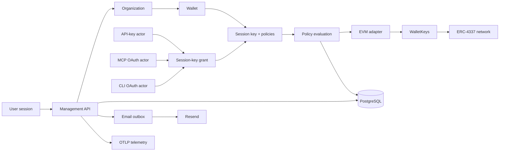

# Namera architecture

This directory is the technical source of truth for Namera. It documents the
implemented boundaries, persistence model, runtime flows, security invariants,
and known production work. Package READMEs explain how to work inside one
workspace; these documents explain how the workspaces compose into the product.

## System model

Namera is a multi-tenant programmable-wallet service. A user manages an
organization through a browser session. The organization creates wallets and
immutable session keys. API keys, MCP clients, and CLI installations receive
explicit grants to session keys. An execution or signature is allowed only when
one active grant points to one active session key whose complete policy set
accepts the operation.

The first supported namespace is `eip155`. Namespace-discriminated protocol and
application contracts are the extension point for future chain families.

## Knowledge-base map

### Engineering

- [Repository and package boundaries](engineering/repository.md)
- [Package-by-package ownership and extension guide](packages/README.md)
- [Feature development](engineering/development.md)
- [Testing](engineering/testing.md)

### Platform

- [Server runtime](platform/runtime.md)
- [Database runtime](platform/database.md)
- [Canonical database catalog](database/README.md)
- [Audit events](platform/audit.md)
- [Telemetry](platform/telemetry.md)
- [Production readiness](platform/production.md)

### Authentication and authorization

- [Auth model](auth/README.md)
- [Magic-link authentication](auth/core/magic-link.md)
- [Browser sessions](auth/core/sessions.md)
- [Organizations, members, roles, and invitations](auth/organization/README.md)
- [API keys](auth/core/api-keys.md)
- [OAuth, MCP, and CLI authorization](auth/oauth/README.md)

### Wallet domain

- [Accounts and smart wallets](wallets/accounts.md)
- [Wallet-key providers](wallets/wallet-keys.md)
- [Session keys and grants](wallets/session-keys.md)
- [EVM namespace adapter](evm/README.md)
- [Supported EVM chains](evm/supported-chains.md)
- [EVM smart accounts](evm/accounts/README.md)
- [EVM execution pipeline](evm/execution/README.md)
- [EVM signatures](evm/signatures.md)
- [EVM policy engine](evm/policies/README.md)

### Operations

- [Executions](operations/executions.md)
- [Signatures and verification](operations/signatures.md)

### Product services and clients

- [Billing and entitlements](billing/README.md)
- [Notifications](notifications/README.md)
- [Durable email delivery](notifications/email-delivery.md)
- [SDK, CLI, and MCP tools](clients/sdk-cli-mcp.md)
- [Dashboard](frontend/dashboard.md)

## Documentation contract

- Document implemented behavior in the present tense.
- Put future work only in the final `Pending` section of the owning feature.
- Link to source boundaries instead of duplicating implementation code.
- Update the relevant document in the same change as a contract, table,
  transaction boundary, authorization rule, or lifecycle change.
- Keep every table's column, nullability, key, constraint, foreign key, and
  index reference in `architecture/database`; feature documents link to it.
- Drizzle schemas and migrations remain authoritative for executable database
  behavior, and the catalog changes in the same commit.
