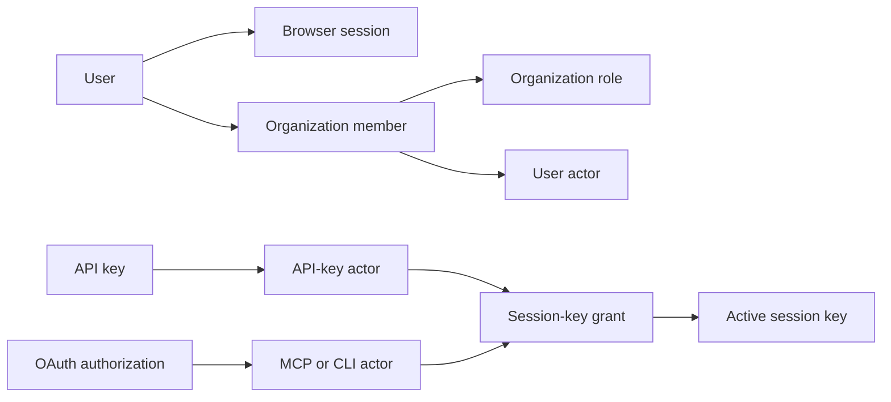

# Authentication and authorization model

Namera separates a human identity, an organization-scoped principal, and the
authority to use a wallet.

## Identities

- `auth.user` is a global person identified by a normalized unique email.
- `auth.organization` is the tenant and billing boundary.
- `auth.actor` is an organization-scoped principal of type `user`, `api-key`,
  `mcp`, or `cli`.
- `auth.organization_member` links a user actor and organization role. Removed
  rows remain as history; only one active membership may exist per user and
  organization.
- API-key and OAuth actors are not members. Their intrinsic capabilities come
  from credential type/scopes and their wallet authority comes from explicit
  session-key grants.

## Authorization paths

### User actor

The `auth-token` cookie resolves an active non-expired session. Authorization
then resolves the active organization, verifies an active membership, and loads
effective role permissions. Handlers call `enforceActor` with the exact user
permission required by the operation.

### API-key actor

The server hashes `x-api-key`, resolves an active unexpired credential, updates
last use, and loads active grants joined to active session keys. The key is
organization-scoped and cannot acquire authority through member permissions.

### MCP and CLI actor

A bearer token resolves an active OAuth token, authorization, actor, resource,
scope set, and active grants. MCP tokens are bound to `/mcp`; CLI tokens are
bound to the API origin. Scopes permit a capability but do not create wallet
access.

## Permission model

Owner, Admin, and Member are code-owned system roles synchronized at startup.
Organization roles store effective permission arrays. Permission-based
hierarchy permits management or assignment only when the target role is a
strict subset of the acting role. Owner assignment, demotion, and removal are
blocked from generic member and invitation workflows.

## Security invariants

- Raw verification tokens, session tokens, API keys, authorization codes, and
  OAuth tokens are never stored.
- Organization-owned foreign keys include organization identity where a
  cross-tenant reference would be dangerous.
- A credential, scope, permission, or grant cannot independently authorize an
  execution. The complete actor, resource, grant, key, wallet, namespace, and
  policy chain must be valid.
- Frontend guards only hide unavailable controls. Server handlers are the
  authoritative permission boundary.

## Pending

- External identity accounts are only a persistence foundation; no external
  identity provider is wired.
- Custom-role CRUD and explicit ownership transfer are not implemented.
