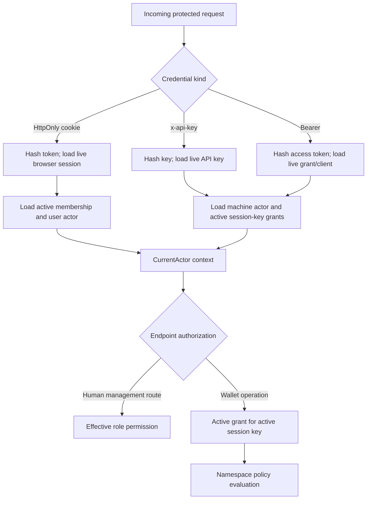

# Authentication and authorization

Namera has four principal types and two independent questions for every protected operation:

1. **Who is calling?** Resolve a browser session, API key, OAuth access token, or trusted system context to an `auth.actor` and organization.
2. **What may that actor do?** For human actors, evaluate role permissions. For delegated actors, evaluate OAuth/API capability plus an active session-key grant and the session key's policies.

## Subsystems

Platform operators have a separate [admin authorization boundary](admin.md),
outside organization actors and delegated wallet authority.
The public [waitlist](waitlist.md) records interest without admitting users.

| Area          | Responsibility                                                                  | Documentation                           |
| ------------- | ------------------------------------------------------------------------------- | --------------------------------------- |
| Core identity | Users, reusable verification challenges, magic-link login, and browser sessions | [Core](core/README.md)                  |
| Organizations | Tenant creation, actors, roles, membership, and invitations                     | [Organizations](organization/README.md) |
| API keys      | Organization machine credentials and session-key grants                         | [API keys](core/api-keys.md)            |
| OAuth         | MCP authorization code + PKCE and CLI device authorization                      | [OAuth](oauth/README.md)                |

The canonical column-level schema is in [the database catalog](../database/README.md).

## Principal resolution

No credential alone grants wallet authority. API keys and OAuth clients require active grants; each operation still passes the immutable policy envelope of the granted session key.

The current-actor response enriches machine actors with an optional
`organizationName`, looked up using only the authenticated actor's organization
ID. This read-only presentation lookup happens in that handler, not on every
authorized request. Older servers remain compatible through the optional field;
no authorization rules or audit events change. CLI API boundary tests verify
the organization name alongside narrowed scopes.

## Data boundaries

- `auth.user` is a human identity.
- `auth.organization_member` is a user's relationship to one tenant.
- `auth.actor` is the principal recorded on mutations and operations.
- `auth.api_key` and `auth.oauth_authorization` are credentials/grants that each own a non-human actor.
- `core.session_key_grant` links an actor to delegated wallet authority.
- `audit.*_events` records security history; telemetry is not audit storage.

## Credential-storage rules

- Raw browser tokens, API keys, magic-link tokens, OAuth codes, device codes, access tokens, and refresh tokens are never persisted.
- High-entropy credentials use purpose-separated hashes.
- Short human-entered codes use purpose-separated HMACs to prevent offline enumeration.
- Transport returns raw material only at creation/redemption and applies `no-store` where appropriate.
- Revocation keeps historical rows and invalidates dependent grants/tokens atomically.

## Code ownership

| Boundary                   | Location                        | Responsibility                                             |
| -------------------------- | ------------------------------- | ---------------------------------------------------------- |
| Schemas/models/errors/DTOs | `packages/protocol`             | Decode identity and OAuth values; define public failures.  |
| Hash/HMAC/token generation | `packages/crypto`               | Purpose-separated credential primitives.                   |
| Tables/repositories        | `packages/database`             | Conditional lifecycle transitions and tenant-safe queries. |
| Workflows                  | `packages/application/src/auth` | Transactions, audit, notifications, and domain decisions.  |
| HTTP contracts             | `packages/api/src/routes/auth`  | Typed routes only.                                         |
| Cookies/protocol handlers  | `apps/server/src/routes/auth`   | Transport rules and authorization middleware.              |
| Browser UI                 | `apps/dashboard/src/routes`     | Login, consent, settings, and authorization management.    |
