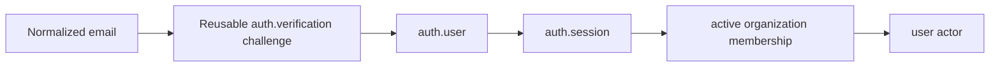

# Core identity

Core identity owns user records, reusable verification challenges, browser sessions, and API-key credentials. Organization membership is documented separately because it is tenant-scoped.

## Features

- [Magic-link authentication](magic-link.md)
- [Google sign-in and connected accounts](google.md)
- [Browser sessions](sessions.md)
- [API keys](api-keys.md)
- [Core auth tables](../../database/auth-core.md)

Magic link and optional Google sign-in authenticate humans. `auth.account` stores
external-provider bindings and must not be confused with programmable wallets.

## Adding a verification purpose

For password recovery, email change, step-up authentication, or another challenge:

1. Add a purpose-discriminated protocol data schema.
2. Define a distinct cryptographic purpose for every token/code representation.
3. Reuse the generic verification repository only if its one-live-challenge, expiry, attempts, consumption, and revocation semantics match.
4. Implement a purpose-specific application workflow; never add magic-link-specific columns to `auth.verification`.
5. Add enumeration-resistant transport behavior and purpose-specific rate limits.
6. Update feature docs and the database catalog if persistence changes.
