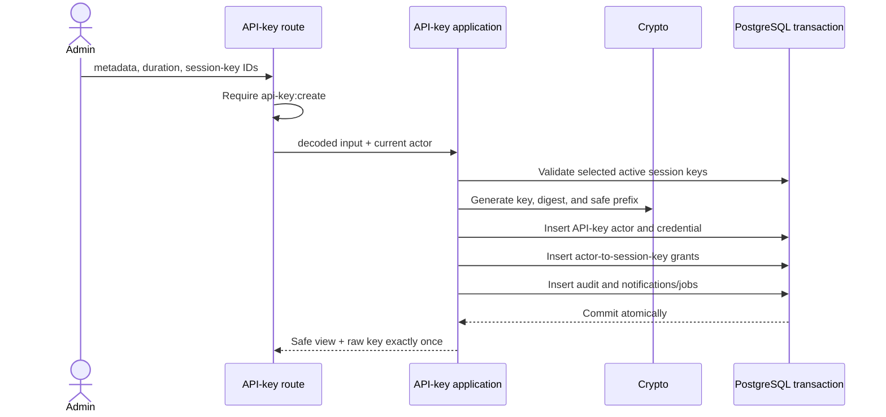

# API keys

An API key is an organization machine credential. It owns one `api-key` actor and receives wallet authority only through explicit active session-key grants. See [`auth.api_key`](../../database/auth-core.md#authapi_key).

## Creation

Creation accepts required display metadata, active session-key IDs in the current organization, and a 1–365 day duration.

## Authentication

1. Read `x-api-key` at the server boundary.
2. Derive its purpose-separated hash.
3. Resolve the unique credential and reject revoked/expired rows.
4. Resolve its actor and organization.
5. Load active grants joined to active session keys.
6. Update `last_used_at` without exposing the digest.
7. Continue through endpoint capability and grant/policy authorization.

The key never inherits the creator's human role permissions and cannot use unrelated organization wallets.

## Revocation and rotation

Revocation conditionally marks the key and every active grant for its actor in one transaction. Only the first transition produces audit/notification effects. Grant editing is intentionally unsupported: create a replacement, deploy it, then revoke the old credential.

List/detail responses expose the visible prefix, metadata, creator, lifecycle, and grant summaries, never `key_hash` or reconstructable material.

## Read-boundary verification

`apps/server/tests/integration/wallet/delegated-reads.test.ts` exercises the HTTP
wallet list, detail and portfolio routes with a real API-key credential. An
installed session grant permits its wallet; an ungranted wallet in the same
organization and a foreign organization's wallet both return `WALLET_NOT_FOUND`.
The credential cannot read passkey-owner ceremony metadata, request registration
options, or update wallet metadata. Session revocation immediately removes read
access without waiting for onchain uninstallation; credential revocation then
changes these reads to `Unauthorized`. The owner can still read the unchanged
wallet. Chain approval and portfolio providers use package-owned substitutes.
This matrix does not certify OAuth actors or every resource route.

## Pending before production

- Add leak-response and zero-downtime rotation runbooks.
- Decide whether enterprise network restrictions are a separate credential control.
- Alert on unusual failed authentication and dormant-key patterns.
