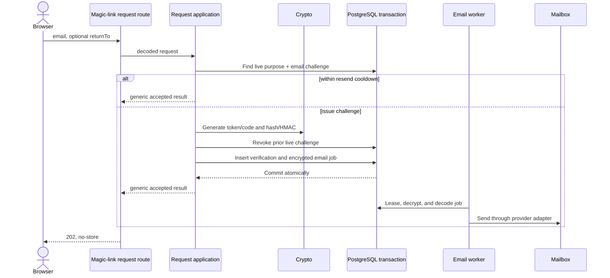
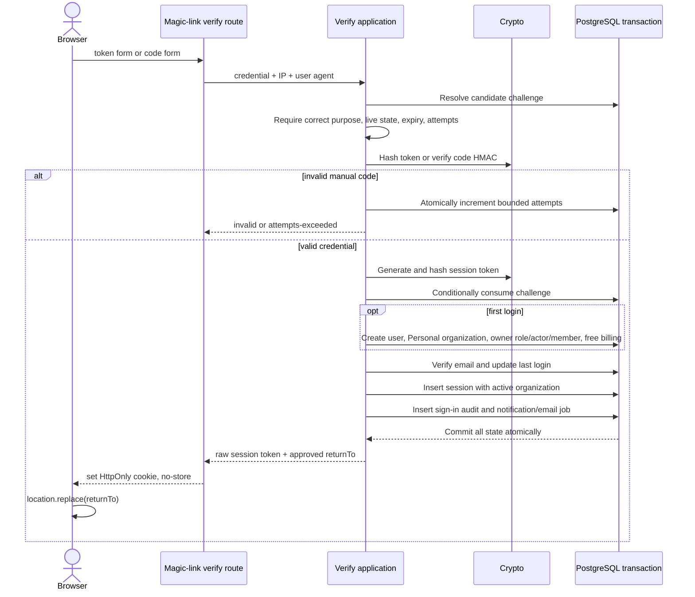

# Magic-link authentication

Magic link proves control of an email, initializes a first-time tenant, and creates a cookie-backed browser session. It consumes the generic [`auth.verification`](../../database/auth-core.md#authverification) lifecycle with the magic-link purpose; the table is not owned by this feature.

## Credentials

Admin requests use optional `surface: "admin"` and must come from the exact
configured `ADMIN_CORS_ORIGIN`. Their email links use that origin's `/auth/verify`;
verification and cookies reuse the ordinary endpoints. Challenges retain the
surface, and a resend across surfaces replaces the previous challenge rather
than silently keeping a link to the other app. Admin UI checks membership after
verification; signing in alone never grants platform access.

| Setting                      | Current behavior                        |
| ---------------------------- | --------------------------------------- |
| Link token                   | 32 random bytes in the email URL        |
| Manual code                  | 8 decimal digits in the same email      |
| Lifetime                     | 10 minutes                              |
| Maximum failed code attempts | 5                                       |
| Resend cooldown              | 1 minute for an existing live challenge |
| Live challenge cardinality   | One per purpose and normalized email    |

The link token uses `cryptoPurpose.magicLinkToken`; the code uses `cryptoPurpose.magicLinkCode`. Raw values exist only while constructing the encrypted email job.

## Request contract

New-user admission is protected by [private-beta invites](beta-invites.md).
Requests accept an optional six-character `inviteCode` carried by an invite link;
the email screen itself does not ask for it. Email verification grants existing
users a normal session. New users without a usable invite get only a restricted
signup cookie and `/auth/invite`, not a user or normal session. Invite redemption
then atomically completes account creation. See beta admission for that branch.

`POST /auth/magic-link/request` accepts a normalized email and optional application-relative `returnTo`. It always returns the same `202 Accepted` message with `Cache-Control: no-store`, whether the identity exists or cooldown suppresses a new email.

`returnTo` is resolved against the dashboard origin, then reduced to path/query/hash only when its path equals or descends from an allowed prefix. Unapproved values are discarded.

## Request sequence

The worker never responds to the browser; provider delivery happens after the HTTP request completes.

## Verification contract and sequence

The dashboard confirmation step accepts the eight-digit email code using UIKit
InputOTP (two groups of four), with paste, numeric keyboard, and one-time-code
autofill support. Explicit submission uses the same verification endpoint and
approved return destination as the email link. A code and link share one challenge;
using either invalidates the other. The six-character beta invite is separate.

`POST /auth/magic-link/verify` accepts either verification ID + raw token or normalized email + code. Opening the dashboard GET page does not consume the credential; the page explicitly posts it, preventing crawlers/prefetchers from using a one-time link.

The conditional consume inside the transaction prevents two valid clicks from minting two sessions.

The route suite races eight mixed token/code redemptions of one challenge and
asserts one success, one auth cookie, and one persisted session. It runs against
both PGlite and the opt-in PostgreSQL lane. Concurrent challenge requests may
send one email (cooldown observed) or replace an earlier challenge; only one
credential may remain redeemable in either schedule.

At four failed code attempts, the HTTP suite races one valid token or code
against seven incorrect codes. Conditional updates serialize consumption against
the fifth failure: successful consumption leaves four attempts and one session;
lockout leaves five attempts and no session or cookie. Both variants pass on
PostgreSQL and PGlite.

## Security and failures

- Expired, consumed, revoked, missing, wrong-purpose, and wrong-token cases collapse to `INVALID_OR_EXPIRED_LINK`.
- Wrong manual codes increment attempts atomically; the configured limit returns `TOO_MANY_ATTEMPTS`.
- Transport applies global, IP, normalized-email, and verification-IP rate limits.
- The cookie is HttpOnly, `SameSite=Lax`, path `/`, and Secure outside development.
- Logs omit email, credential material, digests, and arbitrary payloads.

## Audit and observability

- First login can produce user, organization, actor/member, and billing initialization facts.
- Every successful login writes `user.signed_in` transactionally with the session.
- New-sign-in notification/email is correlated to that audit event.
- Metrics record request duration/count and bounded verification outcomes.

## Pending before production

- Add cleanup/retention for terminal and expired verification rows.
- Verify production sender authentication, reputation, and deliverability.
- Apply and test strict security headers on the verification page.
