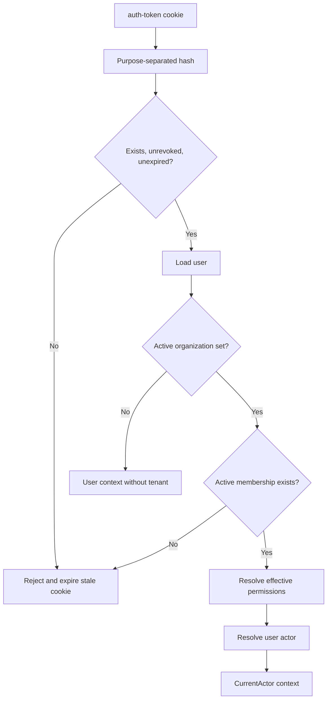

# Browser sessions

Browser sessions authenticate humans. Their complete persistence shape is documented under [`auth.session`](../../database/auth-core.md#authsession).

## Validation pipeline

An `active_organization_id` is not trusted without an active membership whose actor and role belong to the same organization.

## Routes

All paths are under `/auth/session` and use authorization middleware.

| Method and path               | Behavior                                         |
| ----------------------------- | ------------------------------------------------ |
| `GET /actor`                  | Current human or delegated actor representation. |
| `GET /me`                     | Current authenticated human context.             |
| `GET /sessions`               | Current user's active unexpired sessions.        |
| `DELETE /sessions/logout`     | Revoke current session and clear cookie.         |
| `POST /sessions/revoke`       | Revoke every other active session.               |
| `DELETE /sessions/:sessionId` | Revoke one user-owned session.                   |

Organization switching is owned by organization application/routes and only accepts an active membership.

## Revocation invariants

- Conditional updates prevent repeated or foreign transitions.
- Mutation and `session.revoked`/`session.others_revoked` audit rows share a transaction.
- Metrics/logs emit only for a real transition.
- Logout clears the cookie while retaining the historical database row.
- Revoke-others explicitly excludes the current session.

## Pending before production

- Add cleanup after audit-retention policy is fixed.
- Define maximum concurrent sessions and emergency account-wide logout.
- Decide retention/anonymization for IP address and user agent.
