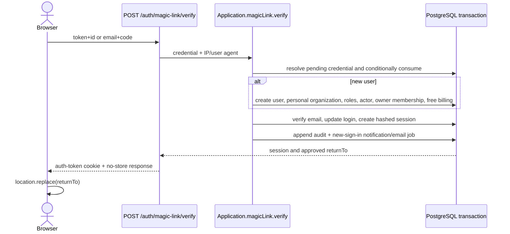

# Magic-link authentication

Magic link is Namera's implemented human sign-in mechanism. It proves ownership
of an email address, initializes a first-time user and personal organization,
and creates a cookie-backed browser session.

## Credential model

- Token: 32 random bytes, delivered in the email URL.
- Code: 8 numeric digits, delivered in the same email for manual entry.
- Lifetime: 10 minutes.
- Maximum failed code attempts: 5.
- Request cooldown: 1 minute for an existing pending email verification.
- Only the latest pending credential for one purpose and normalized email is
  accepted.

The token is stored as a purpose-separated digest and the code as a
purpose-separated HMAC. The raw values exist only while constructing the
encrypted email job.

## Table: `auth.verification`

| Field                         | Purpose                                         |
| ----------------------------- | ----------------------------------------------- |
| `id`, `purpose`, `identifier` | Credential identity and normalized email scope. |
| `data`                        | Typed return path and purpose-specific context. |
| `token_hash`, `code_hmac`     | Non-reversible credential lookups.              |
| `attempts`                    | Failed code attempts, constrained non-negative. |
| `expires_at`                  | Credential deadline.                            |
| `consumed_at`, `revoked_at`   | Terminal lifecycle timestamps.                  |
| timestamps                    | Creation and update history.                    |

`token_hash` is unique. A partial unique index permits one unconsumed,
unrevoked pending row per purpose and identifier. Purpose/identifier and expiry
indexes support request and cleanup paths.

## Request flow

```mermaid
sequenceDiagram
  actor Browser
  participant API as POST /auth/magic-link/request
  participant App as Application.magicLink.request
  participant DB as PostgreSQL transaction
  participant Worker as Email worker

  Browser->>API: email + relative returnTo
  API->>App: normalized request context
  App->>App: enforce cooldown; generate token/code; hash/HMAC
  App->>DB: revoke prior pending + insert verification + encrypted email job
  DB-->>API: commit
  API-->>Browser: 202 Accepted, no-store
  Worker->>DB: lease and decrypt job
  Worker-->>Browser: deliver sign-in email through Resend
```

The response is enumeration-resistant: known and unknown emails receive the same
accepted shape. Return paths are application-relative, canonicalized, and
restricted to configured prefixes. Global, IP, normalized-email, and verify-IP
limits are enforced at transport.

## Verification flow

Opening `/auth/verify?id=...&token=...` does not consume the credential. The
dashboard validates URL shape and makes an explicit POST:



Verification is single-use and transactional. Failed code attempts increment
atomically. Errors collapse persistence detail into `INVALID_OR_EXPIRED_LINK`
or `TOO_MANY_ATTEMPTS`.

The `auth-token` cookie is HttpOnly, `SameSite=Lax`, path `/`, and Secure outside
development. The response and verification page use no-store semantics.

## Audit and telemetry

First sign-in may append `user.created`, `organization.created`,
`member.created`, and `user.signed_in`. Metrics cover accepted requests,
duration, bounded verification outcomes, notification creation, and email
delivery. Logs omit emails and credential material.

## Pending

- Add cleanup for expired verification rows.
- Add strict verification-page security headers.
- Verify production sender reputation, delivery, and spam placement.
