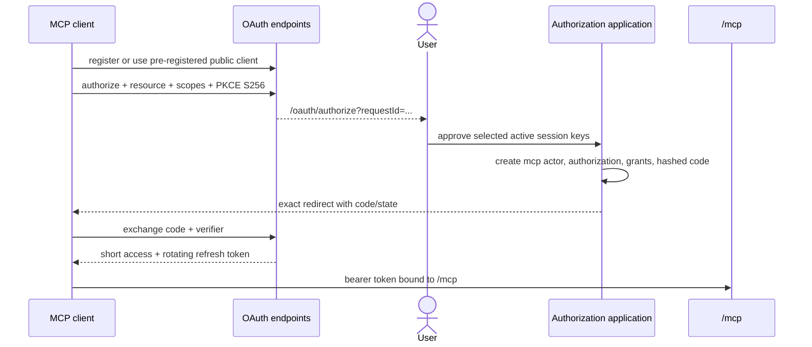
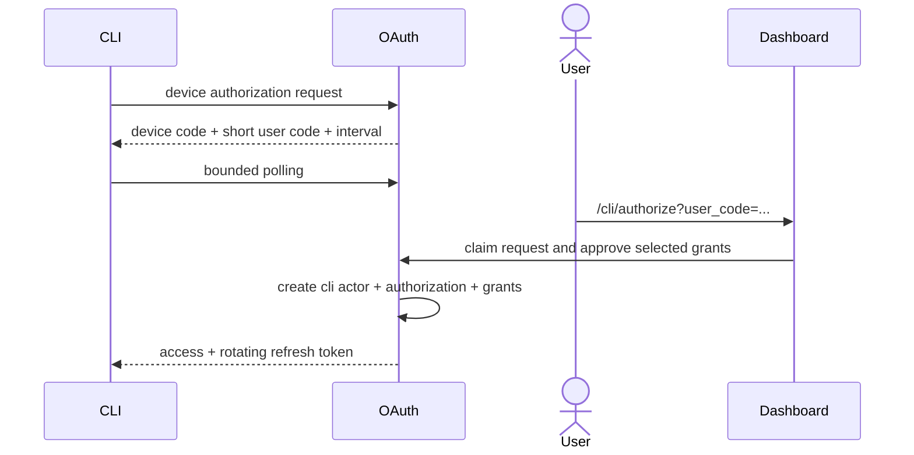

# OAuth, MCP, and CLI authorization

Namera uses one generic OAuth authorization model for `mcp` and `cli` actors.
MCP uses authorization code + PKCE and Streamable HTTP. CLI uses RFC 8628 device
authorization. Both authorize explicit session-key grants.

## Tables

| Table                              | Responsibility and constraints                                                                                                                                                            |
| ---------------------------------- | ----------------------------------------------------------------------------------------------------------------------------------------------------------------------------------------- |
| `auth.oauth_client`                | Public client metadata, exact redirect URIs, supported grants/responses, active/disabled state. `client_id` unique; public auth method only.                                              |
| `auth.oauth_authorization_request` | Short-lived consent request with client, redirect, PKCE S256 challenge, resource, scopes, state, and pending/approved/denied/expired state.                                               |
| `auth.oauth_authorization`         | Durable organization actor, client, `mcp`/`cli` type, scopes/resource, authorizer, active/revoked lifecycle, and last use. Actor unique.                                                  |
| `auth.oauth_authorization_code`    | Hashed single-use code bound to authorization/client, redirect, PKCE, resource, scopes, and expiry.                                                                                       |
| `auth.oauth_device_authorization`  | Hashed device code, HMAC user code, client/resource/scopes, claim/approval lifecycle, poll interval, expiry, and optional authorization.                                                  |
| `auth.oauth_token`                 | Hashed access or refresh token. Refresh rows have a family and optional parent; access rows cannot. Supports rotation, reuse invalidation, expiry, consumption, revocation, and last use. |

Composite foreign keys preserve authorization/client and authorization/
organization consistency. Unique credential hashes support constant lookup and
replay prevention. Lifecycle/status indexes serve consent, polling, cleanup, and
management lists.

## MCP authorization-code flow

Discovery implements authorization-server and protected-resource metadata.
Dynamic registration accepts public clients with exact HTTPS or loopback HTTP
redirects. Protocol routes enforce form media types, no-store, unique
parameters, exact resource/redirect matching, PKCE `S256`, refresh rotation,
and safe error redirects.

## CLI device flow

Polling before approval returns the protocol pending/slow-down behavior. Device
codes are one-time, user codes are HMAC protected, and refresh is serialized in
the CLI to avoid cross-process token-family races.

## Management and revocation

User routes list/get/revoke MCP and CLI authorizations under typed permissions.
Revocation atomically marks the authorization, revokes its token rows and active
session-key grants, and writes audit plus in-app notification state. Tokens are
also rejected when client, authorization, resource, scope, grant, or session key
is no longer active.

## Scope model

- `mcp:read` permits grant-scoped reads.
- `mcp:execute` permits execution and signing tools but policies remain
  authoritative.
- CLI scopes bind corresponding API capabilities to the API resource.
- Scope is necessary but not sufficient: the authorization must have an active
  grant to an active session key that accepts the operation.

## Compatibility

The MCP transport targets protocol revision `2025-06-18`, matching Effect's
implemented Streamable HTTP adapter.

## Pending

- Add scheduled cleanup for expired authorization requests, codes, device
  requests, and inactive token families.
- Adopt a newer MCP revision only with a compatible Effect transport adapter.
