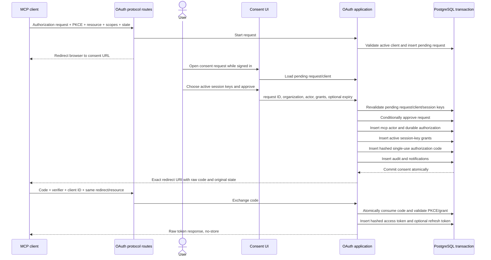

# MCP authorization code and consent

The authorization-code path turns a public MCP client's validated request into an approved tenant actor, session-key grants, single-use code, and token family.

## Client registration

Dynamic registration:

- deduplicates and validates every redirect URI;
- accepts HTTPS or loopback HTTP only;
- rejects URL credentials and fragments;
- requires `authorization_code` and response type `code`;
- accepts only supported scopes without duplicates;
- stores public-client authentication method `none`;
- generates a random public `client_id` under the configured prefix.

Pre-registered and metadata-document client types share the same `auth.oauth_client` model but have different provenance/refresh responsibilities.

## Starting authorization

The server resolves public `client_id`, requires active status and exact redirect membership, requires response type `code`, validates PKCE challenge schema and method `S256`, deduplicates scopes, and verifies them against both server and optional client-registered scope. `offline_access` additionally requires refresh-token grant support.

The resource must be the canonical API origin (local MCP's upstream API client).
The removed hosted `/mcp` audience is rejected before creating an authorization
request. Root protected-resource metadata advertises the API origin. The CLI's
local MCP listener authenticates its agent-facing connection separately; a
loopback-audience bearer token is never passed upstream.

Only after these checks does it insert a pending authorization request and redirect the browser to `/oauth/authorize?requestId=...`.

## Consent sequence

The code is generated before the consent transaction so only its digest enters PostgreSQL. It is returned only after the transaction commits.

## Approval invariants

- Optional authorization expiry must be in the future.
- Every selected session key must exist in the chosen organization and be active.
- Duplicate session-key IDs are removed before inserts/audit.
- Pending request approval is conditional; a concurrent approval/denial cannot create two grants.
- Actor, authorization, grants, code, audit, and notifications share one transaction.
- Approved scopes/resource/redirect/PKCE are copied from the persisted request, not browser-modifiable approval input.

## Denial

Denial conditionally marks the live request and redirects to the exact registered URI with `error=access_denied` and the original `state`. It does not create an actor, authorization, grant, or token.

## Token exchange checks

- Public client exists, is active, and supports authorization code.
- Verifier passes protocol schema.
- Hash resolves an unconsumed, unexpired code.
- Client internal ID, exact redirect URI, exact resource, and SHA-256 verifier challenge all match.
- Durable authorization remains active and belongs to the client.
- Code consumption and token insertion share a transaction.

## Pending before production

- Add end-to-end interoperability tests with Codex, Claude, and generic MCP OAuth clients.
- Test malicious redirect/state/PKCE/resource substitution and concurrent code redemption.
- Define approval expiry UI/policy and reauthorization behavior.
