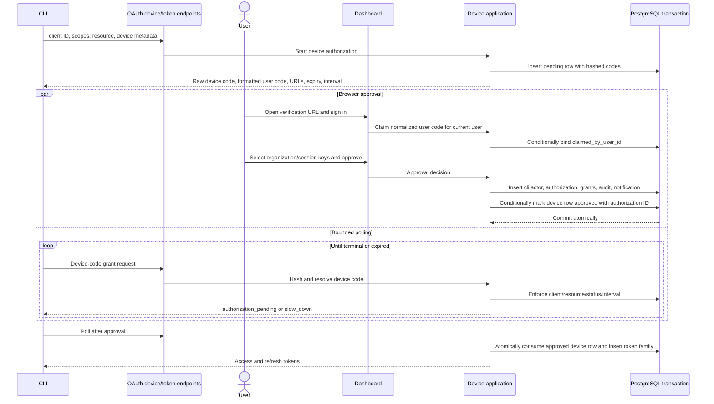

# CLI device authorization

The CLI is a pre-registered public client. Device authorization lets a terminal start a request while an authenticated dashboard session chooses organization and session-key grants.

## Starting a device request

The application ensures the configured CLI client exists, then validates:

- exact configured public client ID and active client status;
- API origin as the exact resource;
- a non-empty, deduplicated subset of CLI scopes.

It generates a high-entropy device code and a short code from the configured alphabet/length. PostgreSQL receives only the device-code hash and normalized user-code HMAC. Metadata records device name, CLI version, and platform for the approval UI/audit.

## Device sequence

## Claim and approval invariants

- User codes are case-normalized and formatting characters removed before HMAC.
- Claim is conditional; another user cannot take an already claimed request.
- Approval requires the claim to belong to the current user and remain pending/unexpired.
- Selected session keys are deduplicated, organization-owned, and active.
- Actor, authorization, grants, device approval, audit, and notification share one transaction.

## Poll behavior

- Unknown code/client mismatch → `INVALID_GRANT`.
- Resource mismatch → `INVALID_TARGET`.
- Expired request is persisted as expired and returns `EXPIRED_TOKEN`.
- Denied → `ACCESS_DENIED`.
- Already consumed → `INVALID_GRANT`.
- Pending at or above interval → `AUTHORIZATION_PENDING` and records poll time.
- Polling too quickly → `SLOW_DOWN` and increases stored interval by five seconds.
- Approved → conditional single-use consume plus token issuance in one transaction.

The CLI must honor the returned interval and updated slow-down behavior rather than tight-looping.

The protocol regression races eight dashboard approval requests and then eight
final HTTP token polls. It asserts one durable CLI authorization with the chosen
grant, one successful token response, and rejection of all losing attempts.
This suite passes with both PGlite and PostgreSQL transactions.

A separate HTTP test pins two users' cookies and races their claims, requiring
one claimant and rejecting denial by the other user. The winner then races
approval against denial. Exactly one decision succeeds; the persisted state,
authorization/grants, approval audit and device-token exchange agree with that
decision. This test passes on PostgreSQL and PGlite.

The CLI authority HTTP regression exchanges an approved device grant, narrows
its refresh token to `wallet:read`, and verifies eight protected operations
reject that token. Revoking its session-key grant immediately hides the wallet;
revoking the CLI authorization invalidates the bearer token. Browser cookies are
cleared for delegated requests so this exercises CLI rather than user authority.

## Pending before production

- Add operator visibility for abandoned/slow-down-heavy device requests without exposing user codes.
- Define maximum device-name/platform lengths at the protocol boundary if not already constrained.
