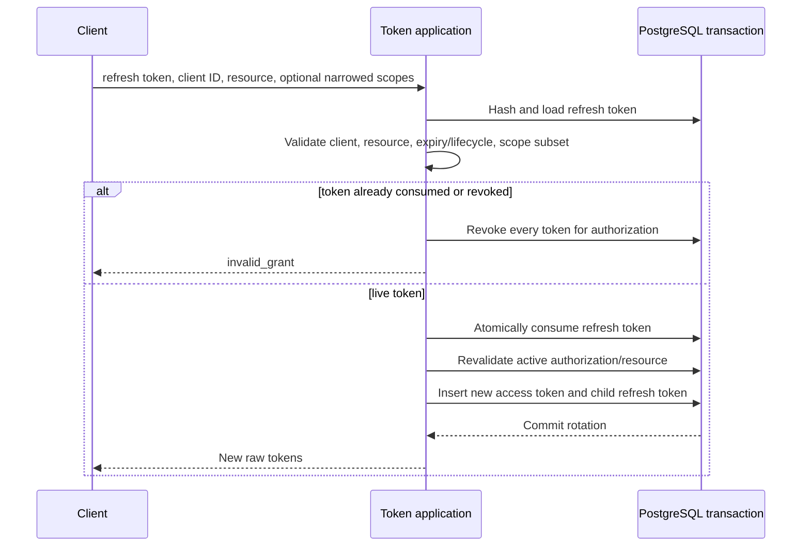

# OAuth tokens, validation, and revocation

Namera stores only purpose-separated access/refresh token hashes. Refresh tokens are single-use and form a parent-linked rotation family. The complete table invariants are in [`auth.oauth_token`](../../database/auth-oauth.md#authoauth_token).

## Issuance

Every issuance creates a short-lived access token. If scopes include `offline_access`, it also creates a refresh token with a new family ID or the consumed parent's family ID. Raw values are returned after inserts; hashes, audience, scopes, expiry, and lineage are persisted.

## Refresh rotation

Reuse is treated as evidence that a rotating credential was copied. The implementation revokes the authorization's token set instead of allowing two live branches.

## Access-token validation

Protected requests must require all of the following:

1. access-token hash resolves one row;
2. token type is `access`, unrevoked, and unexpired;
3. bound client exists and is active;
4. durable authorization is active and unexpired;
5. token/authorization client and resource agree with the endpoint audience;
6. endpoint-required scopes are present;
7. actor belongs to authorization organization;
8. wallet operations resolve an active actor grant to an active session key;
9. operation passes namespace policy evaluation.

Updating `last_used_at` is metadata, not the security decision.

## Explicit revocation

The token revocation endpoint hashes input under both access and refresh purposes and conditionally revokes the matching row. Authorization management revocation is stronger: it marks the durable authorization revoked, revokes all authorization tokens, revokes every active session-key grant for its actor, and writes type-specific audit/notification effects in one transaction.

## Dashboard management

MCP and CLI use separate route groups/views but the same underlying application:

| Route family                | Default UI behavior                                              |
| --------------------------- | ---------------------------------------------------------------- |
| `/oauth/authorizations`     | MCP authorization list/get/revoke; active rows shown by default. |
| `/oauth/cli-authorizations` | CLI authorization list/get/revoke; active rows shown by default. |

Views expand the client, authorizing member/user/role, and currently active granted session keys. Revoked grants remain in history but are not returned as active authority.

## Client-side refresh serialization

Because refresh credentials are single-use, SDK/CLI clients must serialize refresh within a process and persist the new token set atomically. Parallel refresh using the same parent is interpreted as reuse and can revoke the authorization.

## Pending before production

- Verify family-wide reuse handling under concurrent requests and database failure.
- Define token TTLs, authorization expiry, and refresh-session maximum age per client type.
- Add cleanup that preserves required security history while removing expired credential rows.
- Add client-disable and signing-key/credential incident runbooks.
