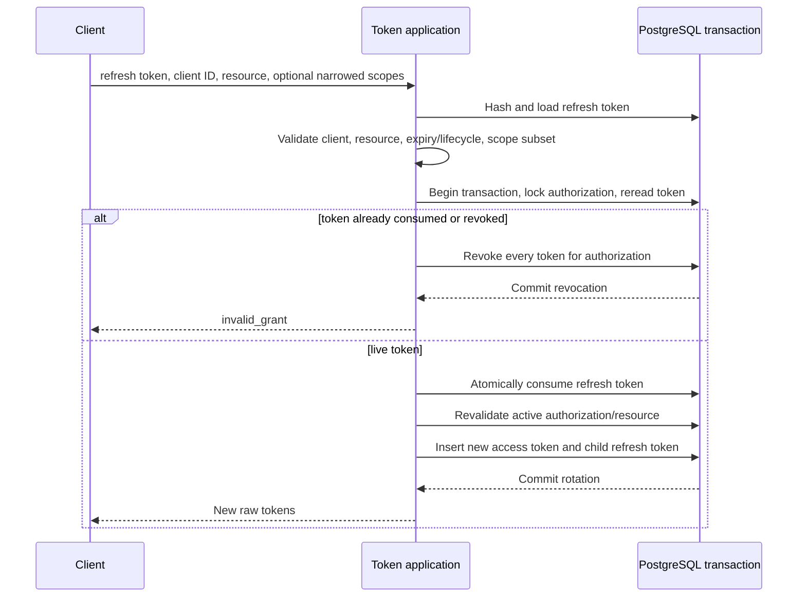

# OAuth tokens, validation, and revocation

Namera stores only purpose-separated access/refresh token hashes. Refresh tokens are single-use and form a parent-linked rotation family. The complete table invariants are in [`auth.oauth_token`](../../database/auth-oauth.md#authoauth_token).

## Issuance

Every issuance creates a short-lived access token. If scopes include `offline_access`, it also creates a refresh token with a new family ID or the consumed parent's family ID. Raw values are returned after inserts; hashes, audience, scopes, expiry, and lineage are persisted.

Authorization-code consumption and issuance share a transaction. A different
registered client, callback (including a trailing slash), resource, or validly
formatted but incorrect PKCE verifier returns `invalid_grant` and rolls back
consumption. The protocol integration test tries all four substitutions, then
redeems the original code successfully and rejects replay. It also verifies
opaque state survives the consent redirect unchanged. The test uses the real
token HTTP handler and migrated PGlite; session installation uses the EVM test
provider, not a live chain.

## Refresh rotation

Reuse is treated as evidence that a rotating credential was copied. The implementation revokes the authorization's token set instead of allowing two live branches.

Refreshes serialize on the authorization row, across all token generations.
Token lifecycle is reread after acquiring that lock; a pre-transaction read
cannot decide whether a concurrent refresh has consumed the token. Reuse returns
a transaction result before raising `INVALID_GRANT` so the revocation is not
rolled back with the protocol error. The durable consent itself is unchanged;
all its current tokens are invalidated.

The regression races eight refreshes of one parent and verifies one issuance,
seven rejections, no surviving access token from that issuance, and a rejected
child refresh. It is exercised against PGlite and PostgreSQL.

## Access-token validation

Protected requests must require all of the following:

1. access-token hash resolves one row;
2. token type is `access`, unrevoked, and unexpired;
3. bound client exists and is active;
4. durable authorization is active and unexpired;
5. token/authorization client and resource agree with the endpoint audience;
6. endpoint-required scopes are present;
7. actor belongs to authorization organization;
8. wallet operations resolve an active actor grant to an active session key;
9. operation passes namespace policy evaluation.

Updating `last_used_at` is metadata, not the security decision.

API bearer middleware accepts CLI or MCP authorizations only for the exact API
origin. It checks the current client status and uses the intersection of token
and authorization scopes, not the original authorization scope set alone.
Consequently a narrowed refresh token cannot regain permissions at route
enforcement. MCP actors use `mcp:read` for wallet/session/history/verification
and `mcp:execute` for simulation, execution preparation/completion, and signature
preparation/completion. User-only management routes remain forbidden, and reads
stay actor/grant scoped. Hosted `/mcp` tokens are not accepted by this middleware.

## Explicit revocation

The token revocation endpoint hashes input under both access and refresh purposes and conditionally revokes the matching row. Authorization management revocation is stronger: it marks the durable authorization revoked, revokes all authorization tokens, revokes every active session-key grant for its actor, and writes type-specific audit/notification effects in one transaction.

## Dashboard management

MCP and CLI use separate route groups/views but the same underlying application:

| Route family                | Default UI behavior                                              |
| --------------------------- | ---------------------------------------------------------------- |
| `/oauth/authorizations`     | MCP authorization list/get/revoke; active rows shown by default. |
| `/oauth/cli-authorizations` | CLI authorization list/get/revoke; active rows shown by default. |

Views expand the client, authorizing member/user/role, and currently active granted session keys. Revoked grants remain in history but are not returned as active authority.

## Client-side refresh serialization

Because refresh credentials are single-use, SDK/CLI clients must serialize refresh within a process and persist the new token set atomically. Parallel refresh using the same parent is interpreted as reuse and can revoke the authorization.

## Pending before production

- Verify revocation rollback behavior under database failure; concurrent reuse
  and child-token invalidation are covered.
- Define token TTLs, authorization expiry, and refresh-session maximum age per client type.
- Add cleanup that preserves required security history while removing expired credential rows.
- Add client-disable and signing-key/credential incident runbooks.
