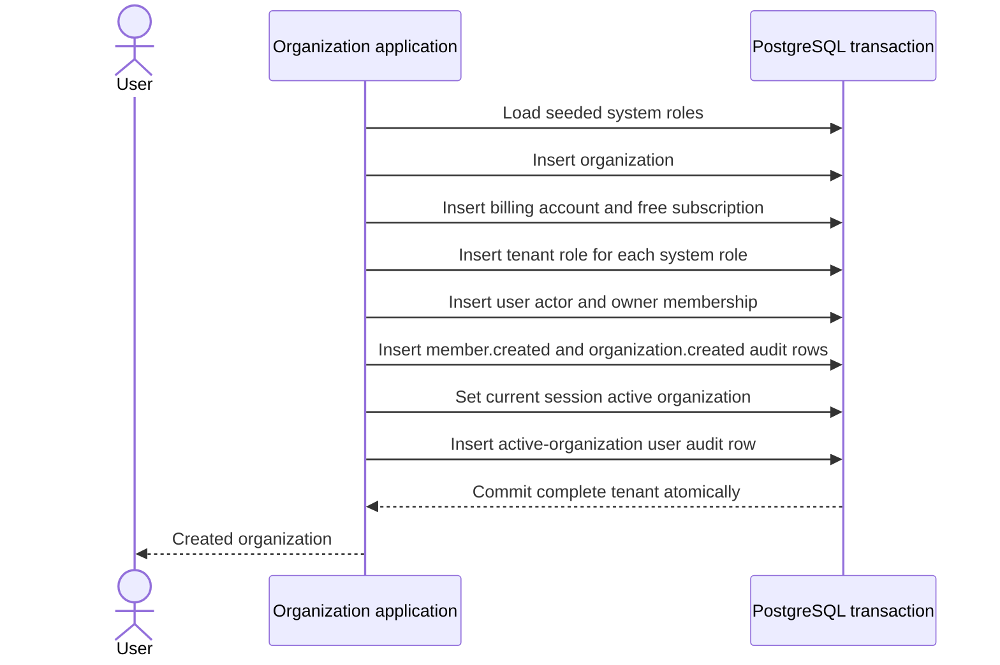

# Organizations

An organization is Namera's tenant, billing, actor, wallet, authorization, and audit boundary. Users may have many memberships; a browser session selects one active organization at a time.

## Documentation

- [Membership and roles](members-roles.md)
- [Invitations](invitations.md)
- [Organization database tables](../../database/auth-organization.md)

## Organization creation

System roles are seeded globally. Creating an organization instantiates every available system role for that tenant, identifies the owner role, creates the user's organization-scoped actor/membership, and initializes free billing.

The first-login helper executes the same organization construction inside the larger verification transaction. No partially initialized organization should be visible.

Free v2 creates at most three owned organizations per user, including Personal.
Explicit creation locks the user row and counts active Owner memberships inside
the transaction. Joined organizations do not count. Existing organizations are
never deleted to enforce the cap. Creation can return `BillingError` with limit
`ownedOrganizations`; all new organizations initialize Free v2.

## Read and update behavior

- List returns active membership views for a user.
- Get requires an active membership in the requested organization.
- Set-active conditionally updates only a live session owned by the user and an organization allowed by membership resolution.
- Updating identical metadata is an idempotent no-op; an actual update writes `organization.updated` in the same transaction.
- Organization deletion is deliberately unsupported because wallets, billing, credentials, operations, and audit history require an explicit offboarding/retention design.

## Tenant-safety invariant

Application queries always carry organization context, but PostgreSQL also protects critical relationships with composite foreign keys. A wallet cannot point to another tenant's key; a member cannot use another tenant's role/actor; an operation cannot use another tenant's grant.
