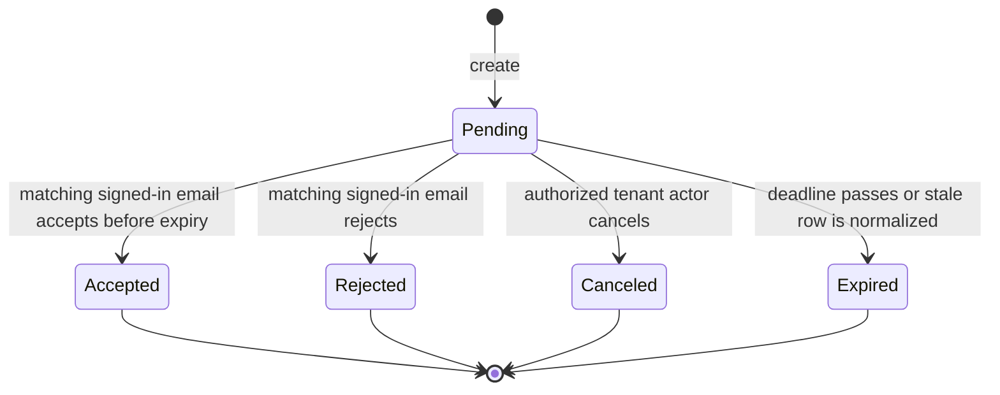

# Organization invitations

Invitations are normalized-email, tenant-role offers with a finite lifetime. Default lists expose only live pending invitations. Their complete schema is [`auth.invitation`](../../database/auth-organization.md#authinvitation).

## Creation decisions

Before inserting, the application:

1. loads the requested role within the organization;
2. verifies the inviter may assign it;
3. rejects an existing active member;
4. returns an existing live duplicate invitation when one already exists;
5. enters a transaction and locks the organization's billing account;
6. rechecks for a concurrent duplicate;
7. counts active members plus pending invitations against plan capacity;
8. expires stale pending rows for the email;
9. inserts the invitation, audit event, and delivery state.

The billing lock serializes the final available seat. Two concurrent invitations cannot both pass the same stale member-count check.

## Delivery sequence

```mermaid
sequenceDiagram
  actor Inviter
  participant App as Invitation application
  participant DB as PostgreSQL transaction
  participant Worker as Email worker
  participant Provider as Email provider
  participant Mailbox as Invitee mailbox
  App->>DB: Validate tenant role and current membership
  App->>DB: Lock billing account and enforce member capacity
  App->>DB: Recheck duplicate; expire stale pending invitation
  App->>DB: Insert invitation and invitation.created audit
  alt invitee already has a Namera user
    App->>DB: Insert notification, recipient, and encrypted email job
  else unknown email
    App->>DB: Insert encrypted email job directly
  end
  DB-->>App: Commit
  App-->>Inviter: Invitation view
  Worker->>Worker: Lease and decrypt typed job
  Worker->>Provider: Send rendered invitation
  Provider->>Mailbox: Deliver message asynchronously
```

## Lifecycle



## Acceptance transaction

Acceptance requires the signed-in user's normalized email to match the invitation. It rejects owner-role invitations and existing memberships, conditionally changes `pending` to `accepted`, creates the user actor/membership, changes the current browser session's active organization, writes organization and user audit rows, expires the inbox notification, and cancels pending invitation email delivery in one transaction.

## Rejection and cancellation

- Rejection is recipient-email-bound; its audit actor is null with the user ID in typed data because the new organization actor does not exist.
- Cancellation is organization-authorized and attributed to the current actor.
- Both expire the actionable notification and cancel the correct pending email-job idempotency key.
- Repeating a terminal action returns not-found rather than producing duplicate audit/notification changes.

## Privacy behavior

Fetching an invitation distinguishes missing from recipient mismatch only for an authenticated caller. Public creation paths do not expose whether an email has a Namera account through delivery response differences.

## Pending before production

- Add scheduled normalization/retention for expired invitations.
- Define resend behavior without weakening one-pending-invitation uniqueness.
- Add concurrency tests covering the last plan seat and duplicate email.
