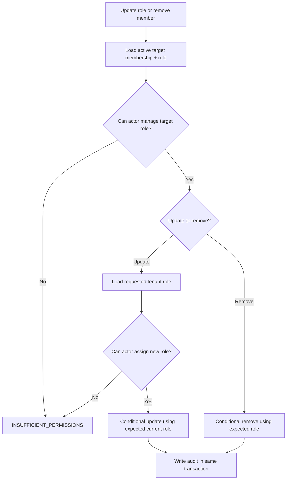

# Members, roles, and permissions

A membership links a user, organization, tenant role, and dedicated `user` actor. Roles are either references to seeded system roles or fully owned custom roles. The exact table constraints are in [the organization database catalog](../../database/auth-organization.md).

## Effective role model

| Role shape    | Key/metadata/permissions source | Tenant cardinality                                        |
| ------------- | ------------------------------- | --------------------------------------------------------- |
| System-backed | Global `auth.system_role`       | At most one instance of each system role per organization |
| Custom        | `auth.organization_role` itself | Unique custom key per organization                        |

Built-in keys `owner`, `admin`, and `member` cannot be claimed by custom roles. Effective authorization evaluates permissions, not display names.

## Management hierarchy

`canManageOrganizationRole` and `canAssignOrganizationRole` compare effective permission sets. A management actor may affect only roles whose permissions are a strict subset of its own authority. This prevents an admin from managing an equal or more privileged actor even if a route-level permission exists.

The expected-current-role argument is an optimistic concurrency guard. If another request changes the target between authorization and mutation, the update fails rather than applying a decision made against stale privilege.

Browser authorization reloads the active membership and effective role for every
request; a session cookie does not retain the permissions from login. The
`organization/access-changes.test.ts` HTTP regression downgrades an authenticated
admin without replacing their session. Member reads remain available, while
registration options, workspace updates, invitations, role changes and removals
return `Forbidden` without extra organization audit events. Removing that member
then rejects session, wallet, session-key, execution, member, billing and inbox
reads with `Unauthorized`; the owner's session remains valid. This verifies
subsequent requests, not a mutation already in flight during the role change or
the dashboard's cache invalidation behavior.

## Operations

| Operation             | Required properties                                                             |
| --------------------- | ------------------------------------------------------------------------------- |
| List members          | Active organization and member-read permission at the route.                    |
| List roles            | Active organization and role-read permission.                                   |
| List assignable roles | Filters the tenant role list through `canAssignOrganizationRole`.               |
| Update role           | Manage current target role, assign requested role, conditional mutation, audit. |
| Remove member         | Manage target role, conditional removal timestamp, audit.                       |

Owner cannot be assigned through ordinary invitation/member flows. Organization
ownership transfer has no public workflow.

## Audit and observability

- Actor/member creation writes `member.created`.
- A changed role writes `member.role_updated` with prior and new role IDs.
- Removal writes `member.removed` with user and role context.
- Metrics count bounded lifecycle outcomes; logs contain no full permission arrays or profile data.

## Adding a permission

1. Add the protocol permission literal and update intended system-role definitions.
2. Identify every API endpoint/use case it protects.
3. Update middleware/route enforcement and authorization tests.
4. Reassess strict-subset management behavior: the new permission can alter which roles dominate others.
5. Add audit events for newly enabled mutations.
6. Document the endpoint matrix before release.
