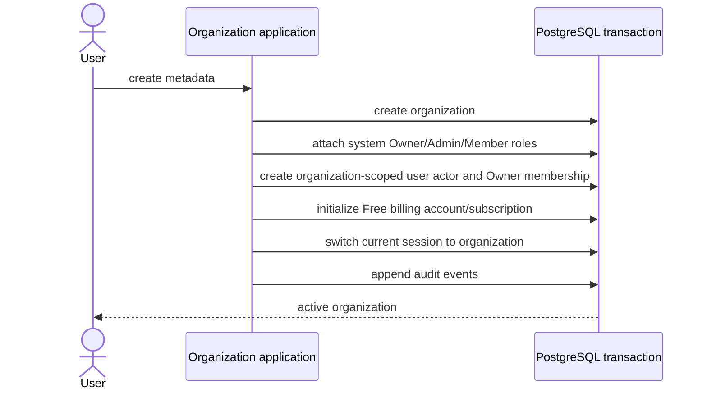
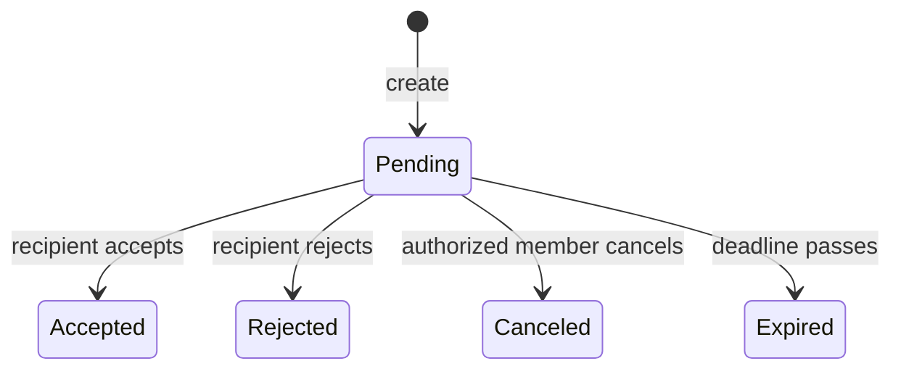

# Organizations, members, roles, and invitations

An organization is the tenant, billing, authorization, and wallet ownership
boundary. A new user receives a Personal organization; users may create and
switch to additional organizations.

## Tables

### `auth.organization`

Stores ID, required metadata, creator user, and timestamps. The creator index
supports user-owned organization lookup. Plan state is not stored here.

### `auth.system_role` and `auth.organization_role`

System roles define code-owned Owner, Admin, and Member metadata and permission
sets. An organization role is either:

- a system-role reference with no custom key/permissions; or
- a custom role with a unique organization key and owned permissions.

Checks enforce the shape and prevent custom roles from claiming reserved system
keys. Partial unique indexes allow one instance of a system role or custom key
per organization.

### `auth.organization_member`

Links organization, user, user actor, and organization role. Composite foreign
keys require the actor and role to belong to the same organization. A partial
unique index permits one active membership per organization/user; `removed_at`
retains history.

### `auth.invitation`

Stores normalized recipient email, organization-scoped role, inviter, status,
expiry, and timestamps. A partial unique index permits one pending invitation
per organization/email. Composite role ownership prevents cross-organization
assignment. Status/email, organization/status, role, and expiry indexes support
management and recipient views.

## Organization creation

Every organization begins with one Owner. Generic member and invitation
operations cannot assign, update, or remove that Owner. Ownership transfer is a
separate future workflow.

## Member hierarchy

Management is permission-set based rather than name based. An actor can manage
or assign a role only when its effective permissions are a strict subset of the
actor's own permissions. The mutation compares the expected current role during
the conditional update, preventing a concurrent role change from bypassing the
decision.

## Invitation lifecycle

Creation locks the billing account and counts active members plus live pending
invitations against member capacity. Concurrent requests for the final seat
allow only one insert. Duplicate pending requests converge on the existing row.

The creation transaction also writes audit history, an in-app occurrence for an
existing user, and a preference-aware email job. Acceptance verifies the signed-
in email, creates the actor/member, and switches the current session to the new
organization in one transaction. Terminal transitions expire the actionable
notification and cancel a pending invitation email.

## Routes and permissions

Organization create/list/get/update/switch, member list/role update/removal,
role/assignable-role lists, and invitation get/list/create/accept/reject/cancel
are exposed under `/auth/organization`, `/auth/member`, and `/auth/invitation`.
Organization management routes use typed permissions such as
`organization:update`, `member:read`, `member:update`, `member:remove`,
`role:read`, and invitation lifecycle permissions. Recipient accept/reject is
email-bound rather than organization-member authorized.

## Pending

- Add custom-role create/update/delete workflows, routes, audit, and UI.
- Add explicit ownership transfer if ownership must change.
- Add invitation expiry cleanup when retention processing is introduced.
- Organization deletion remains intentionally unsupported.
