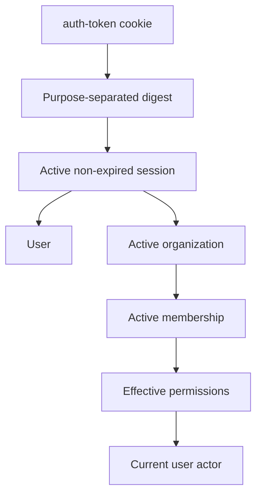

# Browser sessions

Browser sessions authorize user actors. The raw opaque token is held in the
`auth-token` cookie; PostgreSQL stores only its digest.

## Table: `auth.session`

| Field                      | Purpose                                          |
| -------------------------- | ------------------------------------------------ |
| `id`, `user_id`            | Session identity and owner.                      |
| `token_hash`               | Unique credential digest.                        |
| `active_organization_id`   | Current tenant, nullable when none is available. |
| `ip_address`, `user_agent` | Optional security context.                       |
| `expires_at`, `revoked_at` | Active lifecycle.                                |
| timestamps                 | Creation and update.                             |

Indexes support user/expiry cleanup, active-session listing, active organization
resolution, and token lookup. Revocation retains the row for security history.

## Authorization

If the session is expired/revoked or active membership no longer exists,
authorization rejects it and the server expires the stale cookie.

## Operations

| Route                                             | Behavior                                                      |
| ------------------------------------------------- | ------------------------------------------------------------- |
| `GET /auth/session/me`                            | Current actor, user, organization, member, role, and session. |
| `GET /auth/session/sessions`                      | Active sessions owned by the current user.                    |
| `DELETE /auth/session/sessions/logout`            | Revoke current session and clear cookie.                      |
| `DELETE /auth/session/sessions/:sessionId`        | Revoke one user-owned session.                                |
| `POST /auth/session/sessions/revoke`              | Revoke all other active sessions.                             |
| `POST /auth/organization/set-active-organization` | Switch only to an organization with active membership.        |

Conditional updates make repeated revocation and same-organization selection
no-ops. Only the first lifecycle change produces audit and telemetry.

## Pending

- Add cleanup for expired and long-revoked sessions.
