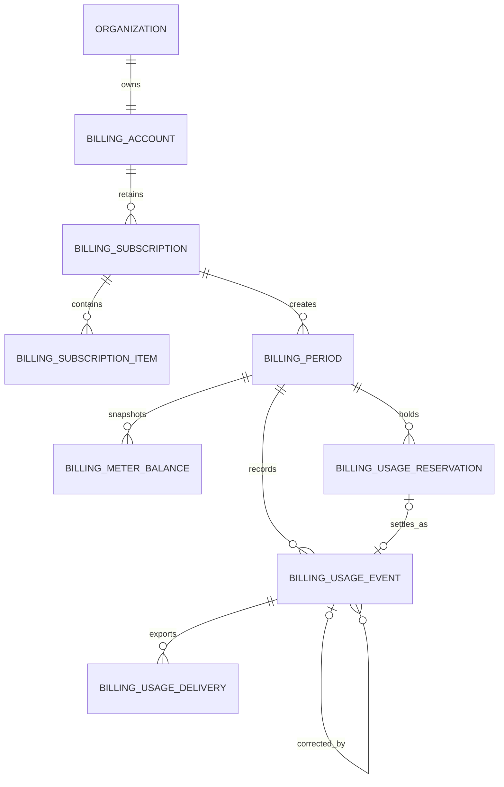

# Billing and entitlements

Billing is organization-scoped. Namera owns product access, quota decisions,
usage evidence, and plan definitions. A payment provider owns payment methods,
invoices, tax, collection, and the provider-side subscription representation.

This document describes the target billing persistence foundation. The protocol
schemas, Drizzle tables, relations, constraints, and migration exist. The
existing application quota workflows still use their derived domain-row usage
model until the repositories and transactional metering workflows are wired.

## Design principles

1. Plan and meter definitions are versioned code-owned registries. They are not
   editable database rows.
2. The database stores selected plan versions, period snapshots, balances,
   immutable usage evidence, and provider synchronization state.
3. A meter is a row dimension, not a table column. Adding a new code-supported
   meter does not require adding `*_used` or `*_reserved` columns.
4. Product authorization never depends on a live Stripe request.
5. Every quota-sensitive operation reserves capacity before external work and
   settles or releases that reservation afterward.
6. Provider delivery is asynchronous and idempotent. Stripe calls do not occur
   inside product transactions.
7. Monetary measurements use integer micro-USD. Floating-point currency values
   are never persisted.

## Code-owned registries

### Plans

The plan catalog maps `(plan, planVersion)` to commercial and entitlement
configuration. The stable plan keys are `free`, `pro`, and `business`. A version
change creates a new immutable definition; historical periods continue to
reference the version under which their usage occurred.

A plan definition is expected to describe:

- recurring base price;
- included and overage-priced software wallets;
- included and overage-priced HSM wallets;
- included and overage-priced mainnet executions;
- a generous hard-capped testnet execution allowance;
- included and overage-priced signatures;
- included gas sponsorship measured in micro-USD;
- whether a meter has a hard product limit or allows paid overage.

### Subscription component keys

Subscription components identify independently priced provider subscription
items:

| Key                 | Intended billing behavior                  |
| ------------------- | ------------------------------------------ |
| `plan.base`         | Licensed base-plan recurring price.        |
| `wallet.software`   | Licensed software-wallet overage quantity. |
| `wallet.hsm`        | Licensed HSM-wallet overage quantity.      |
| `execution.mainnet` | Metered mainnet execution overage.         |
| `signature`         | Metered signature overage.                 |
| `gas-sponsorship`   | Metered sponsored-gas cost overage.        |

Free subscriptions need no provider item rows. Paid subscriptions create only
the components enabled by the selected plan and provider price mapping.

### Meter keys and units

| Meter key           | Unit        | Meaning                                               |
| ------------------- | ----------- | ----------------------------------------------------- |
| `execution.mainnet` | `operation` | Confirmed or otherwise billable mainnet executions.   |
| `execution.testnet` | `operation` | Product-metered testnet executions.                   |
| `signature`         | `operation` | Successful wallet signature operations.               |
| `gas-sponsorship`   | `micro-usd` | Namera-paid sponsored gas at the recorded cost basis. |

The registry owns the valid unit, version, measurement decoder, included
allowance, hard limit, overage behavior, and provider destination for each
meter. Database `text` columns retain forward-compatible historical keys while
protocol schemas constrain current application writes.

## Table mental model

| Table                       | Responsibility                                            |
| --------------------------- | --------------------------------------------------------- |
| `billing.account`           | Organization billing identity and provider customer link. |
| `billing.subscription`      | Plan selection and subscription lifecycle history.        |
| `billing.subscription_item` | Billable-component mapping to provider prices/items.      |
| `billing.period`            | Time window and plan-version snapshot for usage.          |
| `billing.meter_balance`     | Fast consumed/reserved totals for one period and meter.   |
| `billing.usage_reservation` | Temporary capacity held while an operation is in flight.  |
| `billing.usage_event`       | Append-only invoice-grade debit/credit usage evidence.    |
| `billing.usage_delivery`    | Retryable outbound delivery of usage to a provider.       |
| `billing.provider_event`    | Idempotent inbound payment-provider webhook inbox.        |

Complete columns, keys, foreign keys, checks, and indexes are in the
[billing database catalog](../database/billing.md).

## Relationships



`provider_event` is deliberately detached from a local organization. A verified
provider event can arrive before customer or subscription resolution succeeds,
so the inbox first records the event and the worker resolves its target later.

## Subscription and period lifecycle

Organization creation currently inserts a providerless billing account and an
active Free subscription in the same transaction. Under the new metering
workflow, every active subscription—including Free—also receives an open
billing period. The period snapshots the selected plan and version so a later
catalog change cannot rewrite historical entitlement meaning.

At rollover:

1. lock `billing.account` for the organization;
2. close the current period;
3. create the next period with the effective plan/version;
4. create one `meter_balance` row for every enabled meter;
5. initialize included allowance and hard-limit snapshots from the registry;
6. commit all changes atomically.

Only one open period and one current subscription can exist for an organization.

## Usage authorization lifecycle

```mermaid
sequenceDiagram
  participant Product as Product workflow
  participant Tx as SQL transaction
  participant Account as billing.account
  participant Balance as billing.meter_balance
  participant Reservation as billing.usage_reservation
  participant Provider as External execution/signing provider
  participant Event as billing.usage_event
  participant Delivery as billing.usage_delivery

  Product->>Tx: begin authorization
  Tx->>Account: lock organization billing account
  Tx->>Balance: load period and meter balance
  alt hard limit has capacity
    Tx->>Balance: increment reserved_amount
    Tx->>Reservation: insert active reservation
    Tx-->>Product: commit
  else hard limit exceeded
    Tx-->>Product: reject and roll back
  end

  Product->>Provider: perform external work

  alt operation becomes billable
    Product->>Tx: begin settlement
    Tx->>Reservation: lock active reservation
    Tx->>Balance: reserved -= amount; consumed += amount
    Tx->>Event: append debit event
    Tx->>Reservation: mark settled
    Tx->>Delivery: enqueue if provider reporting is required
    Tx-->>Product: commit
  else operation is definitively not billable
    Product->>Tx: begin release
    Tx->>Reservation: mark released
    Tx->>Balance: decrement reserved_amount
    Tx-->>Product: commit
  end
```

Expired reservations are released by a recovery worker. Reservation source
identity is generic (`sourceType`, `sourceId`) so executions, signatures, future
provider costs, and manual adjustments use one mechanism without nullable
foreign-key growth. Application code must create the domain operation and its
reservation within the same transaction.

## Immutable usage and corrections

`usage_event` is the auditable ledger. A debit records billable usage. Existing
rows are never edited or deleted to correct quantity. A correction appends a
credit event whose `reversesUsageEventId` points at the original debit.

Each event records organization, period, meter/version/unit, positive quantity
and direction, domain source identity, an optional reservation, a permanent
idempotency key, versioned measurement evidence, and occurrence/persistence
times. Gas evidence may include provider charge ID, chain ID, original currency
amount, FX quote ID, and normalized micro-USD amount. Secrets, raw provider
responses, transaction payloads, and signed message contents do not belong in
billing evidence.

`meter_balance` is a transactionally maintained projection for fast admission
checks. It is not the historical evidence source. Reconciliation recomputes
consumed totals from debit minus credit events and compares them with the
projection.

## Provider synchronization

### Outbound usage

When an event maps to a metered provider component, settlement inserts a
`usage_delivery` row in the same transaction. A worker claims pending/retrying
rows, reports usage with the stored idempotency key, and marks the row delivered.
Transient failures schedule `nextAttemptAt`; terminal failures remain queryable.

One event may have multiple delivery destinations during provider migrations.
The unique event, provider, and destination tuple prevents duplicate work items.

### Inbound webhooks

The server verifies the provider signature against the raw request body and
inserts `provider_event` before acknowledging receipt. The unique provider event
ID makes retries safe. A worker interprets the event and updates account,
subscription, and item state. Checkout redirects never grant product access.

## Commercial mapping

- Base price is `subscription_item(plan.base, licensed)`.
- Software/HSM wallet overage is represented by licensed quantities. Changing a
  recurring quantity must be explicit; wallet creation must not silently raise
  a bill.
- Execution and signature overage is derived from immutable events beyond the
  included allowance and delivered through the matching metered component.
- Gas sponsorship is measured in micro-USD; the included amount is snapshotted
  on the period balance.
- Testnet execution is a separate generous hard-capped meter so it does not
  contaminate paid mainnet usage or permit unbounded abuse.

## Current implementation boundary

Implemented:

- branded IDs and Effect persistence schemas for all billing tables;
- code-owned component, meter, unit, and source discriminators;
- Drizzle tables, tenant-safe relations, checks, indexes, and migration;
- test-database reset ordering;
- existing Free account/subscription initialization and derived quota reads.

Not yet wired:

- period initialization and rollover;
- meter-balance repositories and transactional reserve/settle/release service;
- immutable event creation and reconciliation;
- provider delivery worker;
- Stripe customer, Checkout, portal, price mapping, and webhook processing;
- billing audit events, metrics, operational alerts, and dashboard UI.

## Pending before production

- Implement repositories for periods, balances, reservations, events,
  deliveries, subscription items, and provider events.
- Replace derived execution/signature counters with transactional metering while
  retaining domain-row reconciliation queries.
- Define the production catalog, price mappings, overage rounding, proration,
  trial, grace-period, delinquency, and cancellation semantics.
- Implement reservation expiry and ledger-to-balance reconciliation workers.
- Implement Stripe, verified raw-body webhook processing, Checkout/portal, and
  subscription reconciliation.
- Define gas cost ingestion and currency conversion evidence for every sponsor.
- Add audit events, bounded metrics, alerts, and boundary tests for concurrency,
  idempotency, correction, rollover, webhook replay, and delivery retries.
