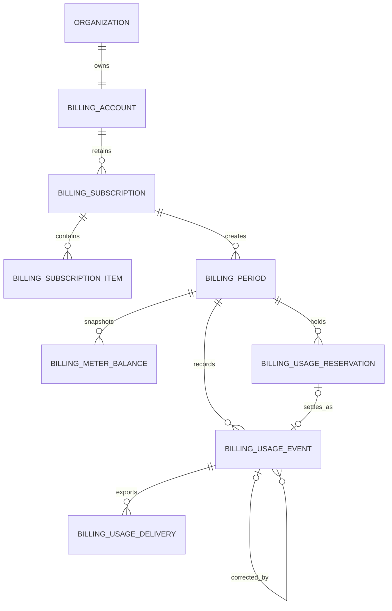

# Billing and entitlements

Billing is organization-scoped. Namera owns product access, quota decisions,
usage evidence, and plan definitions. A payment provider owns payment methods,
invoices, tax, collection, and the provider-side subscription representation.

This document describes the implemented Free v1 billing system. Protocol
contracts, normalized persistence, anniversary periods, transactional metering,
EVM sponsorship measurement, operation integration, recovery, reconciliation,
the read API, metrics, and boundary tests are active. Stripe-facing delivery
tables remain dormant until paid plans are introduced.

## Design principles

1. Plan and meter definitions are versioned code-owned registries. They are not
   editable database rows.
2. The database stores selected plan versions, period snapshots, balances,
   immutable usage evidence, and provider synchronization state.
3. A meter is a row dimension, not a table column. Adding a new code-supported
   meter does not require adding `*_used` or `*_reserved` columns.
4. Product authorization never depends on a live Stripe request.
5. Every quota-sensitive operation reserves capacity before external work and
   settles or releases that reservation afterward.
6. Provider delivery is asynchronous and idempotent. Stripe calls do not occur
   inside product transactions.
7. Monetary measurements use integer micro-USD. Floating-point currency values
   are never persisted.

## Code-owned registries

### Plans

The plan catalog maps `(plan, planVersion)` to commercial and entitlement
configuration. Only `free@1` is currently assignable. The protocol reserves the
reserved `pro` and `business` keys, but they are intentionally absent from the
assignable application registry until paid-plan workflows exist. A version
change creates a new immutable definition; historical periods continue to
reference the version under which their usage occurred.

A plan definition is expected to describe:

- recurring base price;
- included and overage-priced software wallets;
- included and overage-priced HSM wallets;
- non-billable local-wallet entitlement;
- included and overage-priced mainnet executions;
- a generous hard-capped testnet execution allowance;
- included and overage-priced signatures;
- included gas sponsorship measured in micro-USD;
- whether a meter has a hard product limit or allows paid overage.

### Free v1

Free v1 uses a one-month organization-anniversary period. All included amounts
are also hard limits because Free has no overage path.

| Resource or meter    | Included | Hard limit | Unit      |
| -------------------- | -------: | ---------: | --------- |
| Organization members |        5 |          5 | resource  |
| Software wallets     |        5 |          5 | resource  |
| HSM wallets          |        0 |          0 | resource  |
| User-owned wallets   |       50 |         50 | resource  |
| Mainnet executions   |      100 |        100 | operation |
| Testnet executions   |    1,000 |      1,000 | operation |
| Signatures           |   10,000 |     10,000 | operation |
| Sponsored gas        |    $3.00 |      $3.00 | micro-USD |

The gas meter stores `$3.00` as `3,000,000` micro-USD. Meter versions and units
are part of the registry and are snapshotted into each period balance.

Software/HSM entitlements remain in the internal model for managed
custody. The beta API rejects managed wallet creation, and the dashboard does
not advertise those entitlements. Its plan and usage cards show members,
user-owned accounts, and all four operation/gas meters from the billing response.
Resource counts do not reset with the anniversary period; operation meters do.

### Subscription component keys

Subscription components identify independently priced provider subscription
items:

| Key                 | Intended billing behavior                  |
| ------------------- | ------------------------------------------ |
| `plan.base`         | Licensed base-plan recurring price.        |
| `wallet.software`   | Licensed software-wallet overage quantity. |
| `wallet.hsm`        | Licensed HSM-wallet overage quantity.      |
| `execution.mainnet` | Metered mainnet execution overage.         |
| `signature`         | Metered signature overage.                 |
| `gas-sponsorship`   | Metered sponsored-gas cost overage.        |

Free subscriptions need no provider item rows. Paid subscriptions create only
the components enabled by the selected plan and provider price mapping.

### Meter keys and units

| Meter key           | Unit        | Meaning                                               |
| ------------------- | ----------- | ----------------------------------------------------- |
| `execution.mainnet` | `operation` | Confirmed or otherwise billable mainnet executions.   |
| `execution.testnet` | `operation` | Product-metered testnet executions.                   |
| `signature`         | `operation` | Successful wallet signature operations.               |
| `gas-sponsorship`   | `micro-usd` | Namera-paid sponsored gas at the recorded cost basis. |

The registry owns the valid unit, version, measurement decoder, included
allowance, hard limit, overage behavior, and provider destination for each
meter. Database `text` columns retain forward-compatible historical keys while
protocol schemas constrain current application writes.

## Table mental model

| Table                       | Responsibility                                            |
| --------------------------- | --------------------------------------------------------- |
| `billing.account`           | Organization billing identity and provider customer link. |
| `billing.subscription`      | Plan selection and subscription lifecycle history.        |
| `billing.subscription_item` | Billable-component mapping to provider prices/items.      |
| `billing.period`            | Time window and plan-version snapshot for usage.          |
| `billing.meter_balance`     | Fast consumed/reserved totals for one period and meter.   |
| `billing.usage_reservation` | Temporary capacity held while an operation is in flight.  |
| `billing.usage_event`       | Append-only invoice-grade debit/credit usage evidence.    |
| `billing.usage_delivery`    | Retryable outbound delivery of usage to a provider.       |
| `billing.provider_event`    | Idempotent inbound payment-provider webhook inbox.        |

Complete columns, keys, foreign keys, checks, and indexes are in the
[billing database catalog](../database/billing.md).

## Relationships



`provider_event` is deliberately detached from a local organization. A verified
provider event can arrive before customer or subscription resolution succeeds,
so the inbox first records the event and the worker resolves its target later.

## Subscription and period lifecycle

Organization creation inserts a providerless billing account, an active Free
subscription, its first open period, and one balance for each Free meter in the
same transaction as the organization and owner membership. The first period
starts at the organization's exact `createdAt` instant and ends one calendar
month later. It does not align to a UTC calendar-month boundary. The period
snapshots the selected plan and version so a later catalog change cannot
rewrite historical entitlement meaning.

At rollover:

1. lock `billing.account` for the organization;
2. close the current period;
3. create the next period with the effective plan/version;
4. create one `meter_balance` row for every enabled meter;
5. initialize included allowance and hard-limit snapshots from the registry;
6. commit all changes atomically.

Only one open period and one current subscription can exist for an organization.
Rollover is lazy on any metered admission or billing read and is also swept by
the billing worker. Boundaries are always calculated from the original first
period start (`anchor + N months`), not by repeatedly adding one month to the
previous end. This preserves a January 31 anniversary after February instead of
permanently drifting it to the 28th. A single account row lock serializes
rollover and admission for one organization.

Rollover does not move outstanding reservations to the new period. Settlement
and release address the reservation's original period, including after it closes.
The operation-rollover integration test prepares mainnet/testnet executions and
signatures before the anniversary, completes one of each afterward, and expires
the abandoned preparations through their workers. It checks all four old-period
balances against the ledger and active holds, with zero usage or reservations in
the new period. Chain execution is substituted; application, WebAuthn approval,
database transactions and billing workers are real.

## Usage authorization lifecycle

```mermaid
sequenceDiagram
  participant Product as Product workflow
  participant Tx as SQL transaction
  participant Account as billing.account
  participant Balance as billing.meter_balance
  participant Reservation as billing.usage_reservation
  participant Provider as External execution/signing provider
  participant Event as billing.usage_event
  participant Delivery as billing.usage_delivery

  Product->>Tx: begin authorization
  Tx->>Account: lock organization billing account
  Tx->>Balance: load period and meter balance
  alt hard limit has capacity
    Tx->>Reservation: insert active reservation
    Tx->>Balance: atomically increment reserved_amount if consumed + reserved + requested <= hard limit
    Tx-->>Product: commit
  else hard limit exceeded
    Tx-->>Product: reject and roll back
  end

  Product->>Provider: perform external work

  alt operation becomes billable
    Product->>Tx: begin settlement
    Tx->>Reservation: lock active reservation
    Tx->>Balance: reserved -= amount; consumed += amount
    Tx->>Event: append debit event
    Tx->>Reservation: mark settled
    Tx->>Delivery: enqueue if provider reporting is required
    Tx-->>Product: commit
  else operation is definitively not billable
    Product->>Tx: begin release
    Tx->>Reservation: mark released
    Tx->>Balance: decrement reserved_amount
    Tx-->>Product: commit
  end
```

Expired reservations are released by a recovery worker. Reservation source
identity is generic (`sourceType`, `sourceId`) so executions, signatures, future
provider costs, and manual adjustments use one mechanism without nullable
foreign-key growth. Application code must create the domain operation and its
reservation within the same transaction.

Reservation and settlement identities are retry-safe:

- `(period, meter, sourceType, sourceId)` uniquely identifies admission;
- replaying an identical reservation returns the existing row without changing
  the balance;
- a conflicting amount or source shape is rejected as an invariant violation;
- `billing:settle:<reservationId>` uniquely identifies the ledger debit;
- settlement locks the reservation, subtracts its full pessimistic hold, adds
  the measured amount, appends the debit, and marks the reservation settled in
  one transaction;
- release locks the same row and returns capacity only while it is active.

## Operation measurements

### Executions

The EVM package classifies each supported chain as mainnet or testnet and owns
the execution billing envelope. Every accepted submission reserves one unit on
`execution.mainnet` or `execution.testnet`. Confirmation settles one unit;
signing or definitive pre-inclusion failure releases it. A reverted included
operation releases the execution unit because Free v1 counts successful
executions, but still settles sponsored gas from the provider's confirmed cost.

Testnet operations never reserve sponsored-gas allowance. A mainnet operation
only does so when the caller enables Alchemy Bundler Sponsored Operations (BSO).
The signed execution persists that explicit sponsorship mode; BSO receipts do
not need to contain a paymaster address. The EVM adapter fetches ETH/USD from
Alchemy, converts it
conservatively to integer micro-USD, applies Alchemy's 8% mainnet sponsorship
administration fee, and reserves the pessimistic maximum UserOperation gas
envelope from the regular pre-BSO simulation estimate. BSO zeroes the account's
gas fees, so `receipt.actualGasCost` can be zero despite an Alchemy charge.
Confirmation settles execution usage immediately and makes the active gas hold
eligible for asynchronous reconciliation. The EVM adapter queries Alchemy's
[Get Sponsorships API](https://www.alchemy.com/docs/wallets/api-reference/gas-manager-admin-api/admin-api-endpoints/get-sponsorships)
under the configured BSO policy. Only a `MINED` record matching the confirmed
chain, UserOperation hash, transaction hash and sender can settle the hold.
`confirmedTotalUsd` is converted through decimal arithmetic and rounded upward
to integer micro-USD. No additional 8% surcharge or estimated ETH conversion is
applied to that provider total. If pricing is unavailable, sponsored mainnet
preparation fails closed before signing or submission.

Execution sponsorship defaults to enabled. An explicit `sponsor: false`
mainnet request still reserves and settles one `execution.mainnet` unit but
submits through regular Rundler without the BSO policy header and never creates
a `gas-sponsorship` reservation.

### Signatures

Creating a durable reserved signature operation and reserving one `signature`
unit share a transaction. Successful signing settles the unit in the same
transaction as the operation success and audit row. A definitive signer failure
releases it. Verification is read-only and never consumes billing usage.

### Resource limits

Members (including pending invitations), managed software wallets, managed HSM
wallets, and user-owned wallets are current-resource entitlements rather than
period meters. Local wallets have a Free v1 cap of 50 but are not billable and
have no overage component. Their workflows use the stored plan version and
organization billing lock. Managed provider work may happen before persistence,
but the custody-specific locked capacity check is repeated in the final
transaction.

## Immutable usage and corrections

`usage_event` is the auditable ledger. A debit records billable usage. Existing
rows are never edited or deleted to correct quantity. A correction appends a
credit event whose `reversesUsageEventId` points at the original debit.

Each event records organization, period, meter/version/unit, positive quantity
and direction, domain source identity, an optional reservation, a permanent
idempotency key, versioned measurement evidence, and occurrence/persistence
times. Gas evidence may include provider charge ID, chain ID, original currency
amount, FX quote ID, and normalized micro-USD amount. Secrets, raw provider
responses, transaction payloads, and signed message contents do not belong in
billing evidence.

`meter_balance` is a transactionally maintained projection for fast admission
checks. It is not the historical evidence source. Reconciliation recomputes
consumed totals from debit minus credit events and compares them with the
projection.

## Recovery and reconciliation

The server runs a scoped billing worker every minute after migrations. Each run:

1. advances expired open anniversary periods in bounded batches;
2. claims up to 20 due sponsored-gas holds with `FOR UPDATE SKIP LOCKED`, defers
   them by five minutes, commits, then looks up provider costs outside database
   transactions with concurrency two;
3. claims other expired active reservations with `FOR UPDATE SKIP LOCKED`;
4. settles terminal successful execution/signature sources, releases terminal
   failures and manual sources, and defers operations still in flight or whose
   execution/signature source cannot be locked;
5. locks each open meter balance and recomputes consumed usage from immutable
   events plus reserved usage from active reservations;
6. repairs a divergent projection only when the reconstructed totals remain
   within the snapshotted hard limit.

Execution receipt reconciliation remains the authority for uncertain onchain
state. Billing recovery will not guess gas cost for an active submission.
Included failures remain reserved until a bound receipt and matching provider
cost are available; rejected pre-inclusion work can be released. Session
operations and successful executions reuse persisted receipt evidence; failed
executions re-read and validate the chain receipt. Generic expiry recovery never
releases these gas holds, including across period rollover. Settlement uses the
existing reservation lock and unique ledger identity, atomically recording the
provider total and transaction identities while releasing unused capacity.
No separate audit event is added: the immutable usage event is billing evidence.

The server-only `ALCHEMY_ACCESS_TOKEN` must have management access to the
configured policy. Missing credentials, missing/pending costs, malformed
responses and lookup failures retain the hold for retry. A reported zero total
releases it; a total above the authorized hold stays reserved and emits
`billing.sponsorship_cost_exceeds_reservation` for investigation rather than
overcharging or discarding the cost. Lookups have a 30-second deadline and a
20-page/2,000-record scan bound. Repeated cursors or exhausted scans fail closed.
Keep policy access unchanged until pending holds settle; policy rotation and
costs outside the scan window currently require operator follow-up. Existing
released reservations are not retroactively charged by this worker.

Expiry recovery already owns reservation locks, whereas execution settlement
owns its submission lock first. Recovery therefore uses `SKIP LOCKED` for the
source lookup and defers busy or missing submissions without releasing quota.
A PostgreSQL regression holds that source lock in another transaction and
verifies recovery finishes with both holds active; subsequent execution recovery
then confirms and settles both holds. Age alone never establishes non-inclusion.

The worker is safe across replicas because claims skip locked rows and all
terminal transitions are idempotent. Logs contain only aggregate counts;
metrics use bounded meter, source, and outcome attributes.

## Billing API

Authenticated `GET /billing` returns the selected plan/version and status, the
current anniversary period, current resource entitlement usage, and every
period meter's included, hard-limit, consumed, reserved, and remaining amounts.
Big integer quantities are encoded as decimal strings on HTTP and decoded by
the typed client. The route requires billing read permission and never contacts
a payment or pricing provider.

## Provider integration boundary

The schema and repositories include `provider_event`, `usage_delivery`, and
subscription items. The running product uses the Free plan and internal usage
ledger. It does not run a provider delivery worker, verify payment webhooks, or
expose Stripe Checkout/customer portal flows. These persistence capabilities do
not grant paid entitlements. Alchemy BSO cost reconciliation is active and is
separate from payment-provider synchronization.

## Current implementation boundary

- branded IDs and Effect persistence schemas for all billing tables;
- code-owned component, meter, unit, and source discriminators;
- Drizzle tables, tenant-safe relations, checks, indexes, and migration;
- test-database reset ordering;
- a code-owned, Free-only v1 plan and meter registry;
- transaction-aware repositories for every billing table;
- atomic Free account, subscription, anniversary-period, and meter-balance
  initialization during organization creation;
- locked, idempotent reserve/settle/release workflows with hard-limit admission;
- anchor-preserving lazy and scheduled anniversary rollover;
- execution, signature, and sponsored-gas integration;
- EVM-owned chain classification, Alchemy price quotes, pessimistic gas holds,
  and provider-confirmed BSO cost settlement;
- expired-reservation recovery and ledger-to-projection reconciliation worker;
- normalized authenticated `GET /billing` response;
- bounded billing metrics and server/EVM tests for lifecycle, limit, rollover,
  recovery, repair, chain classification, and monetary rounding.
- BSO regressions cover zero-cost receipts, delayed/excessive provider totals,
  included failures, duplicate reconciliation, decimal rounding, identity
  matching, pagination bounds and provider errors. PostgreSQL tests also cover
  competing billing workers, source-lock recovery and period rollover.
- pricing calculator and generated margin report that separate execution
  infrastructure, signing, sponsored gas, provider allowances, and overage
  contribution margins;
- permission-aware dashboard billing page with the current Free plan,
  anniversary date, resource capacity, and settled/reserved meter usage.
- opt-in PostgreSQL tests for concurrent admission on all four Free meters,
  duplicate reservation/settlement, release after settlement, and anniversary
  rollover. These use the production driver and migrations, not PGlite locks.
- wallet-cap PostgreSQL tests cover both retrying one ceremony and five
  independent users with real verified P-256 registration attestations. At
  49 occupied slots, exactly one new wallet and its audit pair are committed;
  unsuccessful admissions return the local-wallet limit error.

Deliberately inactive until paid plans:

- provider delivery worker;
- Stripe customer, Checkout, portal, price mapping, and webhook processing.
