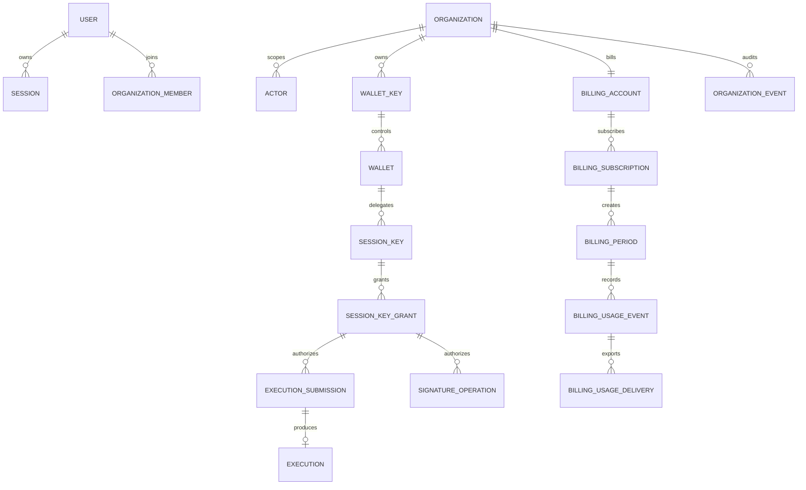

# Database catalog

This directory is the canonical catalog for Namera's PostgreSQL data model. Feature documents explain behavior and link here; they do not redefine shared tables. This distinction matters for tables such as `auth.verification`, which is a reusable verification-credential store and not a magic-link-specific table.

## Schemas

Platform membership, team invitations and their audit events are documented in
[platform administration](auth-platform.md).

| Schema         | Responsibility                                                                        | Catalog                                                                                      |
| -------------- | ------------------------------------------------------------------------------------- | -------------------------------------------------------------------------------------------- |
| `auth`         | Identities, browser sessions, organizations, actors, API keys, invitations, and OAuth | [Core identity](auth-core.md), [organizations](auth-organization.md), [OAuth](auth-oauth.md) |
| `core`         | Wallets, wallet keys, session-key authority, policy state, executions, and signatures | [Wallets and operations](core-wallets-operations.md)                                         |
| `billing`      | Billing identity, subscriptions, metering ledger, and provider synchronization        | [Billing](billing.md)                                                                        |
| `notification` | Durable user-visible notification facts, recipients, and preferences                  | [Notifications and jobs](notifications-jobs.md)                                              |
| `jobs`         | Leased asynchronous work, currently email delivery                                    | [Notifications and jobs](notifications-jobs.md)                                              |
| `audit`        | Append-oriented user and organization security history                                | [Audit](audit.md)                                                                            |

## Shared conventions

- Identifiers are text UUIDv7 values generated by `generateUniqueId`; protocol-branded ID types prevent cross-entity confusion in TypeScript.
- Timestamps use `timestamptz`. Tables using the shared `timestamps` fragment have required `created_at` and `updated_at` columns defaulting to `now()`; Drizzle updates `updated_at` on application writes.
- JSONB columns are typed by protocol encoded models. They contain discriminated domain data, not arbitrary extension bags unless explicitly described as metadata.
- Organization-owned references commonly use composite foreign keys containing `organization_id`. These make cross-tenant references invalid at the database boundary.
- Revocation and removal are normally represented by timestamps and statuses rather than destructive deletion.
- Partial unique indexes encode active-only uniqueness, such as one pending invitation per email and organization.
- `restrict` is intentional for security and financial history. Cascade deletion is limited to genuinely dependent identity rows.

The executable source is [`packages/database/src/schema`](../../packages/database/src/schema). This catalog must change in the same commit as a schema change.

## Relationship overview

The diagram is deliberately an orientation map. Exact columns, optionality, composite keys, and lifecycle checks are documented in the domain catalogs.

## Migration rules

1. Change the Drizzle schema and protocol model together.
2. Generate a migration; do not hand-edit generated SQL unless the generator cannot express a required operation and the reason is documented.
3. Review every `ON DELETE`, partial predicate, unique constraint, and backfill.
4. Update the matching catalog page and feature flow.
5. Run database package checks and the repository check.

## Pending before production

- Establish backup restore drills and measured recovery objectives.
- Add production migration runbooks for expand/backfill/contract changes.
- Document data retention windows for audit, execution, OAuth, notification, and webhook records.
- Add schema drift detection in deployment CI.
