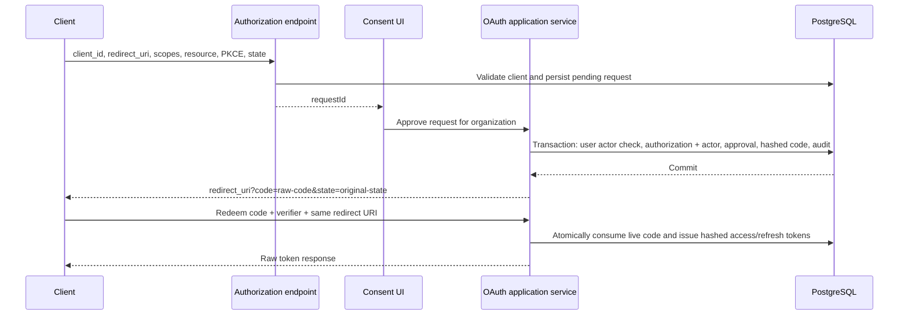
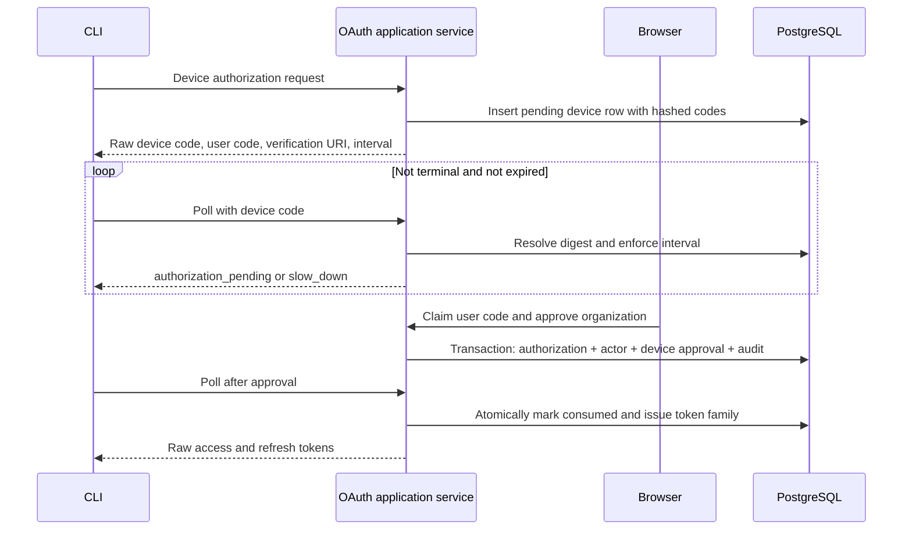

# OAuth tables

Namera persists OAuth authorization state as separate request, durable grant, one-time code/device challenge, and token records. This separation makes consent, revocation, refresh rotation, and security investigations explicit instead of overloading one mutable row.

Source: [`packages/database/src/schema/auth/oauth`](../../packages/database/src/schema/auth/oauth).

## `auth.oauth_client`

Registered OAuth client metadata used to validate redirect URIs and allowed grant/response types.

| Column                       | PostgreSQL type | Required | Default  | Description                                          |
| ---------------------------- | --------------- | -------- | -------- | ---------------------------------------------------- |
| `id`                         | `text`          | Yes      | UUIDv7   | Internal client-row identifier.                      |
| `client_id`                  | `text`          | Yes      | —        | Public OAuth client identifier.                      |
| `registration_type`          | `text`          | Yes      | —        | `metadata-document`, `pre-registered`, or `dynamic`. |
| `client_name`                | `text`          | Yes      | —        | Human-readable name shown on consent screens.        |
| `client_uri`                 | `text`          | No       | `NULL`   | Client homepage.                                     |
| `logo_uri`                   | `text`          | No       | `NULL`   | Client logo location.                                |
| `redirect_uris`              | `jsonb`         | Yes      | —        | Exact allowed redirect URI list.                     |
| `grant_types`                | `jsonb`         | Yes      | —        | Allowed OAuth grant types.                           |
| `response_types`             | `jsonb`         | Yes      | —        | Allowed response types.                              |
| `token_endpoint_auth_method` | `text`          | Yes      | —        | Public-client authentication mode; currently `none`. |
| `metadata`                   | `jsonb`         | Yes      | —        | Protocol-defined registration metadata.              |
| `status`                     | `text`          | Yes      | `active` | `active` or `disabled`.                              |
| `metadata_expires_at`        | `timestamptz`   | No       | `NULL`   | Revalidation deadline for fetched metadata.          |
| `created_at`                 | `timestamptz`   | Yes      | `now()`  | Creation time.                                       |
| `updated_at`                 | `timestamptz`   | Yes      | `now()`  | Last update time.                                    |

### Keys and uniqueness

- Primary key: `id`.
- Unique constraint on `client_id`.

### Foreign keys

- None.

### Checks

- Registration type is one of `metadata-document`, `pre-registered`, `dynamic`.
- Status is `active` or `disabled`.
- Token endpoint authentication method is `none`.

### Indexes

- Index on `status`.
- PostgreSQL indexes backing the primary key and unique `client_id`.

## `auth.oauth_authorization_request`

Short-lived consent transaction. It binds client, redirect URI, PKCE, resource, scopes, state, and the eventual user/organization decision.

| Column                  | PostgreSQL type | Required | Default   | Description                                         |
| ----------------------- | --------------- | -------- | --------- | --------------------------------------------------- |
| `id`                    | `text`          | Yes      | UUIDv7    | Request identifier used by the authorization UI.    |
| `client_id`             | `text`          | Yes      | —         | Requesting OAuth client.                            |
| `user_id`               | `text`          | No       | `NULL`    | Authenticated user after browser resolution.        |
| `organization_id`       | `text`          | No       | `NULL`    | Organization selected during consent.               |
| `redirect_uri`          | `text`          | Yes      | —         | Exact validated callback URI.                       |
| `response_type`         | `text`          | Yes      | —         | Currently `code`.                                   |
| `code_challenge`        | `text`          | Yes      | —         | PKCE challenge.                                     |
| `code_challenge_method` | `text`          | Yes      | —         | Currently `S256`.                                   |
| `resource`              | `text`          | Yes      | —         | Protected-resource audience.                        |
| `requested_scopes`      | `jsonb`         | Yes      | —         | Requested scope set.                                |
| `state`                 | `text`          | No       | `NULL`    | Opaque client correlation value returned unchanged. |
| `status`                | `text`          | Yes      | `pending` | `pending`, `approved`, `denied`, or `expired`.      |
| `expires_at`            | `timestamptz`   | Yes      | —         | Consent request expiry.                             |
| `approved_at`           | `timestamptz`   | No       | `NULL`    | Approval time.                                      |
| `denied_at`             | `timestamptz`   | No       | `NULL`    | Denial time.                                        |
| `created_at`            | `timestamptz`   | Yes      | `now()`   | Creation time.                                      |
| `updated_at`            | `timestamptz`   | Yes      | `now()`   | Last lifecycle update.                              |

### Keys and uniqueness

- Primary key: `id`.

### Foreign keys

- `client_id` → `auth.oauth_client.client_id`, `ON DELETE RESTRICT`.
- `user_id` → `auth.user.id`, `ON DELETE RESTRICT`.
- `organization_id` → `auth.organization.id`, `ON DELETE RESTRICT`.

### Checks

- Status is one of `pending`, `approved`, `denied`, `expired`.
- `response_type = 'code'`.
- `code_challenge_method = 'S256'`.

### Indexes

- (`client_id`, `status`) for client request management.
- (`user_id`, `created_at DESC`) for user consent history.

## `auth.oauth_authorization`

Durable user-approved grant. It owns the non-human actor used by downstream authorization and is the revocation root for issued tokens.

| Column                   | PostgreSQL type | Required | Default  | Description                                       |
| ------------------------ | --------------- | -------- | -------- | ------------------------------------------------- |
| `id`                     | `text`          | Yes      | UUIDv7   | Authorization identifier.                         |
| `organization_id`        | `text`          | Yes      | —        | Tenant granting access.                           |
| `actor_id`               | `text`          | Yes      | —        | `mcp` or `cli` actor representing the client.     |
| `client_id`              | `text`          | Yes      | —        | OAuth client.                                     |
| `type`                   | `text`          | Yes      | —        | Dashboard classification: `mcp` or `cli`.         |
| `authorized_by_actor_id` | `text`          | Yes      | —        | User actor that approved the grant.               |
| `scopes`                 | `jsonb`         | Yes      | —        | Approved scope set, never broader than requested. |
| `resource`               | `text`          | Yes      | —        | Token audience/resource.                          |
| `status`                 | `text`          | Yes      | `active` | `active` or `revoked`.                            |
| `expires_at`             | `timestamptz`   | No       | `NULL`   | Optional grant-level expiry.                      |
| `last_used_at`           | `timestamptz`   | No       | `NULL`   | Most recent authenticated use.                    |
| `revoked_at`             | `timestamptz`   | No       | `NULL`   | Revocation time.                                  |
| `revoked_by_actor_id`    | `text`          | No       | `NULL`   | Actor that revoked the grant.                     |
| `metadata`               | `jsonb`         | Yes      | —        | Client/authorization presentation context.        |
| `created_at`             | `timestamptz`   | Yes      | `now()`  | Creation time.                                    |
| `updated_at`             | `timestamptz`   | Yes      | `now()`  | Last lifecycle update.                            |

### Keys and uniqueness

- Primary key: `id`.
- Unique (`id`, `client_id`) supports authorization-code/token composite FKs.
- Unique (`id`, `organization_id`) supports tenant-safe device authorization references.
- Unique `actor_id`: one durable grant owns one actor.

### Foreign keys

- `organization_id` → `auth.organization.id`, `ON DELETE RESTRICT`.
- `client_id` → `auth.oauth_client.client_id`, `ON DELETE RESTRICT`.
- (`actor_id`, `organization_id`) → `auth.actor`, `ON DELETE RESTRICT`.
- (`authorized_by_actor_id`, `organization_id`) → `auth.actor`, `ON DELETE RESTRICT`.
- (`revoked_by_actor_id`, `organization_id`) → `auth.actor`, `ON DELETE RESTRICT`.

### Checks

- `type IN ('mcp', 'cli')`.
- `status IN ('active', 'revoked')`.

### Indexes

- (`organization_id`, `created_at DESC`) for workspace authorization tables.
- (`client_id`, `status`) for client grant resolution.

## `auth.oauth_authorization_code`

Single-use authorization-code credential bound to its client, redirect URI, PKCE challenge, audience, and scopes.

| Column                  | PostgreSQL type | Required | Default | Description                                     |
| ----------------------- | --------------- | -------- | ------- | ----------------------------------------------- |
| `id`                    | `text`          | Yes      | UUIDv7  | Code-row identifier.                            |
| `authorization_id`      | `text`          | Yes      | —       | Durable approved grant.                         |
| `client_id`             | `text`          | Yes      | —       | Client that may redeem the code.                |
| `code_hash`             | `text`          | Yes      | —       | Digest of the raw authorization code.           |
| `redirect_uri`          | `text`          | Yes      | —       | Redirect URI that must match during redemption. |
| `code_challenge`        | `text`          | Yes      | —       | Original PKCE challenge.                        |
| `code_challenge_method` | `text`          | Yes      | —       | `S256`.                                         |
| `resource`              | `text`          | Yes      | —       | Bound protected-resource audience.              |
| `scopes`                | `jsonb`         | Yes      | —       | Bound approved scopes.                          |
| `expires_at`            | `timestamptz`   | Yes      | —       | Short redemption deadline.                      |
| `consumed_at`           | `timestamptz`   | No       | `NULL`  | Successful single-use redemption time.          |
| `created_at`            | `timestamptz`   | Yes      | `now()` | Creation time.                                  |

### Keys and uniqueness

- Primary key: `id`.
- Unique index on `code_hash`.

### Foreign keys

- `client_id` → `auth.oauth_client.client_id`, `ON DELETE RESTRICT`.
- (`authorization_id`, `client_id`) → (`auth.oauth_authorization.id`, `client_id`), `ON DELETE RESTRICT`.

### Checks

- `code_challenge_method = 'S256'`.

### Indexes

- (`authorization_id`, `created_at DESC`) for security history.

## `auth.oauth_device_authorization`

RFC-style device flow state. The raw device code and displayed user code are represented only by digests.

| Column                     | PostgreSQL type | Required | Default   | Description                                                |
| -------------------------- | --------------- | -------- | --------- | ---------------------------------------------------------- |
| `id`                       | `text`          | Yes      | UUIDv7    | Device authorization identifier.                           |
| `client_id`                | `text`          | Yes      | —         | CLI/device client.                                         |
| `device_code_hash`         | `text`          | Yes      | —         | Digest of the high-entropy polling credential.             |
| `user_code_hmac`           | `text`          | Yes      | —         | Keyed digest of the short human-entered code.              |
| `claimed_by_user_id`       | `text`          | No       | `NULL`    | User who opened and claimed the code.                      |
| `organization_id`          | `text`          | No       | `NULL`    | Organization selected at approval.                         |
| `authorization_id`         | `text`          | No       | `NULL`    | Durable grant created by approval.                         |
| `requested_scopes`         | `jsonb`         | Yes      | —         | Requested scopes.                                          |
| `resource`                 | `text`          | Yes      | —         | Requested protected resource.                              |
| `status`                   | `text`          | Yes      | `pending` | `pending`, `approved`, `denied`, `consumed`, or `expired`. |
| `polling_interval_seconds` | `integer`       | Yes      | —         | Minimum client polling interval.                           |
| `last_polled_at`           | `timestamptz`   | No       | `NULL`    | Last accepted poll time.                                   |
| `expires_at`               | `timestamptz`   | Yes      | —         | Device-flow deadline.                                      |
| `approved_at`              | `timestamptz`   | No       | `NULL`    | Approval time.                                             |
| `denied_at`                | `timestamptz`   | No       | `NULL`    | Denial time.                                               |
| `consumed_at`              | `timestamptz`   | No       | `NULL`    | Token issuance/terminal consumption time.                  |
| `metadata`                 | `jsonb`         | Yes      | —         | Device/client display context.                             |
| `created_at`               | `timestamptz`   | Yes      | `now()`   | Creation time.                                             |
| `updated_at`               | `timestamptz`   | Yes      | `now()`   | Last lifecycle update.                                     |

### Keys and uniqueness

- Primary key: `id`.
- Unique `device_code_hash`.
- Unique `user_code_hmac`.
- Partial unique `authorization_id` where non-null.

### Foreign keys

- `client_id` → `auth.oauth_client.client_id`, `ON DELETE RESTRICT`.
- `claimed_by_user_id` → `auth.user.id`, `ON DELETE RESTRICT`.
- `organization_id` → `auth.organization.id`, `ON DELETE RESTRICT`.
- (`authorization_id`, `organization_id`) → (`auth.oauth_authorization.id`, `organization_id`), `ON DELETE RESTRICT`.

### Checks

- Status is one of the five device-flow states.
- `polling_interval_seconds >= 5`.

### Indexes

- (`client_id`, `status`, `expires_at`) for polling.
- (`claimed_by_user_id`, `status`, `expires_at`) for the browser approval view.
- (`organization_id`, `created_at DESC`) for workspace history.

## `auth.oauth_token`

Hashed access or refresh credential. Refresh tokens form a rotation family using `family_id` and `parent_id`; access tokens deliberately have neither.

| Column             | PostgreSQL type | Required | Default | Description                                                 |
| ------------------ | --------------- | -------- | ------- | ----------------------------------------------------------- |
| `id`               | `text`          | Yes      | UUIDv7  | Token record identifier.                                    |
| `authorization_id` | `text`          | Yes      | —       | Durable grant that owns the token.                          |
| `client_id`        | `text`          | Yes      | —       | Bound OAuth client.                                         |
| `type`             | `text`          | Yes      | —       | `access` or `refresh`.                                      |
| `token_hash`       | `text`          | Yes      | —       | Digest of the bearer credential.                            |
| `family_id`        | `text`          | No       | `NULL`  | Refresh rotation family identifier.                         |
| `parent_id`        | `text`          | No       | `NULL`  | Previously consumed refresh token.                          |
| `resource`         | `text`          | Yes      | —       | Bound audience.                                             |
| `scopes`           | `jsonb`         | Yes      | —       | Token scope set.                                            |
| `expires_at`       | `timestamptz`   | Yes      | —       | Token expiry.                                               |
| `consumed_at`      | `timestamptz`   | No       | `NULL`  | Refresh-token rotation time; always null for access tokens. |
| `revoked_at`       | `timestamptz`   | No       | `NULL`  | Explicit invalidation time.                                 |
| `last_used_at`     | `timestamptz`   | No       | `NULL`  | Most recent validated use.                                  |
| `created_at`       | `timestamptz`   | Yes      | `now()` | Issue time.                                                 |

### Keys and uniqueness

- Primary key: `id`.
- Unique index on `token_hash`.

### Foreign keys

- `client_id` → `auth.oauth_client.client_id`, `ON DELETE RESTRICT`.
- (`authorization_id`, `client_id`) → (`auth.oauth_authorization.id`, `client_id`), `ON DELETE RESTRICT`.
- `parent_id` → `auth.oauth_token.id`, `ON DELETE RESTRICT`.

### Checks

- `type IN ('access', 'refresh')`.
- Shape invariant: access tokens have null `family_id`, `parent_id`, and `consumed_at`; refresh tokens require `family_id` and may reference a parent.

### Indexes

- (`authorization_id`, `type`) for grant revocation and token history.
- `family_id` for refresh-reuse detection and family-wide revocation.

## Authorization-code lifecycle

The raw code and tokens exist only at generation/transport boundaries. Redirect URI and PKCE verifier are revalidated at redemption.

## Device lifecycle

## Pending before production

- Complete conformance/security tests for redirect matching, PKCE, resource binding, state reflection, device polling, and refresh reuse.
- Define dynamic client registration trust and metadata-document validation policy.
- Add scheduled cleanup/retention for expired requests, codes, device rows, and tokens.
- Verify authorization revocation invalidates all live access and refresh tokens atomically.
- Publish client-facing OAuth error semantics and retry guidance.
