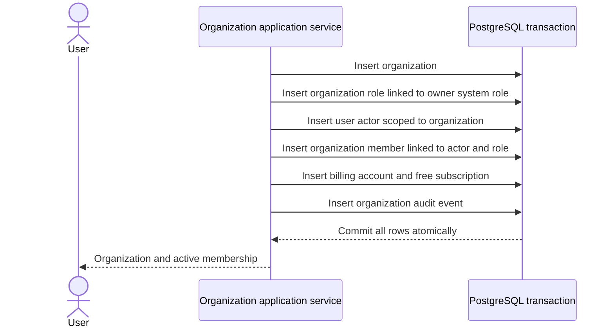

# Organization and membership tables

Organizations are the tenant boundary. Human membership, authorization roles, invitations, and actors are separate records so history remains explicit and non-human principals can share the same authorization/audit model.

Source: [`packages/database/src/schema/auth/organization`](../../packages/database/src/schema/auth/organization).

## `auth.organization`

| Column          | PostgreSQL type | Required | Default | Description                                                   |
| --------------- | --------------- | -------- | ------- | ------------------------------------------------------------- |
| `id`            | `text`          | Yes      | UUIDv7  | Organization identifier.                                      |
| `metadata`      | `jsonb`         | Yes      | —       | Protocol-defined organization name and presentation metadata. |
| `created_by_id` | `text`          | Yes      | —       | User who initiated organization creation.                     |
| `created_at`    | `timestamptz`   | Yes      | `now()` | Creation time.                                                |
| `updated_at`    | `timestamptz`   | Yes      | `now()` | Last update time.                                             |

### Keys and uniqueness

- Primary key: `id`.

### Foreign keys

- `created_by_id` → `auth.user.id`, `ON DELETE RESTRICT`.

### Checks

- None beyond protocol decoding and nullability.

### Indexes

- Index on `created_by_id`.

## `auth.system_role`

Global role template. Organization roles point to these rows for built-in roles, avoiding copied permission arrays per organization.

| Column        | PostgreSQL type | Required | Default | Description                                       |
| ------------- | --------------- | -------- | ------- | ------------------------------------------------- |
| `id`          | `text`          | Yes      | UUIDv7  | System-role identifier.                           |
| `key`         | `text`          | Yes      | —       | Stable built-in role key.                         |
| `metadata`    | `jsonb`         | Yes      | —       | Display name and description.                     |
| `permissions` | `text[]`        | Yes      | —       | Complete permission set granted by this template. |
| `created_at`  | `timestamptz`   | Yes      | `now()` | Creation time.                                    |
| `updated_at`  | `timestamptz`   | Yes      | `now()` | Last update time.                                 |

### Keys and uniqueness

- Primary key: `id`.
- Unique constraint on `key`.

### Foreign keys

- None.

### Checks and indexes

- No explicit checks or secondary indexes beyond unique `key`.

## `auth.organization_role`

Tenant-visible role. Exactly one of the built-in-template shape or custom-role shape is allowed.

| Column            | PostgreSQL type | Required | Default | Description                                                    |
| ----------------- | --------------- | -------- | ------- | -------------------------------------------------------------- |
| `id`              | `text`          | Yes      | UUIDv7  | Role identifier.                                               |
| `organization_id` | `text`          | Yes      | —       | Owning tenant.                                                 |
| `key`             | `text`          | No       | `NULL`  | Custom role key; absent for built-in roles.                    |
| `system_role_id`  | `text`          | No       | `NULL`  | Referenced built-in template; absent for custom roles.         |
| `permissions`     | `text[]`        | No       | `NULL`  | Custom role permissions; inherited from system role otherwise. |
| `metadata`        | `jsonb`         | No       | `NULL`  | Custom role display metadata; inherited otherwise.             |
| `created_at`      | `timestamptz`   | Yes      | `now()` | Creation time.                                                 |
| `updated_at`      | `timestamptz`   | Yes      | `now()` | Last update time.                                              |

### Keys and uniqueness

- Primary key: `id`.
- Unique (`id`, `organization_id`) for tenant-safe references.
- Partial unique (`organization_id`, `system_role_id`) where `system_role_id IS NOT NULL`.
- Partial unique (`organization_id`, `key`) where `system_role_id IS NULL`.

### Foreign keys

- `organization_id` → `auth.organization.id`, `ON DELETE RESTRICT`.
- `system_role_id` → `auth.system_role.id`, `ON DELETE RESTRICT`.

### Checks

- Role shape: a system role has `system_role_id` and null custom fields; a custom role has null `system_role_id` and non-null `key`, `permissions`, and `metadata`.
- Custom keys cannot impersonate reserved built-ins `owner`, `admin`, or `member`.

### Indexes

- Index on `system_role_id`.

## `auth.organization_member`

Membership joins one user to one organization role and gives the human principal an actor. Removal is historical, not destructive.

| Column                 | PostgreSQL type | Required | Default | Description                                           |
| ---------------------- | --------------- | -------- | ------- | ----------------------------------------------------- |
| `id`                   | `text`          | Yes      | UUIDv7  | Membership identifier.                                |
| `actor_id`             | `text`          | Yes      | —       | Organization-scoped `user` actor for this membership. |
| `user_id`              | `text`          | Yes      | —       | Human user.                                           |
| `organization_id`      | `text`          | Yes      | —       | Tenant.                                               |
| `organization_role_id` | `text`          | Yes      | —       | Current tenant role.                                  |
| `joined_at`            | `timestamptz`   | Yes      | `now()` | Effective join time.                                  |
| `removed_at`           | `timestamptz`   | No       | `NULL`  | Effective removal time.                               |
| `created_at`           | `timestamptz`   | Yes      | `now()` | Row creation time.                                    |
| `updated_at`           | `timestamptz`   | Yes      | `now()` | Last update time.                                     |

### Keys and uniqueness

- Primary key: `id`.
- Unique `actor_id`: one actor belongs to one membership.
- Partial unique (`organization_id`, `user_id`) where `removed_at IS NULL`: one active membership per user and tenant.

### Foreign keys

- `user_id` → `auth.user.id`, `ON DELETE RESTRICT`.
- `organization_id` → `auth.organization.id`, `ON DELETE RESTRICT`.
- (`actor_id`, `organization_id`) → (`auth.actor.id`, `auth.actor.organization_id`), `ON DELETE RESTRICT`.
- (`organization_role_id`, `organization_id`) → (`auth.organization_role.id`, `auth.organization_role.organization_id`), `ON DELETE RESTRICT`.

### Checks

- None beyond the keys and lifecycle timestamp semantics.

### Indexes

- `user_id` for a user's membership list.
- Partial (`user_id`, `organization_id`) where `removed_at IS NULL` for authorization lookup.
- (`organization_role_id`, `organization_id`) for role-impact queries.

## `auth.invitation`

Pending or terminal invitation to create an organization membership with a chosen role.

| Column                 | PostgreSQL type | Required | Default   | Description                                  |
| ---------------------- | --------------- | -------- | --------- | -------------------------------------------- |
| `id`                   | `text`          | Yes      | UUIDv7    | Invitation identifier.                       |
| `email`                | `text`          | Yes      | —         | Normalized invitee email.                    |
| `organization_id`      | `text`          | Yes      | —         | Inviting tenant.                             |
| `organization_role_id` | `text`          | Yes      | —         | Role assigned on acceptance.                 |
| `inviter_id`           | `text`          | Yes      | —         | User who sent the invitation.                |
| `status`               | `text`          | Yes      | `pending` | Protocol-defined invitation lifecycle state. |
| `expires_at`           | `timestamptz`   | Yes      | —         | Acceptance deadline.                         |
| `created_at`           | `timestamptz`   | Yes      | `now()`   | Creation time.                               |
| `updated_at`           | `timestamptz`   | Yes      | `now()`   | Last status update.                          |

### Keys and uniqueness

- Primary key: `id`.
- Partial unique (`organization_id`, `email`) where `status = 'pending'` prevents parallel live invitations.

### Foreign keys

- `organization_id` → `auth.organization.id`, `ON DELETE RESTRICT`.
- `inviter_id` → `auth.user.id`, `ON DELETE RESTRICT`.
- (`organization_role_id`, `organization_id`) → (`auth.organization_role.id`, `auth.organization_role.organization_id`), `ON DELETE RESTRICT`.

### Checks

- Email normalization: `email = lower(btrim(email))`.

### Indexes

- (`email`, `status`) for invitee lookup.
- (`organization_id`, `status`) for workspace lists.
- (`organization_role_id`, `organization_id`) for role-impact queries.
- `expires_at` for expiry scans.

## Organization creation transaction

This sequence creates an organization and its first owner. It is separate from
the invitation lifecycle documented above.

Remote calls do not belong inside this transaction. All tenant identity and initial billing facts must either commit together or not exist.

## Pending before production

- Define owner transfer and last-owner invariants.
- Add custom-role management only with permission-change audit events and affected-member analysis.
- Add an invitation expiry worker or normalize expired status during every read path.
- Document organization deletion/offboarding as an explicit retention workflow rather than cascading SQL deletion.
