# Core wallet and operation tables

The `core` schema separates key custody, namespace-specific wallet identity, delegated authority, mutable policy accounting, execution attempts, confirmed onchain results, and signature attempts. This separation is intentional: each record has a different lifecycle, idempotency boundary, and retention value.

Source: [`packages/database/src/schema/core`](../../packages/database/src/schema/core).

## `core.wallet_key`

Provider-neutral public description of a signing key. Private key material remains in the configured wallet-key provider; `data` stores provider references, not an exportable secret.

| Column             | PostgreSQL type | Required | Default  | Description                                              |
| ------------------ | --------------- | -------- | -------- | -------------------------------------------------------- |
| `id`               | `text`          | Yes      | UUIDv7   | Wallet-key identifier.                                   |
| `organization_id`  | `text`          | Yes      | —        | Owning tenant.                                           |
| `provider`         | `text`          | Yes      | —        | Custody provider discriminator.                          |
| `algorithm`        | `text`          | Yes      | —        | Signing algorithm.                                       |
| `protection_level` | `text`          | Yes      | —        | Provider-backed protection classification.               |
| `public_key_hex`   | `text`          | Yes      | —        | Encoded public key used for derivation and verification. |
| `status`           | `text`          | Yes      | `active` | Key lifecycle state.                                     |
| `data`             | `jsonb`         | Yes      | —        | Provider-discriminated key locator/configuration.        |
| `created_at`       | `timestamptz`   | Yes      | `now()`  | Creation time.                                           |
| `updated_at`       | `timestamptz`   | Yes      | `now()`  | Last lifecycle update.                                   |

### Keys and uniqueness

- Primary key: `id`.
- Unique (`id`, `organization_id`) supports tenant-safe wallet references.

### Foreign keys

- `organization_id` → `auth.organization.id`, `ON DELETE RESTRICT`.

### Checks

- Domain values are decoded by protocol models; no explicit SQL check is currently defined for provider, algorithm, protection level, or status.

### Indexes

- (`organization_id`, `status`) for active-key listings.

## `core.wallet`

Programmable account visible to API clients. `namespace` selects the chain-family adapter and `data` contains its discriminated implementation details.

| Column                | PostgreSQL type | Required | Default  | Description                                                                           |
| --------------------- | --------------- | -------- | -------- | ------------------------------------------------------------------------------------- |
| `id`                  | `text`          | Yes      | UUIDv7   | Public wallet identifier.                                                             |
| `organization_id`     | `text`          | Yes      | —        | Owning tenant.                                                                        |
| `wallet_key_id`       | `text`          | Yes      | —        | Owner key used to construct and sign for the account.                                 |
| `metadata`            | `jsonb`         | Yes      | —        | User-controlled name and description.                                                 |
| `status`              | `text`          | Yes      | `active` | Wallet lifecycle state.                                                               |
| `created_by_actor_id` | `text`          | Yes      | —        | Actor that created the wallet.                                                        |
| `namespace`           | `text`          | Yes      | —        | Chain-family namespace, currently `eip155`.                                           |
| `data`                | `jsonb`         | Yes      | —        | Namespace-specific account reconstruction data, currently Alchemy Modular Account V2. |
| `created_at`          | `timestamptz`   | Yes      | `now()`  | Creation time.                                                                        |
| `updated_at`          | `timestamptz`   | Yes      | `now()`  | Last update time.                                                                     |

### Keys and uniqueness

- Primary key: `id`.
- Unique (`id`, `organization_id`) supports all tenant-safe child references.

### Foreign keys

- `organization_id` → `auth.organization.id`, `ON DELETE RESTRICT`.
- (`wallet_key_id`, `organization_id`) → (`core.wallet_key.id`, `organization_id`), `ON DELETE RESTRICT`.
- (`created_by_actor_id`, `organization_id`) → (`auth.actor.id`, `organization_id`), `ON DELETE RESTRICT`.

### Checks

- Namespace and `data` shape are enforced by protocol decoding rather than an SQL check.

### Indexes

- (`organization_id`, `status`) for workspace wallet lists.
- `wallet_key_id` for custody impact and reconstruction queries.
- `created_by_actor_id` for creator history.

## `core.session_key`

Immutable policy envelope granting bounded authority over one wallet. Revocation is terminal; policy edits create a new session key rather than mutating historical authorization.

| Column                | PostgreSQL type | Required | Default  | Description                                                     |
| --------------------- | --------------- | -------- | -------- | --------------------------------------------------------------- |
| `id`                  | `text`          | Yes      | UUIDv7   | Session-key identifier.                                         |
| `organization_id`     | `text`          | Yes      | —        | Owning tenant.                                                  |
| `wallet_id`           | `text`          | Yes      | —        | Controlled wallet.                                              |
| `created_by_actor_id` | `text`          | Yes      | —        | Actor that created the delegation.                              |
| `namespace`           | `text`          | Yes      | —        | Policy namespace matching the wallet.                           |
| `metadata`            | `jsonb`         | Yes      | —        | Session-key display name and description.                       |
| `policies`            | `jsonb`         | Yes      | —        | Ordered, protocol-decoded policy definitions.                   |
| `policy_hash`         | `text`          | Yes      | —        | Canonical hash binding operations to the exact policy envelope. |
| `status`              | `text`          | Yes      | `active` | `active` or terminal revoked state defined by the model.        |
| `revoked_at`          | `timestamptz`   | No       | `NULL`   | Revocation time.                                                |
| `revoked_by_actor_id` | `text`          | No       | `NULL`   | Revoking actor.                                                 |
| `created_at`          | `timestamptz`   | Yes      | `now()`  | Creation time.                                                  |

### Keys and uniqueness

- Primary key: `id`.
- Unique (`id`, `organization_id`).
- Unique (`id`, `wallet_id`, `organization_id`) binds signature references to the same wallet.

### Foreign keys

- `organization_id` → `auth.organization.id`, `ON DELETE RESTRICT`.
- (`wallet_id`, `organization_id`) → `core.wallet`, `ON DELETE RESTRICT`.
- (`created_by_actor_id`, `organization_id`) → `auth.actor`, `ON DELETE RESTRICT`.
- (`revoked_by_actor_id`, `organization_id`) → `auth.actor`, `ON DELETE RESTRICT`.

### Checks

- No explicit SQL lifecycle check currently couples status and revocation columns; application/repository transitions own that invariant.

### Indexes

- (`organization_id`, `wallet_id`, `status`) for account-scoped active lists.
- (`created_by_actor_id`, `organization_id`).
- (`revoked_by_actor_id`, `organization_id`).

## `core.session_key_grant`

Connects an actor to a session key. API-key and OAuth principals can only use delegated authority through an active grant; the session-key record alone is not actor authorization.

| Column                | PostgreSQL type | Required | Default | Description                   |
| --------------------- | --------------- | -------- | ------- | ----------------------------- |
| `id`                  | `text`          | Yes      | UUIDv7  | Grant identifier.             |
| `organization_id`     | `text`          | Yes      | —       | Tenant boundary.              |
| `actor_id`            | `text`          | Yes      | —       | Actor receiving authority.    |
| `session_key_id`      | `text`          | Yes      | —       | Granted session key.          |
| `granted_by_actor_id` | `text`          | Yes      | —       | Actor that issued the grant.  |
| `revoked_at`          | `timestamptz`   | No       | `NULL`  | Grant revocation time.        |
| `revoked_by_actor_id` | `text`          | No       | `NULL`  | Actor that revoked the grant. |
| `created_at`          | `timestamptz`   | Yes      | `now()` | Grant creation time.          |

### Keys and uniqueness

- Primary key: `id`.
- Unique (`id`, `organization_id`).
- Unique (`id`, `actor_id`, `organization_id`) supports execution-submission authorization.
- Unique (`id`, `session_key_id`, `actor_id`, `organization_id`) supports signature-operation authorization.
- Partial unique (`organization_id`, `actor_id`, `session_key_id`) where `revoked_at IS NULL`: at most one active duplicate grant.

### Foreign keys

- `organization_id` → `auth.organization.id`, `ON DELETE RESTRICT`.
- (`actor_id`, `organization_id`) → `auth.actor`, `ON DELETE RESTRICT`.
- (`session_key_id`, `organization_id`) → `core.session_key`, `ON DELETE RESTRICT`.
- (`granted_by_actor_id`, `organization_id`) → `auth.actor`, `ON DELETE RESTRICT`.
- (`revoked_by_actor_id`, `organization_id`) → `auth.actor`, `ON DELETE RESTRICT`.

### Checks

- Active status is derived from `revoked_at IS NULL`.

### Indexes

- Partial (`organization_id`, `session_key_id`) where active.
- (`granted_by_actor_id`, `organization_id`).
- (`revoked_by_actor_id`, `organization_id`).

## `core.session_key_policy_state`

Committed mutable accumulator for one stateful policy scope, for example spent native value or charged gas within a period. Policy handlers define state data and derive deterministic `state_key` values.

| Column            | PostgreSQL type | Required | Default | Description                                                                  |
| ----------------- | --------------- | -------- | ------- | ---------------------------------------------------------------------------- |
| `id`              | `text`          | Yes      | UUIDv7  | State-row identifier.                                                        |
| `organization_id` | `text`          | Yes      | —       | Tenant boundary.                                                             |
| `session_key_id`  | `text`          | Yes      | —       | Policy owner.                                                                |
| `policy_id`       | `text`          | Yes      | —       | Stable policy instance identifier.                                           |
| `state_key`       | `text`          | Yes      | —       | Handler-defined scope, such as chain and period bucket.                      |
| `state_version`   | `integer`       | Yes      | —       | Decoder version for `data`; pre-production policies currently use version 1. |
| `data`            | `jsonb`         | Yes      | —       | Policy-discriminated committed state.                                        |
| `revision`        | `integer`       | Yes      | `0`     | Optimistic-concurrency revision.                                             |
| `created_at`      | `timestamptz`   | Yes      | `now()` | Creation time.                                                               |
| `updated_at`      | `timestamptz`   | Yes      | `now()` | Last settlement update.                                                      |

### Keys and uniqueness

- Primary key: `id`.
- Unique (`organization_id`, `session_key_id`, `policy_id`, `state_key`) ensures one committed accumulator per scope.

### Foreign keys

- `organization_id` → `auth.organization.id`, `ON DELETE RESTRICT`.
- (`session_key_id`, `organization_id`) → `core.session_key`, `ON DELETE RESTRICT`.

### Checks and indexes

- No explicit state-version or revision SQL check is currently defined.
- The unique scope index is the principal lookup path.

## `core.session_key_policy_reservation`

In-flight claim against policy state. Reservations prevent concurrent operations from each passing a stale budget check. Exactly one execution submission or signature operation owns each reservation.

| Column                    | PostgreSQL type | Required    | Default    | Description                                                               |
| ------------------------- | --------------- | ----------- | ---------- | ------------------------------------------------------------------------- |
| `id`                      | `text`          | Yes         | UUIDv7     | Reservation identifier.                                                   |
| `organization_id`         | `text`          | Yes         | —          | Tenant boundary.                                                          |
| `session_key_id`          | `text`          | Yes         | —          | Policy owner.                                                             |
| `policy_id`               | `text`          | Yes         | —          | Policy instance reserving state.                                          |
| `execution_submission_id` | `text`          | Conditional | `NULL`     | Owning execution submission. Exactly one operation reference is required. |
| `signature_operation_id`  | `text`          | Conditional | `NULL`     | Owning signature operation. Exactly one operation reference is required.  |
| `state_key`               | `text`          | Yes         | —          | Same logical scope as committed state.                                    |
| `reservation_version`     | `integer`       | Yes         | —          | Decoder version for reservation `data`.                                   |
| `data`                    | `jsonb`         | Yes         | —          | Policy-discriminated reserved delta/context.                              |
| `status`                  | `text`          | Yes         | `reserved` | Reservation lifecycle state.                                              |
| `expires_at`              | `timestamptz`   | Yes         | —          | Lease deadline after which recovery may release it.                       |
| `submitted_at`            | `timestamptz`   | No          | `NULL`     | Execution reached external submission.                                    |
| `settled_at`              | `timestamptz`   | No          | `NULL`     | Delta committed to policy state.                                          |
| `released_at`             | `timestamptz`   | No          | `NULL`     | Reservation canceled without settlement.                                  |
| `created_at`              | `timestamptz`   | Yes         | `now()`    | Creation time.                                                            |
| `updated_at`              | `timestamptz`   | Yes         | `now()`    | Last lifecycle update.                                                    |

### Keys and uniqueness

- Primary key: `id`.
- Partial unique (`organization_id`, `execution_submission_id`, `policy_id`, `state_key`) when execution-owned.
- Partial unique (`organization_id`, `signature_operation_id`, `policy_id`, `state_key`) when signature-owned.

### Foreign keys

- `organization_id` → `auth.organization.id`, `ON DELETE RESTRICT`.
- (`session_key_id`, `organization_id`) → `core.session_key`, `ON DELETE RESTRICT`.
- (`execution_submission_id`, `organization_id`) → `core.execution_submission`, `ON DELETE RESTRICT`.
- (`signature_operation_id`, `organization_id`) → `core.signature_operation`, `ON DELETE RESTRICT`.

### Checks

- `num_nonnulls(execution_submission_id, signature_operation_id) = 1` enforces generic operation ownership.

### Indexes

- (`organization_id`, `session_key_id`, `status`) for policy evaluation and cleanup.
- (`status`, `expires_at`) for expired-reservation recovery.

## `core.execution_submission`

Idempotent execution attempt and orchestration state. It exists before external submission and may fail without producing a finalized `core.execution` row.

| Column                 | PostgreSQL type | Required | Default    | Description                                                            |
| ---------------------- | --------------- | -------- | ---------- | ---------------------------------------------------------------------- |
| `id`                   | `text`          | Yes      | UUIDv7     | Submission identifier.                                                 |
| `organization_id`      | `text`          | Yes      | —          | Tenant boundary.                                                       |
| `actor_id`             | `text`          | Yes      | —          | Calling principal.                                                     |
| `session_key_grant_id` | `text`          | Yes      | —          | Actor-bound authority used by the operation.                           |
| `namespace`            | `text`          | Yes      | —          | Execution adapter namespace.                                           |
| `idempotency_key`      | `text`          | Yes      | —          | Stable retry key generated by SDK/CLI/MCP clients.                     |
| `request_hash`         | `text`          | Yes      | —          | Canonical request digest used to reject key reuse for different input. |
| `policy_hash`          | `text`          | Yes      | —          | Policy envelope evaluated for this attempt.                            |
| `status`               | `text`          | Yes      | `reserved` | Protocol-defined orchestration state.                                  |
| `data`                 | `jsonb`         | Yes      | —          | Namespace-discriminated prepared/submitted/failure details.            |
| `lease_token`          | `text`          | No       | `NULL`     | Exclusive processing lease credential.                                 |
| `lease_expires_at`     | `timestamptz`   | No       | `NULL`     | Processing lease deadline.                                             |
| `submitted_at`         | `timestamptz`   | No       | `NULL`     | External network submission time.                                      |
| `confirmed_at`         | `timestamptz`   | No       | `NULL`     | Successful finalization time.                                          |
| `failed_at`            | `timestamptz`   | No       | `NULL`     | Terminal failure time.                                                 |
| `created_at`           | `timestamptz`   | Yes      | `now()`    | Reservation/creation time.                                             |
| `updated_at`           | `timestamptz`   | Yes      | `now()`    | Last orchestration update.                                             |

### Keys and uniqueness

- Primary key: `id`.
- Unique (`id`, `organization_id`).
- Unique (`id`, `session_key_grant_id`, `organization_id`) binds finalized execution to the same grant.
- Unique (`organization_id`, `actor_id`, `idempotency_key`) is the retry boundary.

### Foreign keys

- `organization_id` → `auth.organization.id`, `ON DELETE RESTRICT`.
- (`actor_id`, `organization_id`) → `auth.actor`, `ON DELETE RESTRICT`.
- (`session_key_grant_id`, `actor_id`, `organization_id`) → `core.session_key_grant`, `ON DELETE RESTRICT`.

### Checks

- Lifecycle shape is currently enforced by repository transitions and protocol decoding, not a table check.

### Indexes

- (`organization_id`, `created_at`) for activity listing.
- (`organization_id`, `actor_id`, `created_at`) for actor history.
- (`status`, `lease_expires_at`) for processing recovery.

## `core.execution`

Confirmed namespace execution fact. It is one-to-zero-or-one with an execution submission and stores the normalized successful result used by list/detail APIs.

| Column                    | PostgreSQL type | Required | Default | Description                                                                        |
| ------------------------- | --------------- | -------- | ------- | ---------------------------------------------------------------------------------- |
| `id`                      | `text`          | Yes      | UUIDv7  | Final execution identifier.                                                        |
| `execution_submission_id` | `text`          | Yes      | —       | Attempt that produced this result.                                                 |
| `organization_id`         | `text`          | Yes      | —       | Tenant boundary.                                                                   |
| `session_key_grant_id`    | `text`          | Yes      | —       | Authority inherited from the submission.                                           |
| `namespace`               | `text`          | Yes      | —       | Result adapter namespace.                                                          |
| `data`                    | `jsonb`         | Yes      | —       | Namespace-discriminated confirmed result, including chain transaction identifiers. |
| `created_at`              | `timestamptz`   | Yes      | `now()` | Final execution record time.                                                       |

### Keys and uniqueness

- Primary key: `id`.
- Unique `execution_submission_id`: a submission can produce at most one final execution.

### Foreign keys

- `organization_id` → `auth.organization.id`, `ON DELETE RESTRICT`.
- (`execution_submission_id`, `session_key_grant_id`, `organization_id`) → matching `core.execution_submission`, `ON DELETE RESTRICT`.
- (`session_key_grant_id`, `organization_id`) → `core.session_key_grant`, `ON DELETE RESTRICT`.

### Checks

- Namespace result shape is protocol-decoded; no explicit SQL check.

### Indexes

- (`organization_id`, `created_at`, `id`) for stable activity pagination.
- (`organization_id`, `session_key_grant_id`, `created_at`) for delegated-authority history.

## `core.signature_operation`

Auditable, idempotent signature attempt. `data` is a discriminated message or typed-data operation and stores signable request context/result metadata, not merely an unstructured blob.

| Column                   | PostgreSQL type | Required | Default    | Description                                                     |
| ------------------------ | --------------- | -------- | ---------- | --------------------------------------------------------------- |
| `id`                     | `text`          | Yes      | UUIDv7     | Signature-operation identifier.                                 |
| `organization_id`        | `text`          | Yes      | —          | Tenant boundary.                                                |
| `actor_id`               | `text`          | Yes      | —          | Calling principal.                                              |
| `wallet_id`              | `text`          | Yes      | —          | Smart account whose ERC-1271-compatible signature is requested. |
| `session_key_id`         | `text`          | Yes      | —          | Policy envelope.                                                |
| `session_key_grant_id`   | `text`          | Yes      | —          | Actor-bound authority.                                          |
| `namespace`              | `text`          | Yes      | —          | Signature adapter namespace.                                    |
| `idempotency_key`        | `text`          | Yes      | —          | Stable retry key generated by the client integration.           |
| `request_hash`           | `text`          | Yes      | —          | Canonical request digest guarding idempotency-key reuse.        |
| `policy_hash`            | `text`          | Yes      | —          | Evaluated policy envelope hash.                                 |
| `status`                 | `text`          | Yes      | `reserved` | `reserved`, `succeeded`, or `failed`.                           |
| `data`                   | `jsonb`         | Yes      | —          | Fully discriminated message/typed-data operation data.          |
| `failure_code`           | `text`          | No       | `NULL`     | Typed terminal failure reason.                                  |
| `reservation_expires_at` | `timestamptz`   | Yes      | —          | Recovery deadline for an interrupted reserved attempt.          |
| `succeeded_at`           | `timestamptz`   | No       | `NULL`     | Success time.                                                   |
| `failed_at`              | `timestamptz`   | No       | `NULL`     | Failure time.                                                   |
| `created_at`             | `timestamptz`   | Yes      | `now()`    | Attempt creation time.                                          |
| `updated_at`             | `timestamptz`   | Yes      | `now()`    | Last lifecycle update.                                          |

### Keys and uniqueness

- Primary key: `id`.
- Unique (`id`, `organization_id`).
- Unique (`organization_id`, `actor_id`, `idempotency_key`) is the signature retry boundary.

### Foreign keys

- `organization_id` → `auth.organization.id`, `ON DELETE RESTRICT`.
- (`actor_id`, `organization_id`) → `auth.actor`, `ON DELETE RESTRICT`.
- (`wallet_id`, `organization_id`) → `core.wallet`, `ON DELETE RESTRICT`.
- (`session_key_id`, `wallet_id`, `organization_id`) → `core.session_key`, `ON DELETE RESTRICT`.
- (`session_key_grant_id`, `session_key_id`, `actor_id`, `organization_id`) → `core.session_key_grant`, `ON DELETE RESTRICT`.

### Checks

- Lifecycle check permits exactly these shapes:
  - `reserved`: no failure code, success time, or failure time;
  - `succeeded`: success time present, failure fields absent;
  - `failed`: failure code and failure time present, success time absent.

### Indexes

- (`organization_id`, `status`, `created_at`).
- (`organization_id`, `wallet_id`, `created_at`).
- (`organization_id`, `session_key_id`, `status`, `created_at`).
- (`organization_id`, `actor_id`, `created_at`).

## Why submissions and executions are separate

An execution request crosses an irreversible remote boundary. Before submission, Namera needs an idempotency record, policy reservations, and a processing lease. After confirmation, consumers need a compact immutable execution fact. Merging both into one row would make failed attempts indistinguishable from confirmed operations and would complicate retries, reconciliation, and activity pagination.

```mermaid
stateDiagram-v2
  [*] --> Reserved: execution_submission inserted
  Reserved --> Prepared: simulation and policy reservation succeed
  Prepared --> Submitted: user operation accepted by bundler
  Submitted --> Confirmed: receipt observed; execution inserted
  Reserved --> Failed
  Prepared --> Failed
  Submitted --> Failed: terminal receipt/reconciliation result
  Confirmed --> [*]
  Failed --> [*]
```

Exact protocol statuses remain the executable contract; feature flow is documented in [EVM execution](../evm/execution/README.md).

## Pending before production

- Add SQL lifecycle checks for session-key and execution-submission status/timestamp shapes if transitions have stabilized.
- Define retention tiers for failed submissions, confirmed executions, signatures, and settled/released reservations.
- Add an explicit reservation recovery runbook and monitoring thresholds.
- Confirm state `revision` compare-and-swap behavior under high concurrency with database integration tests.
