# Core wallet and operation tables

The `core` schema separates key custody, namespace-specific wallet identity, delegated authority, mutable policy accounting, execution attempts, confirmed onchain results, and signature attempts. This separation is intentional: each record has a different lifecycle, idempotency boundary, and retention value.

Source: [`packages/database/src/schema/core`](../../packages/database/src/schema/core).

## `core.credentials`

Internal, tenant-scoped encrypted provider credentials. This is a general-purpose
table with explicit `1claw-agent` and `1claw-customer` variants.

| Column                     | PostgreSQL type | Required    | Description                                                                        |
| -------------------------- | --------------- | ----------- | ---------------------------------------------------------------------------------- |
| `id`                       | `text`          | Yes         | UUIDv7 primary key.                                                                |
| `organization_id`          | `text`          | Yes         | Owning tenant; references `auth.organization` with restricted deletion.            |
| `type`                     | `text`          | Yes         | `1claw-agent` or `1claw-customer`.                                                 |
| `data`                     | `jsonb`         | Yes         | Version 1 agent ID or customer connection/app/remote connection/customer identity. |
| `encrypted_payload`        | `text`          | Yes         | Nonempty ciphertext; never a plaintext provider API key.                           |
| `expires_at`               | `timestamptz`   | Conditional | Required for customer tokens, null for agent credentials.                          |
| `created_at`, `updated_at` | `timestamptz`   | Yes         | Standard timestamps, defaulting to `now()`.                                        |

Unique (`id`, `organization_id`) supports tenant-safe signer references. A partial
unique index on organization, type and agent ID allows one credential per agent
within a tenant. Checks reject unknown types, invalid metadata and empty payloads.
Customer credentials have a unique JSON `providerConnectionId`, so renewal replaces
the existing ciphertext rather than creating competing active token rows.

`repository.core.credentials` exposes `insert` and tenant-scoped `findById` using
the shared transaction context. Insert errors discard driver query parameters to
avoid exposing ciphertext. Referenced credentials cannot be deleted. Repositories
do not encrypt, decrypt, authenticate ciphertext or match agent IDs across rows;
those checks belong to the later application/provider workflow. No public DTO,
credential rotation workflow or provisioning table is introduced here.

`replaceCustomerToken` compares the old ciphertext and requires an unexpired,
token-owned connection lease. It locks that connection during replacement and
atomically updates ciphertext and expiry; expired replacement tokens are rejected.
Write errors discard driver query parameters. Application must authenticate the
envelope and verify all identity/expiry bindings before insertion or replacement.

Persistence tests cover tenant isolation, uniqueness, restricted deletion,
metadata checks, atomic writes/rollback and legacy signer compatibility.

## `core.provider_connections`

Durable organization-to-1Claw customer identity, not a per-wallet attempt ledger.

| Column                            | Meaning                                                                            |
| --------------------------------- | ---------------------------------------------------------------------------------- |
| `id`, `organization_id`           | Local UUIDv7 identity and owning organization.                                     |
| `provider`, `provider_app_id`     | Currently `1claw` and the deployment's platform app.                               |
| `external_connection_id`          | Remote identity; null only while local setup is reserved.                          |
| `customer_credential_id`          | Tenant-scoped restricted FK to encrypted customer authority.                       |
| `status`                          | `pending`, `ready`, or terminal `disabled`.                                        |
| `data`                            | Version 1 customer ID, stable OIDC subject/email, bootstrap/delegation timestamps. |
| `lease_token`, `lease_expires_at` | Internal setup/renewal ownership, absent from decoded model.                       |
| `created_at`, `updated_at`        | Standard timestamps.                                                               |

Unique organization/provider/app, provider/app/subject and provider/app/remote ID
indexes prevent competing mappings. A reservation has both remote/customer IDs
null; reconciliation sets them together and cannot substitute an established
identity. Ready rows require remote identity, customer credential, bootstrap and
delegation timestamps. JSON/lease checks reject incomplete combinations.

`repository.core.providerConnections` exposes reservation, organization/app lookup,
lease acquisition/release, identity reconciliation, bootstrap recording, verified
customer-credential attachment, readiness and disablement. All methods join the
ambient transaction. Credential attachment checks tenant, variant and every cleartext
identity binding. The FK itself enforces tenant ownership, not JSON equality;
decrypted envelope verification remains an application responsibility.

Acquire a unique token-owned 60-second lease before setup or renewal; use a fresh
token for each acquisition. A takeover fences stale database writes. It does not
cancel an earlier HTTP request or make remote creation exactly-once. After expiry
or ambiguous provider results, reconcile remote state before taking more actions;
never blindly repeat bootstrap/agent creation. No transaction spans provider HTTP.
Disablement clears the lease and prevents further repository setup/renewal writes.

Tests run on migrated PGlite and disposable PostgreSQL, including eight-way lease
and ciphertext-CAS contention. Readiness/token changes roll back with an enclosing
transaction. Application audit emission, encryption, token renewal HTTP, OIDC and
live provisioning are not wired by this persistence phase. Future workflows must
persist their audit rows in that same transaction.

## `core.signing_key`

Provider-neutral signing identity used by wallets and, in a later slice,
cryptographic session keys. Private and encrypted local key material is never
persisted by the server.

| Column                   | PostgreSQL type | Required | Default  | Description                                                                                |
| ------------------------ | --------------- | -------- | -------- | ------------------------------------------------------------------------------------------ |
| `id`                     | `text`          | Yes      | UUIDv7   | Signing-key identifier.                                                                    |
| `organization_id`        | `text`          | Yes      | —        | Owning tenant.                                                                             |
| `purpose`                | `text`          | Yes      | —        | `wallet-root` or `session`.                                                                |
| `credential_id`          | `text`          | No       | —        | Required for 1Claw; null for other signer variants.                                        |
| `provider_connection_id` | `text`          | No       | `NULL`   | Tenant-scoped 1Claw connection; legacy unlinked signers remain readable.                   |
| `custody`                | `text`          | Yes      | —        | `local` or `namera-managed`.                                                               |
| `algorithm`              | `text`          | Yes      | —        | `p256`, `secp256k1`, or `ed25519` (not an EVM owner).                                      |
| `public_key_hex`         | `text`          | Yes      | —        | Canonical lowercase public key used for verification and identity.                         |
| `status`                 | `text`          | Yes      | `active` | `active`, `disabled`, or terminal `destroyed`.                                             |
| `data`                   | `jsonb`         | Yes      | —        | Discriminated passkey, local-key, GCP KMS, managed development-provider or 1Claw metadata. |
| `created_at`             | `timestamptz`   | Yes      | `now()`  | Creation time.                                                                             |
| `updated_at`             | `timestamptz`   | Yes      | `now()`  | Last lifecycle update.                                                                     |

### Keys and uniqueness

- Primary key: `id`.
- Unique (`id`, `organization_id`) supports tenant-safe wallet references.
- Unique (`organization_id`, `algorithm`, `public_key_hex`) prevents duplicate
  registration of one cryptographic key inside a tenant.
- Partial unique organization/agent/provider-key/numeric-key-version identity for 1Claw.

### Foreign keys

- `organization_id` → `auth.organization.id`, `ON DELETE RESTRICT`.
- (`credential_id`, `organization_id`) → `core.credentials` (`id`, `organization_id`),
  `ON DELETE RESTRICT`. The foreign key enforces tenant ownership, not JSON agent matching.
- (`provider_connection_id`, `organization_id`) references `core.provider_connections`
  (`id`, `organization_id`) with restricted deletion and a supporting index.
  Only 1Claw signers may carry this reference. Existing null links require verified
  operator reconciliation; future live provisioning must supply the link.

### Checks

- Purpose, custody, algorithm, and status are restricted to protocol values.
- Public keys use an even-length lowercase hexadecimal encoding.
- `data` must be an object with a recognized discriminator.
- Local custody accepts only `passkey` or `local-key` data; managed custody
  requires `gcp-kms`, development-only `local-provider` or `1claw` data.
- 1Claw requires a credential reference, metadata version 1, nonempty agent/key
  identifiers and a positive integer key version. Ethereum/Bitcoin/Tron require
  secp256k1; Solana/XRP/Cardano require Ed25519. Other variants require a null reference.
- Passkeys are P-256 wallet-root signing keys.

### Indexes

- (`organization_id`, `purpose`, `status`) supports tenant-scoped lifecycle
  lookups.
- The unique public-key index supports deduplication lookup.
- (`credential_id`, `organization_id`) supports credential-reference lookups.

`SigningKeyRepository` exposes insert, tenant-scoped ID lookup, public-key
lookup, and lifecycle updates. Lifecycle updates refuse to modify a destroyed
key. Wallet roots and dedicated session signers reference this table. Session
registration uses conflict-safe public-key insertion inside its transaction.

`advancePasskeyCounter` conditionally updates only the active local credential
whose tenant, ID, credential ID and previous counter match. It accepts an
increasing unsigned 32-bit counter or zero-to-zero for synced passkeys, never a
decrease. It updates only `data.signCount`. Approval workflows must consume
their one-time operation challenge in the same transaction: a zero counter is
not itself replay protection. A focused persistence test covers stale counters,
credential/tenant mismatch and disabled keys.

## `core.wallet`

Programmable account visible to API clients. `namespace` selects the chain-family adapter and `data` contains its discriminated implementation details.

| Column                | PostgreSQL type | Required | Default  | Description                                                                           |
| --------------------- | --------------- | -------- | -------- | ------------------------------------------------------------------------------------- |
| `id`                  | `text`          | Yes      | UUIDv7   | Public wallet identifier.                                                             |
| `organization_id`     | `text`          | Yes      | —        | Owning tenant.                                                                        |
| `signing_key_id`      | `text`          | Yes      | —        | Root signing key used to construct and authorize the account.                         |
| `metadata`            | `jsonb`         | Yes      | —        | User-controlled name and description.                                                 |
| `status`              | `text`          | Yes      | `active` | Wallet lifecycle state.                                                               |
| `created_by_actor_id` | `text`          | Yes      | —        | Actor that created the wallet.                                                        |
| `namespace`           | `text`          | Yes      | —        | Chain-family namespace, currently `eip155`.                                           |
| `data`                | `jsonb`         | Yes      | —        | Namespace-specific account reconstruction data, currently Alchemy Modular Account V2. |
| `created_at`          | `timestamptz`   | Yes      | `now()`  | Creation time.                                                                        |
| `updated_at`          | `timestamptz`   | Yes      | `now()`  | Last update time.                                                                     |

### Keys and uniqueness

- Primary key: `id`.
- Unique (`id`, `organization_id`) supports all tenant-safe child references.

### Foreign keys

- `organization_id` → `auth.organization.id`, `ON DELETE RESTRICT`.
- (`signing_key_id`, `organization_id`) → (`core.signing_key.id`, `organization_id`), `ON DELETE RESTRICT`.
- (`created_by_actor_id`, `organization_id`) → (`auth.actor.id`, `organization_id`), `ON DELETE RESTRICT`.

### Checks

- Namespace and `data` shape are enforced by protocol decoding rather than an SQL check.

### Indexes

- (`organization_id`, `status`) for workspace wallet lists.
- `signing_key_id` for custody impact and reconstruction queries.
- `created_by_actor_id` for creator history.

## `core.session_key`

Immutable policy envelope granting bounded authority over one wallet. Revocation is terminal; policy edits create a new session key rather than mutating historical authorization.

| Column                | PostgreSQL type | Required | Default   | Description                                                                   |
| --------------------- | --------------- | -------- | --------- | ----------------------------------------------------------------------------- |
| `id`                  | `text`          | Yes      | UUIDv7    | Session-key identifier.                                                       |
| `organization_id`     | `text`          | Yes      | —         | Owning tenant.                                                                |
| `wallet_id`           | `text`          | Yes      | —         | Controlled wallet.                                                            |
| `signing_key_id`      | `text`          | Yes      | —         | Dedicated session signing key; registration stores only a local public key.   |
| `created_by_actor_id` | `text`          | Yes      | —         | Actor that created the delegation.                                            |
| `namespace`           | `text`          | Yes      | —         | Policy namespace matching the wallet.                                         |
| `metadata`            | `jsonb`         | Yes      | —         | Session-key display name and description.                                     |
| `policies`            | `jsonb`         | Yes      | —         | Ordered, protocol-decoded policy definitions.                                 |
| `policy_hash`         | `text`          | Yes      | —         | Canonical hash binding operations to the exact policy envelope.               |
| `status`              | `text`          | Yes      | `pending` | `pending`, `active`, `revoking`, or `revoked`.                                |
| `revoked_at`          | `timestamptz`   | No       | `NULL`    | API revocation request time; onchain completion is recorded per installation. |
| `revoked_by_actor_id` | `text`          | No       | `NULL`    | Revoking actor.                                                               |
| `created_at`          | `timestamptz`   | Yes      | `now()`   | Creation time.                                                                |

### Keys and uniqueness

- Primary key: `id`.
- Unique (`id`, `organization_id`).
- Unique (`id`, `wallet_id`, `organization_id`) binds signature references to the same wallet.
- Unique `signing_key_id`: a signer belongs to one immutable delegation.

### Foreign keys

- `organization_id` → `auth.organization.id`, `ON DELETE RESTRICT`.
- (`wallet_id`, `organization_id`) → `core.wallet`, `ON DELETE RESTRICT`.
- (`signing_key_id`, `organization_id`) → `core.signing_key`, `ON DELETE RESTRICT`.
- (`created_by_actor_id`, `organization_id`) → `auth.actor`, `ON DELETE RESTRICT`.
- (`revoked_by_actor_id`, `organization_id`) → `auth.actor`, `ON DELETE RESTRICT`.

### Checks

- Status is one of `pending`, `active`, `revoking`, `revoked`.
- Revoking/revoked states require both revocation timestamp and actor; pending/active require neither.
- The activation repository conditionally updates pending rows only when a
  tenant-matching installed chain record exists. Authorization must still check
  the specific requested chain.

### Indexes

- (`organization_id`, `wallet_id`, `status`) for account-scoped active lists.
- (`created_by_actor_id`, `organization_id`).
- (`revoked_by_actor_id`, `organization_id`).

## `core.session_key_installation`

Per-chain onchain delegation state, bound to the session signing key.
Owner-approval routes and the session-operation worker apply receipt-confirmed
installation and removal transitions; see [session keys](../wallets/session-keys.md).
Compiler output is immutable through the repository; changing permissions needs
a new session/validation entity. No private key material is stored here.

| Field                           | Required | Description                                                                                                  |
| ------------------------------- | -------- | ------------------------------------------------------------------------------------------------------------ |
| `id`                            | Yes      | UUIDv7 installation identity.                                                                                |
| `organization_id`               | Yes      | Tenant scope, bound through the session FK.                                                                  |
| `session_key_id`                | Yes      | Logical session.                                                                                             |
| `wallet_id`                     | Yes      | Exact wallet owning that session.                                                                            |
| `namespace`                     | Yes      | Currently `eip155`.                                                                                          |
| `chain_id`                      | Yes      | CAIP-2 chain identifier.                                                                                     |
| `entity_id`                     | Yes      | Non-root validation entity in the provider-supported range.                                                  |
| `configuration_hash`            | Yes      | Digest binding the immutable compiled authorization.                                                         |
| `data`                          | Yes      | Version 1 EVM authorization, validator address, global flag, install/uninstall calldata and hook identities. |
| `status`                        | Yes      | `pending`, `submitted`, `installed`, `revoking`, `revoked`, `failed`; defaults to pending.                   |
| `install_user_operation_hash`   | No       | Exact submitted installation operation.                                                                      |
| `install_transaction_hash`      | No       | Confirmed installation transaction.                                                                          |
| `uninstall_user_operation_hash` | No       | Exact submitted revocation operation.                                                                        |
| `uninstall_transaction_hash`    | No       | Confirmed revocation transaction.                                                                            |
| `installed_at`                  | No       | Installation confirmation time.                                                                              |
| `revoked_at`                    | No       | Revocation confirmation time, not merely API-grant revocation.                                               |
| `created_at`                    | Yes      | Insert timestamp.                                                                                            |
| `updated_at`                    | Yes      | Last lifecycle update.                                                                                       |

### Keys, constraints and indexes

- Primary key `id`; unique `(id, organization_id)`.
- Unique `(id, session_key_id, organization_id)` binds execution submissions to
  the same session as their actor grant.
- Unique `(organization_id, session_key_id, chain_id)`.
- Unique `(organization_id, wallet_id, chain_id, entity_id)`, including terminal
  rows: validation entities are not recycled while old signed operations may exist.
- Restricting composite FK `(session_key_id, wallet_id, organization_id)` to the
  exact session/wallet/organization tuple.
- Namespace/chain check: `eip155` and positive decimal CAIP-2 suffix.
- Entity range `1..2147483646`; JSON authorization entity must equal the indexed
  entity column, with missing JSON identity explicitly rejected.
- Closed status check; submitted states require an install UserOperation hash;
  installed/revoking/revoked require an installation receipt and timestamp;
  revoked also requires the uninstall hashes and timestamp.
- Lookup index `(organization_id, wallet_id, chain_id, status)`.
- Recovery lookup index `(status, updated_at)`; durable worker leases belong to the session-operation ledger.

The repository uses conditional updates and matches the stored UserOperation
hash before confirming an installation or revocation. Duplicate/stale transitions
return no row. It does not verify chain receipts: the EVM adapter and application
must do that before calling these methods, and compose audit/grant changes in the
same transaction. PGlite integration tests exercise ownership constraints,
receipt prerequisites, replayed transitions and organization-scoped lookups.

## `core.session_key_operation`

One owner-approved installation or removal attempt. Installation state describes
what is onchain; this ledger retains the exact prepared/signed operation needed
to recover an interrupted attempt. Expired unsigned attempts can be retried
without overwriting history. It contains public signatures, never private keys.

| Field              | Required | Description                                                                                                               |
| ------------------ | -------- | ------------------------------------------------------------------------------------------------------------------------- |
| `id`               | Yes      | UUIDv7 operation identity.                                                                                                |
| `organization_id`  | Yes      | Tenant scope.                                                                                                             |
| `actor_id`         | Yes      | Actor initiating the owner approval.                                                                                      |
| `installation_id`  | Yes      | Exact per-chain installation being changed.                                                                               |
| `wallet_id`        | Yes      | Wallet bound through the installation FK; serializes owner approvals.                                                     |
| `chain_id`         | Yes      | CAIP-2 chain, bound to the installation and prepared payload.                                                             |
| `kind`             | Yes      | `install` or `uninstall`.                                                                                                 |
| `idempotency_key`  | Yes      | Client retry identity scoped to actor and organization.                                                                   |
| `request_hash`     | Yes      | Immutable semantic request digest checked during completion.                                                              |
| `status`           | Yes      | `awaiting-signature`, `signed`, `submitted`, `confirmed`, `failed`, `expired`.                                            |
| `data`             | Yes      | Version 1 prepared EVM operation plus nullable exact signed envelope. Uses a canonical JSON codec for context timestamps. |
| `expires_at`       | Yes      | Last instant at which an unsigned owner approval may be accepted; not an onchain signature expiry.                        |
| `lease_token`      | No       | Current request/worker ownership token.                                                                                   |
| `lease_expires_at` | No       | Lease deadline, or next reconciliation time when no token is held.                                                        |
| `transaction_hash` | No       | Receipt transaction for confirmed or reverted operations.                                                                 |
| `finished_at`      | No       | Confirmation, receipt failure, or unsigned expiry timestamp.                                                              |
| `created_at`       | Yes      | Insertion timestamp.                                                                                                      |
| `updated_at`       | Yes      | Last lifecycle transition.                                                                                                |

### Keys, constraints and indexes

- Primary key `id`; unique `(id, organization_id)`.
- Unique `(organization_id, actor_id, idempotency_key)`.
- Restricting `(actor_id, organization_id)` FK to the initiating actor.
- Restricting `(installation_id, wallet_id, chain_id, organization_id)` FK to installation;
  installation has a matching unique tuple.
- Partial unique `(wallet_id, chain_id)` while awaiting signature, signed or
  submitted. Owner approvals on one wallet/chain are serialized to avoid root
  nonce competition; different chains remain independent. Terminal attempts
  remain historical records.
- Closed kind/status checks; prepared JSON chain must equal `chain_id`.
- Awaiting/expired states require a null signed envelope; other states require
  one. The signed operation may differ only in its signature and computed hash:
  all unsigned fields, chain/EntryPoint, sponsorship and billing data must match
  the prepared JSON. Cryptographic hash/signature verification remains EVM-owned.
- Confirmed/failed states require a transaction hash. Terminal states require
  `finished_at`; nonterminal states cannot carry either terminal field.
- Only signed/submitted states can carry lease fields; a token requires a deadline.
- Recovery index `(status, lease_expires_at)`; unsigned-expiry partial index on
  `expires_at`; history index `(organization_id, installation_id, created_at)`.

### Repository lifecycle

Signature acceptance atomically requires the initiating actor, request hash,
awaiting status and `now < expires_at`. It persists the signed payload and leases
the initial submission before any broadcast. Duplicate completion returns no row.
The application must verify the passkey first and compose counter advancement,
approval consumption, billing and audit changes in the same transaction.

Reconciliation claims signed/submitted rows with `FOR UPDATE SKIP LOCKED`.
Submit, receipt finalization and rescheduling require the current token and a
still-live lease. Receipt finalization also matches the signed UserOperation
hash. Only a chain receipt can mark a signed attempt failed here: an RPC timeout
or rejection does not invalidate a root signature that may still be broadcast.
Unsigned expiry never touches signed attempts, even after `expires_at` passes.

Repository tests cover JSON round trips, idempotency, constraints, rollback,
replay, expiry and lease transitions. Application routes and the scoped server
worker use this ledger for owner approval and recovery; see
[session keys](../wallets/session-keys.md) and [test lanes](../engineering/testing.md).

## `core.session_key_grant`

Connects an actor to a session key. API-key and OAuth principals can only use delegated authority through an active grant; the session-key record alone is not actor authorization.

| Column                | PostgreSQL type | Required | Default | Description                   |
| --------------------- | --------------- | -------- | ------- | ----------------------------- |
| `id`                  | `text`          | Yes      | UUIDv7  | Grant identifier.             |
| `organization_id`     | `text`          | Yes      | —       | Tenant boundary.              |
| `actor_id`            | `text`          | Yes      | —       | Actor receiving authority.    |
| `session_key_id`      | `text`          | Yes      | —       | Granted session key.          |
| `granted_by_actor_id` | `text`          | Yes      | —       | Actor that issued the grant.  |
| `revoked_at`          | `timestamptz`   | No       | `NULL`  | Grant revocation time.        |
| `revoked_by_actor_id` | `text`          | No       | `NULL`  | Actor that revoked the grant. |
| `created_at`          | `timestamptz`   | Yes      | `now()` | Grant creation time.          |

### Keys and uniqueness

- Primary key: `id`.
- Unique (`id`, `organization_id`).
- Unique (`id`, `actor_id`, `organization_id`) supports execution-submission authorization.
- Unique (`id`, `session_key_id`, `actor_id`, `organization_id`) supports signature-operation authorization.
- Partial unique (`organization_id`, `actor_id`, `session_key_id`) where `revoked_at IS NULL`: at most one active duplicate grant.

### Foreign keys

- `organization_id` → `auth.organization.id`, `ON DELETE RESTRICT`.
- (`actor_id`, `organization_id`) → `auth.actor`, `ON DELETE RESTRICT`.
- (`session_key_id`, `organization_id`) → `core.session_key`, `ON DELETE RESTRICT`.
- (`granted_by_actor_id`, `organization_id`) → `auth.actor`, `ON DELETE RESTRICT`.
- (`revoked_by_actor_id`, `organization_id`) → `auth.actor`, `ON DELETE RESTRICT`.

### Checks

- Active status is derived from `revoked_at IS NULL`.

### Indexes

- Partial (`organization_id`, `session_key_id`) where active.
- (`granted_by_actor_id`, `organization_id`).
- (`revoked_by_actor_id`, `organization_id`).

## `core.session_key_policy_state`

Committed mutable accumulator for one stateful policy scope, for example spent native value or charged gas within a period. Policy handlers define state data and derive deterministic `state_key` values.

| Column            | PostgreSQL type | Required | Default | Description                                                                  |
| ----------------- | --------------- | -------- | ------- | ---------------------------------------------------------------------------- |
| `id`              | `text`          | Yes      | UUIDv7  | State-row identifier.                                                        |
| `organization_id` | `text`          | Yes      | —       | Tenant boundary.                                                             |
| `session_key_id`  | `text`          | Yes      | —       | Policy owner.                                                                |
| `policy_id`       | `text`          | Yes      | —       | Stable policy instance identifier.                                           |
| `state_key`       | `text`          | Yes      | —       | Handler-defined scope, such as chain and period bucket.                      |
| `state_version`   | `integer`       | Yes      | —       | Decoder version for `data`; pre-production policies currently use version 1. |
| `data`            | `jsonb`         | Yes      | —       | Policy-discriminated committed state.                                        |
| `revision`        | `integer`       | Yes      | `0`     | Optimistic-concurrency revision.                                             |
| `created_at`      | `timestamptz`   | Yes      | `now()` | Creation time.                                                               |
| `updated_at`      | `timestamptz`   | Yes      | `now()` | Last settlement update.                                                      |

### Keys and uniqueness

- Primary key: `id`.
- Unique (`organization_id`, `session_key_id`, `policy_id`, `state_key`) ensures one committed accumulator per scope.

### Foreign keys

- `organization_id` → `auth.organization.id`, `ON DELETE RESTRICT`.
- (`session_key_id`, `organization_id`) → `core.session_key`, `ON DELETE RESTRICT`.

### Checks and indexes

- No explicit state-version or revision SQL check is currently defined.
- The unique scope index is the principal lookup path.

## `core.session_key_policy_reservation`

In-flight claim against policy state. Reservations prevent concurrent operations from each passing a stale budget check. Exactly one execution submission or signature operation owns each reservation.

| Column                    | PostgreSQL type | Required    | Default    | Description                                                               |
| ------------------------- | --------------- | ----------- | ---------- | ------------------------------------------------------------------------- |
| `id`                      | `text`          | Yes         | UUIDv7     | Reservation identifier.                                                   |
| `organization_id`         | `text`          | Yes         | —          | Tenant boundary.                                                          |
| `session_key_id`          | `text`          | Yes         | —          | Policy owner.                                                             |
| `policy_id`               | `text`          | Yes         | —          | Policy instance reserving state.                                          |
| `execution_submission_id` | `text`          | Conditional | `NULL`     | Owning execution submission. Exactly one operation reference is required. |
| `signature_operation_id`  | `text`          | Conditional | `NULL`     | Owning signature operation. Exactly one operation reference is required.  |
| `state_key`               | `text`          | Yes         | —          | Same logical scope as committed state.                                    |
| `reservation_version`     | `integer`       | Yes         | —          | Decoder version for reservation `data`.                                   |
| `data`                    | `jsonb`         | Yes         | —          | Policy-discriminated reserved delta/context.                              |
| `status`                  | `text`          | Yes         | `reserved` | Reservation lifecycle state.                                              |
| `expires_at`              | `timestamptz`   | Yes         | —          | Lease deadline after which recovery may release it.                       |
| `submitted_at`            | `timestamptz`   | No          | `NULL`     | Execution reached external submission.                                    |
| `settled_at`              | `timestamptz`   | No          | `NULL`     | Delta committed to policy state.                                          |
| `released_at`             | `timestamptz`   | No          | `NULL`     | Reservation canceled without settlement.                                  |
| `created_at`              | `timestamptz`   | Yes         | `now()`    | Creation time.                                                            |
| `updated_at`              | `timestamptz`   | Yes         | `now()`    | Last lifecycle update.                                                    |

### Keys and uniqueness

- Primary key: `id`.
- Partial unique (`organization_id`, `execution_submission_id`, `policy_id`, `state_key`) when execution-owned.
- Partial unique (`organization_id`, `signature_operation_id`, `policy_id`, `state_key`) when signature-owned.

### Foreign keys

- `organization_id` → `auth.organization.id`, `ON DELETE RESTRICT`.
- (`session_key_id`, `organization_id`) → `core.session_key`, `ON DELETE RESTRICT`.
- (`execution_submission_id`, `organization_id`) → `core.execution_submission`, `ON DELETE RESTRICT`.
- (`signature_operation_id`, `organization_id`) → `core.signature_operation`, `ON DELETE RESTRICT`.

### Checks

- `num_nonnulls(execution_submission_id, signature_operation_id) = 1` enforces generic operation ownership.

### Indexes

- (`organization_id`, `session_key_id`, `status`) for policy evaluation and cleanup.
- (`status`, `expires_at`) for expired-reservation recovery.

## `core.execution_submission`

Idempotent execution attempt and orchestration state. It exists before external submission and may fail without producing a finalized `core.execution` row.

| Column                 | PostgreSQL type | Required | Default    | Description                                                            |
| ---------------------- | --------------- | -------- | ---------- | ---------------------------------------------------------------------- |
| `id`                   | `text`          | Yes      | UUIDv7     | Submission identifier.                                                 |
| `organization_id`      | `text`          | Yes      | —          | Tenant boundary.                                                       |
| `actor_id`             | `text`          | Yes      | —          | Calling principal.                                                     |
| `session_key_grant_id` | `text`          | Yes      | —          | Actor-bound authority used by the operation.                           |
| `session_key_id`       | `text`          | Yes      | —          | Cryptographic session shared by the grant and installation.            |
| `installation_id`      | `text`          | Yes      | —          | Onchain session installation selected for signing.                     |
| `expires_at`           | `timestamptz`   | Yes      | —          | Deadline to accept a local signature; not a signed-operation timeout.  |
| `namespace`            | `text`          | Yes      | —          | Execution adapter namespace.                                           |
| `idempotency_key`      | `text`          | Yes      | —          | Stable retry key generated by SDK/CLI/MCP clients.                     |
| `request_hash`         | `text`          | Yes      | —          | Canonical request digest used to reject key reuse for different input. |
| `policy_hash`          | `text`          | Yes      | —          | Policy envelope evaluated for this attempt.                            |
| `status`               | `text`          | Yes      | `reserved` | Protocol-defined orchestration state.                                  |
| `data`                 | `jsonb`         | Yes      | —          | Namespace-discriminated prepared/submitted/failure details.            |
| `lease_token`          | `text`          | No       | `NULL`     | Exclusive processing lease credential.                                 |
| `lease_expires_at`     | `timestamptz`   | No       | `NULL`     | Processing lease deadline.                                             |
| `submitted_at`         | `timestamptz`   | No       | `NULL`     | External network submission time.                                      |
| `confirmed_at`         | `timestamptz`   | No       | `NULL`     | Successful finalization time.                                          |
| `failed_at`            | `timestamptz`   | No       | `NULL`     | Terminal failure time.                                                 |
| `created_at`           | `timestamptz`   | Yes      | `now()`    | Reservation/creation time.                                             |
| `updated_at`           | `timestamptz`   | Yes      | `now()`    | Last orchestration update.                                             |

### Keys and uniqueness

- Primary key: `id`.
- Unique (`id`, `organization_id`).
- Unique (`id`, `session_key_grant_id`, `organization_id`) binds finalized execution to the same grant.
- Unique (`organization_id`, `actor_id`, `idempotency_key`) is the retry boundary.

### Foreign keys

- `organization_id` → `auth.organization.id`, `ON DELETE RESTRICT`.
- (`actor_id`, `organization_id`) → `auth.actor`, `ON DELETE RESTRICT`.
- (`session_key_grant_id`, `session_key_id`, `actor_id`, `organization_id`) → `core.session_key_grant`, `ON DELETE RESTRICT`.
- (`installation_id`, `session_key_id`, `organization_id`) → `core.session_key_installation`, `ON DELETE RESTRICT`.

### Checks

- Lifecycle shape is currently enforced by repository transitions and protocol decoding, not a table check.

### Indexes

- (`organization_id`, `created_at`) for activity listing.
- (`organization_id`, `actor_id`, `created_at`) for actor history.
- (`status`, `lease_expires_at`) for processing recovery.
- (`status`, `expires_at`) for expired unsigned preparation recovery.
- (`installation_id`, `organization_id`) for installation-bound operation lookup.

### Local signature acceptance

The version-1 EVM payload now retains the full `prepared` operation alongside
`signedExecution`. `acceptSignature` changes only the signed envelope and
lifecycle fields; it never replaces prepared calls or gas. Its conditional write
requires the original actor, tenant, request hash, `reserved` state and an
unexpired deadline. Replays cannot overwrite an accepted signature. The caller
must cryptographically verify the envelope and recheck current authority before
this write, within the billing/policy transaction.

Before external submission, `recordBroadcastAttempt` stores
`data.broadcastAttempted: true` while requiring a prepared signed row and the
current, unexpired lease in the same organization. Absence means no recorded
broadcast attempt. This monotonic marker survives lost responses and worker
takeover; it does not assert provider acceptance. A later send rejection alone
cannot prove an earlier attempt was not accepted. No new column or index is
needed; the marker is part of the version-1 typed JSON payload.

The two-phase application and HTTP routes are wired. Repository tests cover
ownership, expiry, signature acceptance and broadcast-lease guards; HTTP
execution tests additionally cover authorization, policy/billing and recovery.

## `core.execution`

Confirmed namespace execution fact. It is one-to-zero-or-one with an execution submission and stores the normalized successful result used by list/detail APIs.

| Column                    | PostgreSQL type | Required | Default | Description                                                                        |
| ------------------------- | --------------- | -------- | ------- | ---------------------------------------------------------------------------------- |
| `id`                      | `text`          | Yes      | UUIDv7  | Final execution identifier.                                                        |
| `execution_submission_id` | `text`          | Yes      | —       | Attempt that produced this result.                                                 |
| `organization_id`         | `text`          | Yes      | —       | Tenant boundary.                                                                   |
| `session_key_grant_id`    | `text`          | Yes      | —       | Authority inherited from the submission.                                           |
| `namespace`               | `text`          | Yes      | —       | Result adapter namespace.                                                          |
| `data`                    | `jsonb`         | Yes      | —       | Namespace-discriminated confirmed result, including chain transaction identifiers. |
| `created_at`              | `timestamptz`   | Yes      | `now()` | Final execution record time.                                                       |

### Keys and uniqueness

- Primary key: `id`.
- Unique `execution_submission_id`: a submission can produce at most one final execution.

### Foreign keys

- `organization_id` → `auth.organization.id`, `ON DELETE RESTRICT`.
- (`execution_submission_id`, `session_key_grant_id`, `organization_id`) → matching `core.execution_submission`, `ON DELETE RESTRICT`.
- (`session_key_grant_id`, `organization_id`) → `core.session_key_grant`, `ON DELETE RESTRICT`.

### Checks

- Namespace result shape is protocol-decoded; no explicit SQL check.

### Indexes

- (`organization_id`, `created_at`, `id`) for stable activity pagination.
- (`organization_id`, `session_key_grant_id`, `created_at`) for delegated-authority history.

## `core.signature_operation`

Auditable, idempotent signature attempt. `data` is a discriminated message or typed-data operation and stores signable request context/result metadata, not merely an unstructured blob.

| Column                   | PostgreSQL type | Required | Default    | Description                                                     |
| ------------------------ | --------------- | -------- | ---------- | --------------------------------------------------------------- |
| `id`                     | `text`          | Yes      | UUIDv7     | Signature-operation identifier.                                 |
| `organization_id`        | `text`          | Yes      | —          | Tenant boundary.                                                |
| `actor_id`               | `text`          | Yes      | —          | Calling principal.                                              |
| `wallet_id`              | `text`          | Yes      | —          | Smart account whose ERC-1271-compatible signature is requested. |
| `session_key_id`         | `text`          | Yes      | —          | Policy envelope.                                                |
| `session_key_grant_id`   | `text`          | Yes      | —          | Actor-bound authority.                                          |
| `namespace`              | `text`          | Yes      | —          | Signature adapter namespace.                                    |
| `idempotency_key`        | `text`          | Yes      | —          | Stable retry key generated by the client integration.           |
| `request_hash`           | `text`          | Yes      | —          | Canonical request digest guarding idempotency-key reuse.        |
| `policy_hash`            | `text`          | Yes      | —          | Evaluated policy envelope hash.                                 |
| `status`                 | `text`          | Yes      | `reserved` | `reserved`, `succeeded`, or `failed`.                           |
| `data`                   | `jsonb`         | Yes      | —          | Fully discriminated message/typed-data operation data.          |
| `failure_code`           | `text`          | No       | `NULL`     | Typed terminal failure reason.                                  |
| `reservation_expires_at` | `timestamptz`   | Yes      | —          | Recovery deadline for an interrupted reserved attempt.          |
| `succeeded_at`           | `timestamptz`   | No       | `NULL`     | Success time.                                                   |
| `failed_at`              | `timestamptz`   | No       | `NULL`     | Failure time.                                                   |
| `created_at`             | `timestamptz`   | Yes      | `now()`    | Attempt creation time.                                          |
| `updated_at`             | `timestamptz`   | Yes      | `now()`    | Last lifecycle update.                                          |

### Keys and uniqueness

- Primary key: `id`.
- Unique (`id`, `organization_id`).
- Unique (`organization_id`, `actor_id`, `idempotency_key`) is the signature retry boundary.

### Foreign keys

- `organization_id` → `auth.organization.id`, `ON DELETE RESTRICT`.
- (`actor_id`, `organization_id`) → `auth.actor`, `ON DELETE RESTRICT`.
- (`wallet_id`, `organization_id`) → `core.wallet`, `ON DELETE RESTRICT`.
- (`session_key_id`, `wallet_id`, `organization_id`) → `core.session_key`, `ON DELETE RESTRICT`.
- (`session_key_grant_id`, `session_key_id`, `actor_id`, `organization_id`) → `core.session_key_grant`, `ON DELETE RESTRICT`.

### Checks

- Lifecycle check permits exactly these shapes:
  - `reserved`: no failure code, success time, or failure time;
  - `succeeded`: success time present, failure fields absent;
  - `failed`: failure code and failure time present, success time absent.

### Indexes

- (`organization_id`, `status`, `created_at`).
- (`organization_id`, `wallet_id`, `created_at`).
- (`organization_id`, `session_key_id`, `status`, `created_at`).
- (`organization_id`, `actor_id`, `created_at`).

## Why submissions and executions are separate

An execution request crosses an irreversible remote boundary. Before submission, Namera needs an idempotency record, policy reservations, and a processing lease. After confirmation, consumers need a compact immutable execution fact. Merging both into one row would make failed attempts indistinguishable from confirmed operations and would complicate retries, reconciliation, and activity pagination.

```mermaid
stateDiagram-v2
  [*] --> Reserved: execution_submission inserted
  Reserved --> Prepared: simulation and policy reservation succeed
  Prepared --> Submitted: user operation accepted by bundler
  Submitted --> Confirmed: receipt observed; execution inserted
  Reserved --> Failed
  Prepared --> Failed
  Submitted --> Failed: terminal receipt/reconciliation result
  Confirmed --> [*]
  Failed --> [*]
```

Exact protocol statuses remain the executable contract; feature flow is documented in [EVM execution](../evm/execution/README.md).
