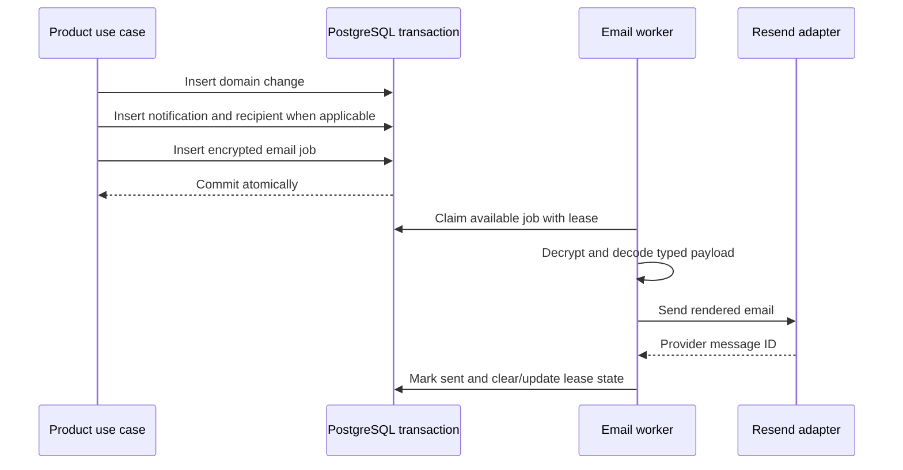

# Notification and job tables

Notifications preserve product facts and per-user delivery/read state. Email jobs are a separate encrypted, leased outbox so provider calls never occur inside product transactions.

Sources: [`notification`](../../packages/database/src/schema/notification) and [`jobs`](../../packages/database/src/schema/jobs).

## `notification.notifications`

One durable notification fact, optionally scoped to an organization and originating actor.

| Column            | PostgreSQL type | Required | Default | Description                                     |
| ----------------- | --------------- | -------- | ------- | ----------------------------------------------- |
| `id`              | `text`          | Yes      | UUIDv7  | Notification identifier.                        |
| `organization_id` | `text`          | No       | `NULL`  | Tenant for organization-scoped events.          |
| `actor_id`        | `text`          | No       | `NULL`  | Actor that caused the notification.             |
| `type`            | `text`          | Yes      | —       | Protocol notification discriminator.            |
| `data`            | `jsonb`         | Yes      | —       | Type-discriminated display/delivery data.       |
| `resource_type`   | `text`          | Yes      | —       | Associated resource kind.                       |
| `resource_id`     | `text`          | Yes      | —       | Associated resource identifier.                 |
| `idempotency_key` | `text`          | Yes      | —       | Stable deduplication key.                       |
| `correlation_id`  | `text`          | Yes      | —       | Cross-log/audit/workflow correlation.           |
| `expires_at`      | `timestamptz`   | No       | `NULL`  | Optional product visibility/retention deadline. |
| `created_at`      | `timestamptz`   | Yes      | `now()` | Fact creation time.                             |

### Keys and uniqueness

- Primary key: `id`.
- Unique `idempotency_key` prevents duplicate product notifications.

### Foreign keys

- `organization_id` → `auth.organization.id`, `ON DELETE RESTRICT`.
- (`actor_id`, `organization_id`) → `auth.actor`, `ON DELETE RESTRICT`.

### Checks

- Actor/organization shape: an actor may only be present when organization is present.

### Indexes

- (`organization_id`, `created_at DESC`).
- (`organization_id`, `type`, `created_at DESC`).
- (`resource_type`, `resource_id`, `created_at DESC`).
- Partial `expires_at` where non-null.

## `notification.notification_recipients`

Per-user delivery and inbox state for a notification.

| Column            | PostgreSQL type | Required | Default | Description                         |
| ----------------- | --------------- | -------- | ------- | ----------------------------------- |
| `notification_id` | `text`          | Yes      | —       | Notification fact.                  |
| `user_id`         | `text`          | Yes      | —       | Recipient.                          |
| `email_job_id`    | `text`          | No       | `NULL`  | Optional linked email delivery job. |
| `read_at`         | `timestamptz`   | No       | `NULL`  | Inbox read time.                    |
| `archived_at`     | `timestamptz`   | No       | `NULL`  | Inbox archive time.                 |
| `received_at`     | `timestamptz`   | Yes      | `now()` | Recipient association time.         |

### Keys and uniqueness

- Composite primary key (`notification_id`, `user_id`).
- Unique `email_job_id` prevents one email job being attached to multiple recipients.

### Foreign keys

- `notification_id` → `notification.notifications.id`, `ON DELETE CASCADE`.
- `user_id` → `auth.user.id`, `ON DELETE RESTRICT`.
- `email_job_id` → `jobs.email_jobs.id`, `ON DELETE SET NULL`.

### Checks

- None beyond keys and nullability.

### Indexes

- (`user_id`, `received_at DESC`) for the inbox.
- Partial (`user_id`, `received_at DESC`) where `read_at IS NULL AND archived_at IS NULL` for unread counts/lists.

## `notification.notification_preferences`

User preference override at global or organization scope.

| Column            | PostgreSQL type | Required | Default | Description                        |
| ----------------- | --------------- | -------- | ------- | ---------------------------------- |
| `id`              | `text`          | Yes      | UUIDv7  | Preference identifier.             |
| `user_id`         | `text`          | Yes      | —       | Preference owner.                  |
| `organization_id` | `text`          | No       | `NULL`  | Optional tenant-specific override. |
| `category`        | `text`          | Yes      | —       | Product category.                  |
| `topic`           | `text`          | Yes      | —       | Event topic within category.       |
| `channel`         | `text`          | Yes      | —       | Delivery channel such as email.    |
| `enabled`         | `boolean`       | Yes      | `true`  | Whether delivery is enabled.       |
| `created_at`      | `timestamptz`   | Yes      | `now()` | Creation time.                     |
| `updated_at`      | `timestamptz`   | Yes      | `now()` | Last update time.                  |

### Keys and uniqueness

- Primary key: `id`.
- Partial unique (`user_id`, `category`, `topic`, `channel`) where `organization_id IS NULL`.
- Partial unique (`user_id`, `organization_id`, `category`, `topic`, `channel`) where organization is present.

### Foreign keys

- `user_id` → `auth.user.id`, `ON DELETE RESTRICT`.
- `organization_id` → `auth.organization.id`, `ON DELETE RESTRICT`.

### Checks and indexes

- No explicit checks beyond the two mutually scoped unique indexes.

## `jobs.email_jobs`

Encrypted durable email outbox with retry scheduling and an exclusive processing lease.

| Column                | PostgreSQL type | Required | Default   | Description                                                                       |
| --------------------- | --------------- | -------- | --------- | --------------------------------------------------------------------------------- |
| `id`                  | `text`          | Yes      | UUIDv7    | Job identifier.                                                                   |
| `type`                | `text`          | Yes      | —         | Email-template/job discriminator.                                                 |
| `idempotency_key`     | `text`          | Yes      | —         | Stable enqueue deduplication key.                                                 |
| `encrypted_payload`   | `text`          | No       | `NULL`    | Authenticated-encrypted template payload; may be cleared after terminal handling. |
| `status`              | `text`          | Yes      | `pending` | Job lifecycle state.                                                              |
| `attempts`            | `integer`       | Yes      | `0`       | Delivery attempts.                                                                |
| `available_at`        | `timestamptz`   | Yes      | `now()`   | Earliest next attempt.                                                            |
| `expires_at`          | `timestamptz`   | Yes      | —         | Deadline after which delivery is no longer useful.                                |
| `lease_token`         | `text`          | No       | `NULL`    | Exclusive worker lease credential.                                                |
| `lease_expires_at`    | `timestamptz`   | No       | `NULL`    | Lease recovery deadline.                                                          |
| `provider_message_id` | `text`          | No       | `NULL`    | Provider delivery identifier.                                                     |
| `sent_at`             | `timestamptz`   | No       | `NULL`    | Successful send time.                                                             |
| `last_error_code`     | `text`          | No       | `NULL`    | Bounded typed failure code, not arbitrary provider payload.                       |
| `created_at`          | `timestamptz`   | Yes      | `now()`   | Enqueue time.                                                                     |
| `updated_at`          | `timestamptz`   | Yes      | `now()`   | Last worker update.                                                               |

### Keys and uniqueness

- Primary key: `id`.
- Unique `idempotency_key`.

### Foreign keys

- None. Product rows reference jobs, keeping the generic outbox independent of feature schemas.

### Checks

- `attempts >= 0`.

### Indexes

- (`status`, `available_at`) for claiming ready jobs.
- `lease_expires_at` for abandoned-lease recovery.
- `expires_at` for terminal expiry.

## Transaction and worker boundary

