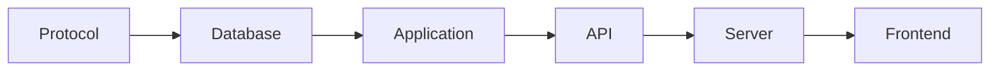

# Feature development

## Boundary order

Implement backend features in dependency order:

1. Define primitives, models, DTOs, and expected tagged errors in `protocol`.
2. Add tables, constraints, relations, migrations, and focused repositories in
   `database` when persistence changes.
3. Implement the use case in `application`, including the transaction boundary,
   audit event, notification/email enqueue, and bounded telemetry where needed.
4. Declare the transport contract in `api`.
5. Implement server authentication, permission enforcement, rate limiting, DTO
   mapping, and the route handler in `apps/server`.
6. Add dashboard atoms, hooks, loader prefetching, and UI after the contract is
   usable.
7. Update the owning architecture document in the same change.

## Effect conventions

- Read `node_modules/effect/AGENTS.md` before changing Effect code.
- Define services with class-based `Context.Service` and implementations with
  `Layer`.
- Use `Effect.gen` for workflows and named `Effect.fn` boundaries for operations
  that deserve a trace.
- Model expected failures with `Schema.TaggedError`; unexpected defects remain
  defects.
- Decode untrusted transport, persistence, configuration, and provider data with
  Effect Schema.
- Load secrets with `Config` and `Redacted`; provide platform services such as
  `NodeCrypto.layer` from the composition root.
- Use `Layer.provide` to hide implementation dependencies that consumers do not
  need to supply.

## Transactions and side effects

- A successful state mutation and its audit event share one database
  transaction.
- Notification occurrences, recipients, and durable email jobs belong in that
  transaction when they describe the same state change.
- Repositories use the ambient transaction context exposed by
  `TransactionService.run`; application APIs do not pass raw transaction clients.
- Remote provider work that cannot participate in PostgreSQL transactions runs
  before the final transaction. Recheck locked entitlements inside the final
  transaction before persistence.
- Do not call email or billing providers in a user transaction. Persist outbox
  work and let a worker deliver it idempotently.

## Security and contracts

- Persist credential digests or HMACs, never raw API keys, OAuth tokens,
  verification tokens, or session cookies.
- Return one-time credentials only from their creation boundary.
- Public DTOs exclude key-provider data, credential hashes, encrypted payloads,
  raw provider failures, and internal leases.
- User management actions require membership permissions. Machine actors require
  the correct intrinsic OAuth/API-key authority plus an active grant to an
  active session key.
- Frontend permission checks are presentation only; every handler enforces the
  permission again.
- Logs and metric labels contain bounded classifications, not identities,
  arbitrary URLs, messages, calls, signatures, or provider error text.

## Frontend workflow

- Use shared `@namera-ai/ui` components and semantic tokens.
- Validate forms with one Effect Schema converted through
  `Schema.toStandardSchemaV1`, React Hook Form, and the standard-schema resolver.
- Route loaders prefetch into the router-owned Effect Atom registry; hooks read
  the same cache.
- Domain hooks expose mutation lifecycle callbacks. Components use `mutate` for
  expected mutations and the shared feedback registry for concise toasts.
- Keep route-only UI in the adjacent `-components` directory. Put a component in
  `src/components` only when unrelated routes share it.
- Preserve keyboard interaction, visible focus, accessible names, descriptions,
  errors, and reduced-motion behavior.

## Change verification

Run the narrowest package checks first, then `pnpm check` for cross-package
changes. Commit meaningful changes with a small conventional commit message.

## Pending

No repository-wide development-rule work is currently pending. Feature-specific
work is listed in the owning architecture document.
