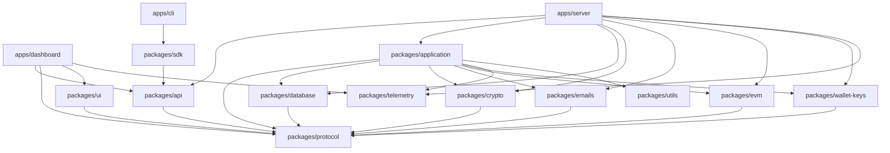

# Repository and package boundaries

Namera is a pnpm/Turborepo TypeScript monorepo targeting Node.js 24 and Effect
v4. Packages expose narrow public entry points and use the `namera-source`
condition for direct source consumption during development.

## Dependency versions

The workspace uses Effect 4.0.0 stable, with matching runtime, SQL, Atom,
OpenTelemetry, and Vitest adapters. Import platform modules from `effect/http`,
`effect/http-api`, `effect/sql`, and the other stable paths, not `effect/unstable/*`.
Encoding helpers live in `effect/encoding/*`. Keep the CLI npm shrinkwrap in sync
with the pnpm catalog using `pnpm cli:lock`, then run `pnpm pack:check` before release.

Direct dependencies track the latest releases accepted by pnpm's supply-chain
policies, with these explicit exceptions:

- Drizzle ORM and Kit stay on the standard `rc` channel (1.0.0-rc.4), not
  experimental snapshot tags. Its existing Effect error-constructor patch remains.
- TypeScript stays on 6.0.3: the current declaration build rejects TypeScript 7's
  experimental compiler API.
- UA Parser stays on the latest MIT-licensed v1 release; v2 changes to AGPL.

Scoped peer exceptions cover Klarity 0.2.0's tested Vitest 5 configuration and
React Hook Form's Standard Schema resolver with Effect 4. Do not import the
resolver package's Effect 3-specific adapter.

Oxlint's new React Compiler migration diagnostics are warnings while the compiler
is not enabled. Existing correctness, Hooks, and accessibility checks remain active.

## Dependency direction

Lower layers must not import orchestration or transport layers. In particular,
`protocol` has no infrastructure dependency; `api` contains contracts but no
handlers; `application` does not import `api` or server code; provider packages
do not import application workflows.

## Workspace responsibilities

| Workspace              | Responsibility                                                                                                   |
| ---------------------- | ---------------------------------------------------------------------------------------------------------------- |
| `apps/server`          | Node runtime, middleware, actor authentication, rate limits, HTTP/MCP handlers, workers, live Layer composition. |
| `apps/dashboard`       | Vite/React dashboard, route loaders, Effect Atom queries, forms, and product presentation.                       |
| `apps/cli`             | Effect CLI, OAuth device login, keyring profiles, interactive prompts, output formatting.                        |
| `apps/email-templates` | React Email preview and generation of email-safe PNG assets.                                                     |
| `packages/protocol`    | Effect Schemas, branded identities, models, public DTOs, and expected errors.                                    |
| `packages/database`    | Drizzle schemas, migrations, PostgreSQL/PGlite layers, transactions, repositories.                               |
| `packages/application` | Business workflows, transaction boundaries, billing enforcement, audit and notification orchestration.           |
| `packages/api`         | Public typed `HttpApi` declaration and authentication middleware contracts.                                      |
| `packages/crypto`      | Purpose-separated HMAC, AES-GCM encryption, tokens, and numeric codes.                                           |
| `packages/emails`      | Encrypted durable email jobs, worker, Resend provider, and runtime React Email templates.                        |
| `packages/wallet-keys` | Provider-neutral key lifecycle with local and Google Cloud KMS layers.                                           |
| `packages/evm`         | Chain registry, clients, smart accounts, simulations, execution, signing, verification, and policy handlers.     |
| `packages/telemetry`   | OTLP exporters, service identity, HTTP normalization, and shared bounded metrics.                                |
| `packages/sdk`         | Fetch-based Promise client over the generated API contract.                                                      |
| `packages/ui`          | Shared source-only React components and Namespace UIKit exports.                                                 |
| `packages/utils`       | Dependency-light deterministic helpers without Effect services or application state.                             |

## Source organization

`apps/web` owns the public website scaffold using TanStack Start and Fumadocs.
Its `/` landing route is empty, `/docs` serves the local MDX collection, and
`/api/search` searches that public content. It consumes `packages/ui` styles
and has no backend API, authentication, persistence, or telemetry integration.
These read-only routes do not create audit events. See the
[web README](../../apps/web/README.md) for local commands and content structure.
Production hosting and website content remain pending.

- Internal package imports use `#/*`; cross-package imports use package exports.
- Relative ESM imports include `.js`.
- Domain folders own their service, models, helpers, repositories, and tests.
- A package barrel exports only the supported public surface. Internal provider
  clients and persistence details do not leak through package roots.
- Split executable feature files when they combine distinct workflows or become
  difficult to scan. Large declarative schemas or registries may remain intact
  when splitting would obscure ownership.
- Shared helpers move to `utils` only when multiple packages need the same
  dependency-light behavior. Resourceful, configurable, or substitutable
  capabilities are Effect services in their owning package.

## Runtime ownership rule

The server is the composition root. It selects live providers, supplies secrets
through Effect `Config`, runs migrations and workers, and exposes transport.
Application workflows receive interfaces such as repositories, `WalletKeys`,
EVM, EmailJobs, and telemetry; they do not select concrete providers.

## Pending

- Remove `packages/template` when package scaffolding moves to a maintained
  generator, or keep it synchronized with repository conventions.
