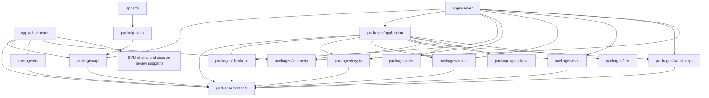

# Repository and package boundaries

Namera is a pnpm/Turborepo TypeScript monorepo targeting Node.js 24 and Effect
v4. Packages expose narrow public entry points and use the `namera-source`
condition for direct source consumption during development.

## Toolchain and dependency ownership

The pnpm catalog and lockfile own exact dependency versions. Effect v4 modules
use stable `effect/http`, `effect/http-api`, `effect/sql` and
`effect/encoding/*` paths. Packages retain the `namera-source` condition and
Klarity's unbundled build conventions. The root config is a Turbo global dependency.

The root `prepare` script installs hooks and patches TypeScript with
`@effect/tsgo`; installs using `--ignore-scripts` can run
`pnpm exec effect-tsgo patch --typescript --no-oxlint` for editor integration.
Effect editor diagnostics do not replace the normal typecheck and lint gates.
React Hook Form uses the Standard Schema resolver with Effect schemas.

Keep the CLI npm shrinkwrap synchronized with `pnpm cli:lock`, and validate
published entry points with `pnpm pack:check`. Exact versions and peer exceptions
belong in package configuration rather than a second architecture inventory.

## Dependency direction

Lower layers must not import orchestration or transport layers. In particular,
`protocol` has no infrastructure dependency; `api` contains contracts but no
handlers; `application` does not import `api` or server code; provider packages
do not import application workflows.

## Workspace responsibilities

| Workspace              | Responsibility                                                                                                          |
| ---------------------- | ----------------------------------------------------------------------------------------------------------------------- |
| `apps/server`          | Node runtime, middleware, actor authentication, rate limits, HTTP handlers, workers, live Layer composition.            |
| `apps/dashboard`       | Vite/React dashboard, route loaders, Effect Atom queries, forms, and product presentation.                              |
| `apps/web`             | Public website, waitlist form, documentation and MDX blog.                                                              |
| `apps/admin-portal`    | Static platform administration over internal APIs.                                                                      |
| `apps/cli`             | Effect CLI, OAuth device login, keyring profiles, interactive prompts, output formatting, local signing, and stdio MCP. |
| `apps/email-templates` | React Email preview and generation of email-safe PNG assets.                                                            |
| `packages/protocol`    | Effect Schemas, branded identities, models, public DTOs, and expected errors.                                           |
| `packages/database`    | Drizzle schemas, migrations, PostgreSQL/PGlite layers, transactions, repositories.                                      |
| `packages/application` | Business workflows, transaction boundaries, billing enforcement, audit and notification orchestration.                  |
| `packages/api`         | Public typed `HttpApi` declaration and authentication middleware contracts.                                             |
| `packages/crypto`      | Purpose-separated HMAC, AES-GCM encryption, tokens, and numeric codes.                                                  |
| `packages/emails`      | Encrypted durable email jobs, worker, Resend provider, and runtime React Email templates.                               |
| `packages/wallet-keys` | Provider-neutral key lifecycle with local and Google Cloud KMS layers.                                                  |
| `packages/passkeys`    | WebAuthn ceremony generation and verification.                                                                          |
| `packages/ens`         | Namespace offchain ENS provider boundary.                                                                               |
| `packages/template`    | Workspace starter without product runtime behavior.                                                                     |
| `packages/evm`         | Chain registry, clients, smart accounts, simulations, execution, signing, verification, and policy handlers.            |
| `packages/telemetry`   | OTLP exporters, service identity, HTTP normalization, and shared bounded metrics.                                       |
| `packages/sdk`         | Fetch-based Promise client over the generated API contract.                                                             |
| `packages/ui`          | Shared source-only React components and Namespace UIKit exports.                                                        |
| `packages/utils`       | Dependency-light deterministic helpers without Effect services or application state.                                    |

## Source organization

`apps/web` owns the public landing page, waitlist, pricing, legal pages,
Fumadocs documentation and MDX blog; see [website](../frontend/website.md).
`apps/admin-portal` is a static operator SPA using verified browser sessions and
platform membership through `/internal`; see [administration](../auth/admin.md).

- Internal package imports use `#/*`; cross-package imports use package exports.
- Relative ESM imports include `.js`.
- Domain folders own their service, models, helpers, repositories, and tests.
- A package barrel exports only the supported public surface. Internal provider
  clients and persistence details do not leak through package roots.
- Split executable feature files when they combine distinct workflows or become
  difficult to scan. Large declarative schemas or registries may remain intact
  when splitting would obscure ownership.
- Shared helpers move to `utils` only when multiple packages need the same
  dependency-light behavior. Resourceful, configurable, or substitutable
  capabilities are Effect services in their owning package.

## Runtime ownership rule

The server is the composition root. It selects live providers, supplies secrets
through Effect `Config`, runs migrations and workers, and exposes transport.
Application workflows receive interfaces such as repositories, `WalletKeys`,
EVM, EmailJobs, and telemetry; they do not select concrete providers.
