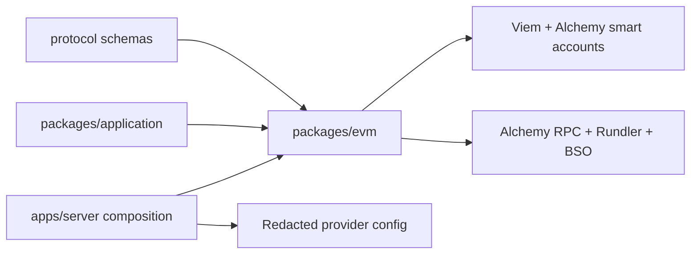

# EVM namespace adapter

`packages/evm` owns everything specific to the `eip155` namespace: supported chains, Alchemy Modular Account V2 construction, provider clients, ERC-4337 preparation/signing/submission/receipt normalization, ERC-1271-compatible signatures, and EVM policy handlers. It does not own organization authorization, billing, persistence transactions, or HTTP transport.

## Documentation

- [Supported chains and provider clients](supported-chains.md)
- [Smart accounts](accounts/README.md)
- [Execution pipeline](execution/README.md)
  - [Prepare and simulate](execution/prepare.md)
  - [Sign and submit](execution/sign-submit.md)
  - [Receipts and reconciliation](execution/receipts.md)
- [Signatures and ERC-1271 verification](signatures.md)
- [Fungible wallet portfolio](portfolio.md)
- [Policy engine](policies/README.md)
  - [Policy catalog](policies/catalog.md)
  - [State and reservations](policies/state-reservations.md)

## Public adapter surface

The package exposes focused services rather than Viem/Alchemy clients:

| Service          | Operations                                                                |
| ---------------- | ------------------------------------------------------------------------- |
| Account creation | Create protocol `AlchemyModularV2WalletData` with P-256 validation.       |
| Execution        | `prepare`, `sign`, `submit`, `getReceipt`, `getStatus`, `waitForReceipt`. |
| Signature        | `digest`, `sign`, `verify`.                                               |
| Portfolio        | Multi-chain native/ERC-20 assets with metadata and USD prices.            |
| Policy           | deterministic evaluation, state seeds, reserve, settle, release.          |

Large provider-specific types stay inside the package. `application` dispatches by namespace and receives protocol models/errors.

## Dependency direction

`packages/evm` must never depend on `application`, `api`, or `apps/server`.

## Adding an EVM capability

1. Define the public namespace schema/error in protocol.
2. Implement the chain-specific adapter here with focused files and Effect error mapping.
3. Keep provider SDK types internal and normalize results to protocol models.
4. Wire the new method through application namespace dispatch.
5. Add server/API/client surfaces only if it is public.
6. Add test adapters in `packages/evm`; compose them into server boundary tests.
7. Update this hub and the relevant flow document.

## Pending before production

- Run funded provider/bundler integration tests on every advertised chain tier.
- Define chain support tiers and incident disable behavior.
- Document provider fallback strategy and rate/capacity assumptions.
- Add reconciliation worker/alerts for submitted operations that outlive synchronous waits.
