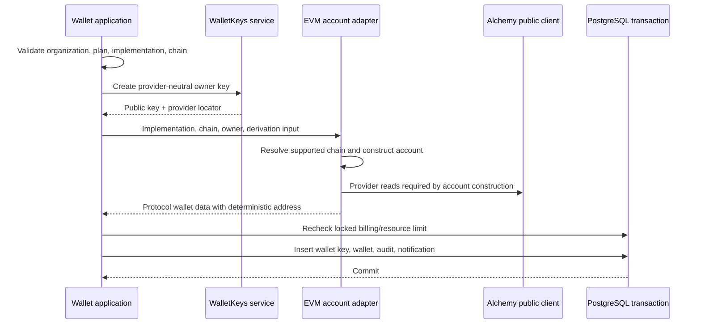
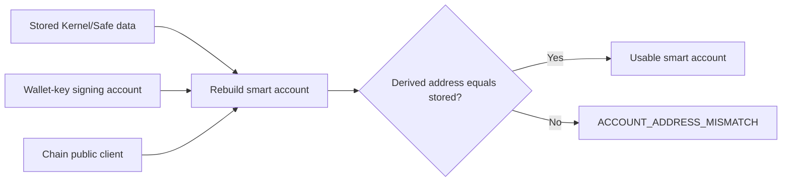

# EVM smart accounts

Namera currently supports Kernel and Safe ERC-4337 accounts with EntryPoint `0.7`. Account identity is deterministic from owner key plus implementation-specific derivation input. The database stores public reconstruction data; the owner key remains in `wallet-keys` custody.

## Supported implementations

| Implementation | Version | Derivation input       | Stored protocol data                                                                |
| -------------- | ------- | ---------------------- | ----------------------------------------------------------------------------------- |
| Kernel         | `0.3.3` | `accountIndex: bigint` | version, implementation, Kernel/EntryPoint versions, validator type, index, address |
| Safe           | `1.4.1` | `saltNonce: bigint`    | version, implementation, Safe/EntryPoint versions, validator type, nonce, address   |

Both use EntryPoint `0.7` and one owner. Validator type is `webauthn_p256` for a WebAuthn owner and `ecdsa_secp256k1` for a local ECDSA owner. Kernel WebAuthn creation uses the configured Kernel passkey validator address in the adapter.

## Creation flow

Remote key/account construction occurs before the final transaction. The wallet application repeats the locked billing check inside that transaction so concurrent creation cannot exceed the plan.

## Reconstruction invariant

Execution and signing never trust stored address alone. `reconstructEvmAccount` rebuilds Kernel/Safe using stored versions/derivation data plus the owner account, then compares the reconstructed address to the stored address using checksum-aware equality.

This detects corrupt/mismatched implementation versions, derivation inputs, owner keys, or addresses before signing.

## WebAuthn owner adapter

`createWalletKeyWebAuthnAccount` adapts a provider P-256 signer to Viem's `WebAuthnAccount`:

1. create a WebAuthn sign payload for the requested hash and configured origin/RP ID;
2. ask the provider-neutral wallet key service to sign the payload bytes;
3. convert DER P-256 signature to EVM signature representation;
4. construct serialized WebAuthn response metadata;
5. expose `sign`, `signMessage`, and `signTypedData` methods.

This file does not persist raw private keys or provider credentials.

## Counterfactual accounts

Accounts may be undeployed. Preparation can still encode/send a UserOperation with factory data. Signature verification requests factory/factoryData when `getCode` returns empty so Viem can verify the counterfactual ERC-1271 signature path.

## Adding an implementation

1. Add a discriminated wallet-data schema and creation DTO in protocol.
2. Add an implementation creator returning only protocol data.
3. Extend the `CreateAccountProps` and reconstruction union.
4. Reconstruct with the correct EntryPoint/version/owner and verify stored address.
5. Confirm encoding, UserOperation signing, counterfactual factory args, ERC-1271 verification, and receipt behavior.
6. Add audit/display mapping and dashboard selectors.
7. Add provider-boundary tests for both deployed and counterfactual states.

## Pending before production

- Decide whether multi-owner/multisig Safe accounts are in scope; current schema assumes one owner key.
- Add implementation migration/version policy before supporting upgrades.
- Run counterfactual/deployed parity tests for both validator types.
