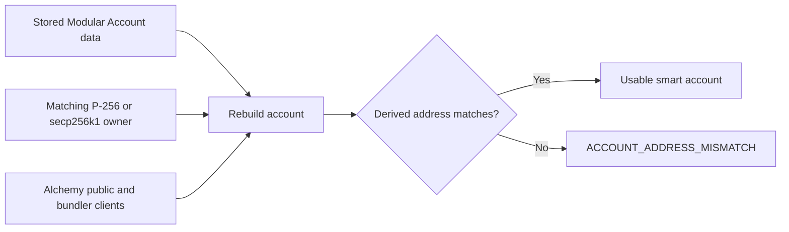

# Alchemy Modular Account V2

See [onchain sessions](onchain-sessions.md) for the local-signer permission
compiler and its contract-test coverage.

Namera supports one EVM smart-account implementation: Alchemy Modular Account
V2 with EntryPoint `0.7`. Its account boundary accepts two discriminated owner
modes, with separate account modes for ECDSA:

- `webauthn_p256` uses Namera's counterfactual WebAuthn factory integration;
- `ecdsa_secp256k1` with `accountMode: "factory"` uses a factory-deployed
  Semi-Modular Account with an EOA owner and a separate smart-account address;
- `ecdsa_secp256k1` with `accountMode: "7702"` preserves the legacy delegated EOA.

The public create-wallet workflow creates only passkey-owned P-256 accounts. The
secp256k1 construction, persistence, response, and reconstruction contracts are
implemented internally; public creation does not expose 7702 accounts.
The factory ECDSA adapter is also internal. Managed-account provisioning,
credential persistence/renewal and public runtime exposure are not wired yet.

The database stores only the public data needed to reconstruct the account.
Public wallet creation uses a browser passkey; its private key remains with
the authenticator. Internal managed-provider adapters belong to independent
`wallet-providers/gcp` and `wallet-providers/local` packages, whose server layers
are disabled. Application supplies their signing callbacks to EVM.

## Stored account data

| Field                   | Required | Owner mode       | Description                                                                 |
| ----------------------- | -------- | ---------------- | --------------------------------------------------------------------------- |
| `version`               | Yes      | Both             | Namera wallet-data schema version. Currently `1`.                           |
| `implementation`        | Yes      | Both             | Constant discriminator: `alchemy-modular-v2`.                               |
| `modularAccountVersion` | Yes      | Both             | Alchemy Modular Account contract family version. Currently `2.0.0`.         |
| `entryPointVersion`     | Yes      | Both             | ERC-4337 EntryPoint version. Currently `0.7`.                               |
| `validatorType`         | Yes      | Both             | Union discriminator: `webauthn_p256` or `ecdsa_secp256k1`.                  |
| `salt`                  | Yes      | Factory accounts | Deterministic uint256 salt; encoded as a decimal string.                    |
| `entityId`              | Yes      | P-256            | Validation entity encoded into WebAuthn signatures and factory calls.       |
| `accountMode`           | Yes      | secp256k1        | `factory` or `7702`; never infer the mode from an ECDSA key alone.          |
| `delegationVersion`     | Yes      | 7702             | Alchemy 7702 delegation version used to reconstruct the account.            |
| `ownerAddress`          | Yes      | Factory ECDSA    | EOA derived from the supplied uncompressed secp256k1 public key.            |
| `factoryVersion`        | Yes      | Factory ECDSA    | `2.0.0`, resolving the pinned AccountFactory deployment.                    |
| `implementationVersion` | Yes      | Factory ECDSA    | `v1.0.0`, resolving SemiModularAccountBytecode (not the MA family version). |
| `address`               | Yes      | Both             | Counterfactual account or delegated EOA address.                            |

The public create-wallet DTO does not expose an implementation selector. EVM
wallet creation always chooses this implementation and generates the derivation
data internally.

## Creation flow

```mermaid
sequenceDiagram
  participant App as Wallet application
  participant Keys as Passkey verification
  participant EVM as EVM adapter
  participant Alchemy as Alchemy RPC
  participant DB as PostgreSQL
  App->>App: Validate organization and locked plan limits
  App->>Keys: Verify browser registration ceremony
  Keys-->>App: Public credential and P-256 key
  App->>EVM: Create Modular Account V2
  EVM->>Alchemy: Resolve deterministic counterfactual account
  Alchemy-->>EVM: Account construction reads
  EVM-->>App: Address and public reconstruction data
  App->>DB: Recheck locked wallet entitlement
  App->>DB: Consume ceremony; insert signing key, wallet, audit, notification, email job
  DB-->>App: Commit
```

Passkey verification and account construction happen before the final database
transaction. The wallet application repeats the locked billing check inside
that transaction so concurrent requests cannot exceed the plan.

## Reconstruction invariant

Execution and signing never trust the stored address by itself. Reconstruction
first requires the persisted validator discriminator to match the supplied
owner adapter. It then rebuilds either the factory account from its salt and
entity ID or the 7702 account from its secp256k1 owner and delegation version.
The derived address is compared with the persisted address using
checksum-aware equality.



The comparison detects mismatched owner keys, derivation inputs, account data,
or addresses before Namera signs an operation.

Factory ECDSA reconstruction also decodes its versioned metadata, validates the
owner public point and EOA binding, and rejects an unsupported client chain before
returning the account. Preparation/signing use the existing supported-chain
registry and operational pause checks. Prepared factory-owner operations must
match the client network and current canonical factory arguments and must not
contain a 7702 authorization. If deployment occurs after preparation, reprepare
instead of signing stale init data. No factory address or initialization bytes
are accepted from persistence as authoritative derivation inputs.

### Pinned factory ECDSA deployment

`factory-ecdsa.ts` pins AccountFactory `2.0.0` at
`0x00000000000017c61b5bEe81050EC8eFc9c6fecd` and
SemiModularAccountBytecode `v1.0.0` at
`0x000000000000c5A9089039570Dd36455b5C07383`.
These match the installed SDK and [Alchemy deployments](https://www.alchemy.com/docs/wallets/smart-contracts/deployed-addresses).
The SDK's `mode: "default"` computes CREATE2 using the owner/salt and encodes
`createSemiModularAccount(owner, salt)`. The bytecode implementation embeds the
fallback owner; no separately supplied owner initialization is needed.
Persisted versions deliberately do not track changing SDK defaults.

The existing eight-chain registry is the adapter's network boundary. Contract
tests were run on a local Sepolia fork, not every production chain. Registration
is offline derivation, not proof of onchain deployment, installed permissions,
provider availability or enabled networks. Production rollout must verify each
enabled network and hosted bundler/sponsorship separately.

## P-256 owner encoding and internal managed adapter

`createWalletKeyWebAuthnAccount` adapts the provider-neutral P-256 signer to the
WebAuthn account expected by the Alchemy SDK:

1. create a WebAuthn sign payload for the requested hash and configured origin
   and RP ID;
2. invoke the application-supplied callback to sign the payload bytes;
3. decode the provider's DER P-256 signature;
4. construct the serialized WebAuthn response metadata;
5. expose `sign`, `signMessage`, and `signTypedData` without exposing private
   key material.

The account encoder normalizes P-256 `s` into the lower half of the curve before
ABI encoding. Authenticators and managed providers may produce high-S values;
the Solidity verifier rejects them. The local fork regression deliberately
uses a high-S signature and verifies a real EntryPoint deployment and transfer.

`encodeVerifiedOwnerAssertion` converts a browser assertion already verified by
the passkey service into the same validator ABI. It preserves the signed JSON
and authenticator bytes and calculates JSON field positions as UTF-8 byte
offsets. It is an encoder, not an authentication verifier. For owner
UserOperations the current deployed adapter's WebAuthn challenge is the
EIP-191 hash of the exact UserOperation hash, not the raw UserOperation hash.
`evm.execution.ownerApprovalChallenge` computes this challenge;
`completeOwnerApproval` checks the assertion's challenge and encodes the signed
operation without invoking an owner signer. Application approval routes verify the credential and atomically consume a
persisted approval before the signed operation can be submitted. Receipt
reconciliation updates installation state; see [session keys](../../wallets/session-keys.md).

## secp256k1 owner adapter

`createSecp256k1OwnerAccount` supports DER (default) and explicit `recoverable`
65-byte signatures. It validates recovery against the stored public key and exact
digest, accepts recovery bytes 0/1/27/28, and normalizes high-S plus parity. It does
not expose `signAuthorization`. The callback must sign the supplied 32 bytes
without hashing them again. Alchemy's UserOperation flow requests EIP-191 signing
of the UserOperation hash; contract-message signing uses its replay-safe typed
data. Those hashes are computed once before invoking the callback. The EVM package
never imports a provider service or credential type.

`createWalletKeySecp256k1Account` adapts a provider-neutral digest signer into
the Viem local account required by Alchemy's 7702 mode:

1. derive the EOA address from the stored uncompressed secp256k1 public key;
2. invoke the application-supplied callback to sign exact Keccak-256 digests;
3. normalize DER signatures to low-S Ethereum signatures and recover parity
   against the stored public key;
4. implement message, typed-data, and EIP-7702 authorization signing;
5. deliberately reject direct EOA transaction signing because Namera submits
   operations through the smart-account execution path.

The 7702 constructor delegates the owner's EOA to the explicitly persisted
Alchemy delegation version. It has no factory arguments, and the account
address must equal the owner address.

## Counterfactual behavior

P-256 and factory ECDSA accounts may be undeployed. Preparation includes factory data when needed,
and the first successful UserOperation deploys the account. Signature
verification supplies factory data when bytecode is absent so ERC-6492/ERC-1271
verification can validate a counterfactual account. A 7702 account has no
factory arguments; its authorization delegates the existing EOA to the selected
Semi-Modular Account implementation.

## Factory ECDSA verification

Unit tests cover version/salt/owner/address corruption, substituted prepared
factory data, unexpected authorization, unsupported/cross-chain inputs and
recoverable signature failures. Protocol tests round-trip the salt without loss
and reject missing or unsupported metadata. The existing wallet JSON column and
repository schema decoding need no table or migration change for this variant.

The opt-in `factory-ecdsa.test.ts` uses ephemeral local digest signing with the
same callback shape as 1Claw. On a local Sepolia Anvil fork it compares prediction
with `getAddressSemiModular`, deploys through EntryPoint `handleOps`, reconstructs
and executes again without factory arguments, verifies message and typed-data
signatures before/after deployment, and installs/executes/removes a restricted
session. Wrong messages, typed data, session targets and removed validators are
rejected. Existing passkey/session contract suites and 7702 unit tests remain.
This is contract compatibility evidence, not live 1Claw or hosted bundler coverage.
No audit mutation is added here: account registration and its atomic audits remain
application-owned work in Phase 6.

## Adding another account implementation

Adding an implementation is deliberately a product and compatibility decision,
not just a DTO option. It requires:

1. a discriminated protocol persistence schema;
2. creator and reconstruction adapters owned by `evm`;
3. deterministic-address and corruption checks;
4. execution, BSO, signature, and ERC-1271 parity tests on every supported
   chain;
5. application audit and notification mapping;
6. dashboard creation and display support.
