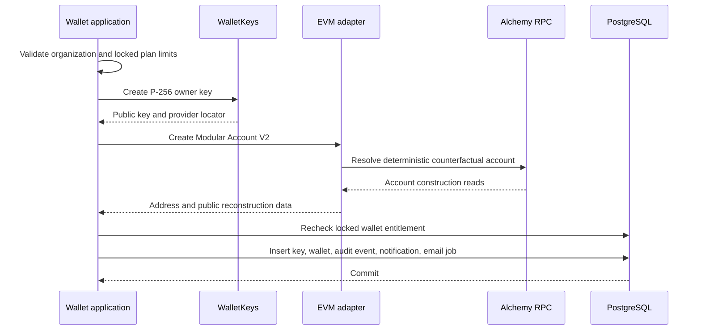
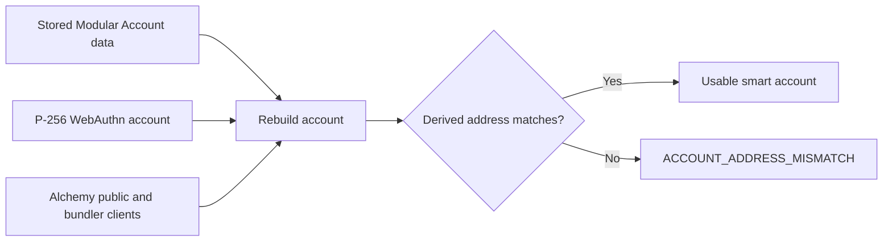

# Alchemy Modular Account V2

Namera supports one EVM smart-account implementation: Alchemy Modular Account
V2 with a P-256 WebAuthn validator and EntryPoint `0.7`. Keeping one account
model gives creation, reconstruction, signing, simulation, sponsorship, and
verification a single tested path.

The database stores only the public data needed to reconstruct the account. The
P-256 private key and provider locator remain owned by `wallet-keys`.

## Stored account data

| Field                   | Required | Description                                                             |
| ----------------------- | -------- | ----------------------------------------------------------------------- |
| `version`               | Yes      | Namera wallet-data schema version. Currently `1`.                       |
| `implementation`        | Yes      | Constant discriminator: `alchemy-modular-v2`.                           |
| `modularAccountVersion` | Yes      | Alchemy Modular Account contract version. Currently `2.0.0`.            |
| `entryPointVersion`     | Yes      | ERC-4337 EntryPoint version. Currently `0.7`.                           |
| `validatorType`         | Yes      | Constant validator discriminator: `webauthn_p256`.                      |
| `salt`                  | Yes      | Deterministic salt used by the Modular Account factory.                 |
| `entityId`              | Yes      | Validation entity identifier encoded into signatures and factory calls. |
| `address`               | Yes      | Counterfactual or deployed smart-account address.                       |

The public create-wallet DTO does not expose an implementation selector. EVM
wallet creation always chooses this implementation and generates the derivation
data internally.

## Creation flow

Remote key creation and account construction happen before the final database
transaction. The wallet application repeats the locked billing check inside
that transaction so concurrent requests cannot exceed the plan.

## Reconstruction invariant

Execution and signing never trust the stored address by itself. The adapter
rebuilds the Modular Account from its stored salt, entity ID, and P-256 owner,
then compares the derived address with the persisted address using checksum-aware
equality.

The comparison detects mismatched owner keys, derivation inputs, account data,
or addresses before Namera signs an operation.

## P-256 owner adapter

`createWalletKeyWebAuthnAccount` adapts the provider-neutral P-256 signer to the
WebAuthn account expected by the Alchemy SDK:

1. create a WebAuthn sign payload for the requested hash and configured origin
   and RP ID;
2. ask `WalletKeys` to sign the payload bytes;
3. decode the provider's DER P-256 signature;
4. construct the serialized WebAuthn response metadata;
5. expose `sign`, `signMessage`, and `signTypedData` without exposing private
   key material.

## Counterfactual behavior

New accounts may be undeployed. Preparation includes factory data when needed,
and the first successful UserOperation deploys the account. Signature
verification supplies factory data when bytecode is absent so ERC-6492/ERC-1271
verification can validate a counterfactual account.

## Adding another account implementation

Adding an implementation is deliberately a product and compatibility decision,
not just a DTO option. It requires:

1. a discriminated protocol persistence schema;
2. creator and reconstruction adapters owned by `evm`;
3. deterministic-address and corruption checks;
4. execution, BSO, signature, and ERC-1271 parity tests on every supported
   chain;
5. application audit and notification mapping;
6. dashboard creation and display support.

## Pending before production

- Retain provider-boundary tests for deployed and counterfactual accounts on all
  launch networks.
- Define a reviewed account-upgrade policy before accepting new Modular Account
  versions.
- Add a bounded provider/chain disable control for operational incidents.
