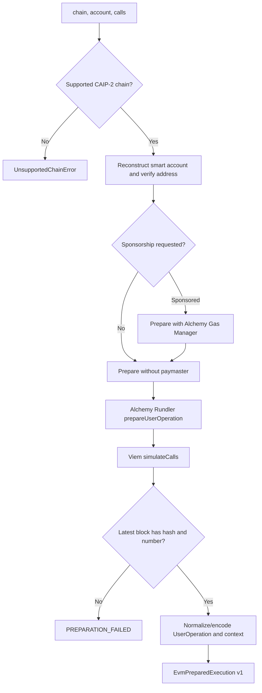

# Prepare and simulate

Preparation turns decoded calls and stored smart-account data into an unsigned EntryPoint 0.7 UserOperation plus a policy context anchored to a concrete block.

## Inputs

- supported CAIP-2 chain ID;
- reconstructed Kernel or Safe account data and owner account;
- ordered calls containing destination, native value, and calldata;
- sponsorship mode (`none` for simulation, `sponsored` for execution).

## Pipeline

`prepareUserOperation` failures classified by Viem as `UserOperationExecutionError` map to `SIMULATION_FAILED`; other construction failures map to `PREPARATION_FAILED`. Rundler, Gas Manager, or call-simulation failures map to `SIMULATION_FAILED`.

## Two simulations

| Simulation                                      | Purpose                                                          | Context fields                                                            |
| ----------------------------------------------- | ---------------------------------------------------------------- | ------------------------------------------------------------------------- |
| `prepareUserOperation` through Alchemy Rundler  | Validate ERC-4337 envelope and estimate EntryPoint/paymaster gas | call, verification, pre-verification, paymaster verification/post-op gas  |
| `viem.simulateCalls` through Alchemy public RPC | Execute exact account calls and trace user-visible effects       | per-call status/return/gas, asset changes, native transfers, block anchor |

Both are required: EntryPoint gas estimation does not provide the same asset-transfer context, while raw call simulation does not validate the complete ERC-4337 envelope.

Simulation requests explicitly prepare without a paymaster and therefore never
consume or imply Namera-sponsored gas. Execution requests prepare with Alchemy
Gas Manager and pass the configured policy ID as paymaster context. Viem's
preparation performs the paymaster stub/final-data handshake and
`eth_estimateUserOperationGas`; Namera records those prepared gas fields rather
than issuing a duplicate estimate.
After preparation, the adapter classifies the chain and attaches a JSON-safe
billing envelope:

- testnet: `execution.testnet`, no gas sponsorship measurement;
- mainnet without a paymaster: `execution.mainnet`, no gas measurement;
- mainnet with an Alchemy paymaster: `execution.mainnet` plus a pessimistic
  sponsored-cost reservation.

For sponsored mainnet execution, the adapter fetches ETH/USD from Alchemy,
rounds the quote upward to micro-USD, applies Alchemy's 8% mainnet sponsorship fee,
and prices the sum of call, verification, pre-verification, paymaster
verification, and paymaster post-op gas at `maxFeePerGas`. The quote timestamp,
price, and margin remain embedded in the signed execution so receipt settlement
uses the same cost basis. Pricing failure is a preparation failure; application
code never reimplements these EVM rules.

## Call normalization

For auxiliary `simulateCalls`, empty calldata is omitted rather than sent as `data: "0x"`; Viem otherwise attempts an access-list asset-selector path that can produce provider gas errors. Non-empty calldata remains unchanged.

Native transfers are normalized from provider trace logs emitted at `0xeeee…eeee` with the ERC-20-style `Transfer(address,address,uint256)` selector. Each record includes call index, from, to, and decimal-string value. Token asset changes contain address, bounded symbol (≤64 when valid), optional valid decimals (0–255), and pre/post/diff values.

## Prepared context

The version-1 `EvmIntentContext` includes:

- namespace, chain ID, and reconstructed account address;
- block number, hash, and timestamp;
- ordered calls with bigint values normalized for schema encoding;
- nonce, complete gas envelope, fee caps, and paymaster;
- both simulation sources and normalized results.

Policies consume this context. Period windows use the simulated block timestamp rather than server wall-clock time; gas budgets use the pessimistic prepared gas/fee envelope; native-spend limits inspect exact call values.

## Integrity boundary

`EvmPreparedExecution` includes serialized UserOperation and redundant normalized context. The sign phase intentionally compares them before producing a signature, protecting against accidental or malicious mutation between policy evaluation and signing.

## Pending before production

- Validate `simulateCalls` and asset tracing support on every advertised chain/provider tier.
- Add fixtures for malformed token metadata and native-transfer trace normalization.
- Define behavior when asset tracing is unavailable but ERC-4337 simulation succeeds.
