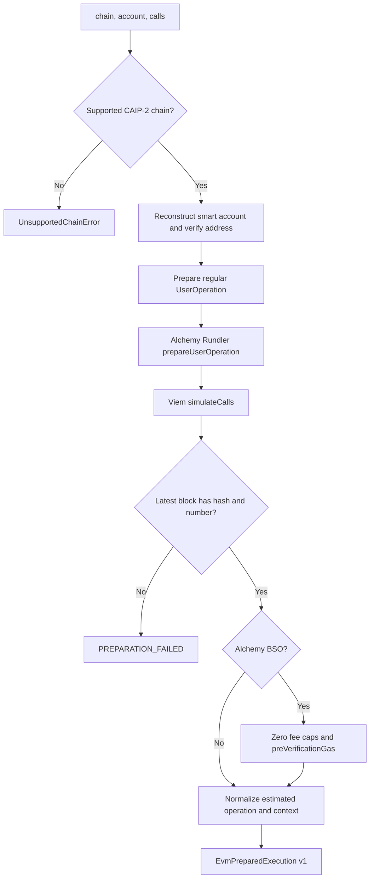

# Prepare and simulate

Preparation turns decoded calls and stored smart-account data into an unsigned EntryPoint 0.7 UserOperation plus a policy context anchored to a concrete block.

## Inputs

- supported CAIP-2 chain ID;
- reconstructed Alchemy Modular Account V2 data and P-256 owner account;
- ordered calls containing destination, native value, and calldata;
- sponsorship mode (`none` for simulation or self-funded execution,
  `alchemy-bso` for the default execution path).

## Pipeline

`prepareUserOperation` failures classified by Viem as `UserOperationExecutionError` map to `SIMULATION_FAILED`; other construction failures map to `PREPARATION_FAILED`. Rundler or call-simulation failures map to `SIMULATION_FAILED`.

## Two simulations

| Simulation                                      | Purpose                                                    | Context fields                                                            |
| ----------------------------------------------- | ---------------------------------------------------------- | ------------------------------------------------------------------------- |
| `prepareUserOperation` through Alchemy Rundler  | Validate the ERC-4337 envelope and estimate execution gas  | call, verification, pre-verification gas and fee caps                     |
| `viem.simulateCalls` through Alchemy public RPC | Execute exact account calls and trace user-visible effects | per-call status/return/gas, asset changes, native transfers, block anchor |

Both are required: EntryPoint gas estimation does not provide the same asset-transfer context, while raw call simulation does not validate the complete ERC-4337 envelope.

All requests prepare and estimate a regular UserOperation without an EIP-7677
paymaster. Simulation and `sponsor: false` retain that estimated operation. The
default sponsored execution path records the estimates for policy and billing,
then creates the exact BSO payload by setting `maxFeePerGas`,
`maxPriorityFeePerGas`, and `preVerificationGas` to `0`. The BSO policy ID is not
part of the UserOperation; submission sends it only in the
`x-alchemy-policy-id` header. There is no paymaster stub/final-data handshake.
After preparation, the adapter classifies the chain and attaches a JSON-safe
billing envelope:

- testnet: `execution.testnet`, no gas sponsorship measurement;
- unsponsored mainnet: `execution.mainnet`, no gas measurement;
- BSO-sponsored mainnet: `execution.mainnet` plus a pessimistic
  sponsored-cost reservation.

For sponsored mainnet execution, the adapter fetches ETH/USD from Alchemy,
rounds the quote upward to micro-USD, applies Alchemy's 8% mainnet sponsorship fee,
and prices the sum of the estimated call, verification, and pre-verification gas
at the estimated `maxFeePerGas`. Those pre-BSO estimates remain in the simulation
context even though the signed BSO payload contains zero fee caps and
pre-verification gas. The quote timestamp, price, and margin remain embedded in
the signed execution so receipt settlement uses the same cost basis. Pricing
failure is a preparation failure; application code never reimplements these EVM
rules.

Preparation encodes the decoded billing envelope with `EvmExecutionBilling`
before decoding the complete prepared execution. This preserves decimal-string
quantities and the ISO quote timestamp at that boundary. Regression tests cover
sponsored Base/Ethereum, sponsored Sepolia, and self-funded Base with substituted
provider responses; they do not prove live mainnet approval or submission.

## Call normalization

For auxiliary `simulateCalls`, empty calldata is omitted rather than sent as `data: "0x"`; Viem otherwise attempts an access-list asset-selector path that can produce provider gas errors. Non-empty calldata remains unchanged.

Every auxiliary call carries the successfully estimated UserOperation call-gas
limit plus 21,000 intrinsic gas and a conservative 40 gas per calldata byte.
This accommodates the [EIP-7623 calldata floor](https://eips.ethereum.org/EIPS/eip-7623)
without underfunding cheap raw calls. It only bounds auxiliary simulation; it
does not change the signed operation's gas or billing estimates.
Viem forwards it to `eth_createAccessList` during asset discovery, avoiding
Alchemy's rejection of an implicit gas allowance above the block limit. Asset
and transfer tracing remain enabled; a simulation failure still fails preparation.

Native transfers are normalized from provider trace logs emitted at `0xeeee…eeee` with the ERC-20-style `Transfer(address,address,uint256)` selector. Each record includes call index, from, to, and decimal-string value. Token asset changes contain address, bounded symbol (≤64 when valid), optional valid decimals (0–255), and pre/post/diff values.

## Prepared context

The version-1 `EvmIntentContext` includes:

- namespace, chain ID, and reconstructed account address;
- block number, hash, and timestamp;
- ordered calls with bigint values normalized for schema encoding;
- nonce, submitted gas envelope and fee caps, plus the separate pre-BSO estimate;
- both simulation sources and normalized results.

Policies consume this context. Period windows use the simulated block timestamp rather than server wall-clock time; gas budgets use the pessimistic prepared gas/fee envelope; native-spend limits inspect exact call values.

## Integrity boundary

`EvmPreparedExecution` includes serialized UserOperation and redundant normalized context. The sign phase intentionally compares them before producing a signature, protecting against accidental or malicious mutation between policy evaluation and signing.
