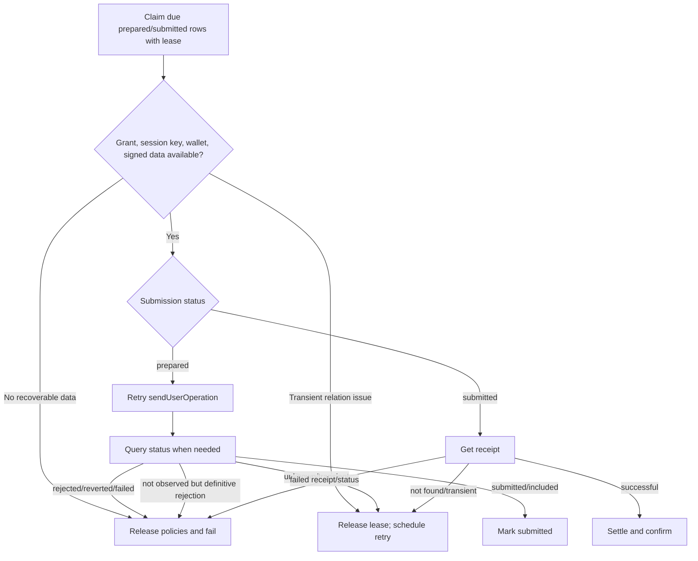

# Receipts and reconciliation

Receipt operations normalize Alchemy Rundler results into protocol models and verify the returned UserOperation hash. Application reconciliation turns uncertain prepared/submitted rows into confirmed executions or safely released failures.

## Adapter receipt operations

| Operation        | Behavior                                                                                           |
| ---------------- | -------------------------------------------------------------------------------------------------- |
| `getReceipt`     | Return `Option.none` only for recognized not-found; map other failures to `RECEIPT_LOOKUP_FAILED`. |
| `getStatus`      | Normalize Rundler unknown, pending, bundled, preconfirmed, and mined status.                       |
| `waitForReceipt` | Bound timeout to 1–120,000 ms (default 30,000); timeout returns `Option.none`.                     |

Normalized receipt includes chain ID, UserOperation/transaction/block hashes,
block number, sender, nonce, EntryPoint, optional provider-reported paymaster,
actual gas cost/used, success, and optional failure reason. BSO receipts normally
report no paymaster; sponsorship is determined from the persisted signed
execution envelope rather than receipt paymaster presence.

`isReceiptForEvmExecution` additionally compares chain, sender, nonce and
EntryPoint with a stored signed envelope. Session-key owner-operation recovery
uses this guard before committing installation or billing transitions. A failed
receipt may still match the operation; success controls the resulting transition,
not the identity check.

## Settlement transaction

For a successful receipt, application settlement locks the submission first, verifies any reconciliation lease, locks policy states in deterministic order, applies handler settlement, marks reservations settled, inserts one final execution, marks submission confirmed, writes `execution.confirmed` audit, and creates permission-filtered notifications/email jobs—all in one transaction.

If already confirmed, settlement returns the existing execution. If failed or lease ownership was lost, it does nothing.

## Release transaction

For signing, definitive submission, or failed receipt, release locks the submission, verifies terminal/lease state, loads operation reservations, locks matching states, applies handler release, marks reservations released, marks submission failed, and writes `execution.failed` with a bounded stage.

## Reconciliation worker

Current policy:

| Setting        |      Value |
| -------------- | ---------: |
| Batch size     |         20 |
| Concurrency    |          5 |
| Lease duration |  2 minutes |
| Retry delay    | 15 seconds |

The submission row is locked before policy state for both settle and release. Deterministic state-scope ordering prevents deadlocks when operations touch multiple budgets.

## User-visible status

The synchronous execute route may return `submitted` when the bounded wait produces no receipt. Clients use execution status/detail endpoints rather than resending a new logical operation. Reconciliation later creates the final execution or marks the submission failed.

## Pending before production

- Run reconciliation as a durable scheduled worker in every production environment.
- Alert on oldest due row, retry age, lease recovery, terminal failure, and provider outage.
- Define maximum reconciliation age and manual operator resolution for permanently unknown operations.
- Test receipt reorg/finality expectations per supported chain.
