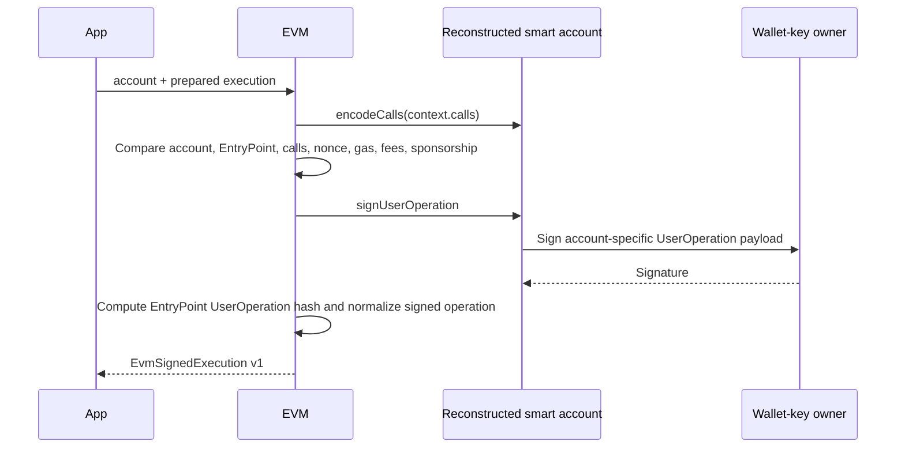

# Sign and submit

Signing proves the prepared context still matches the reconstructed account and serialized UserOperation. Submission proves the signed object hashes to the expected UserOperation hash and that the bundler returns the same hash.

## Sign integrity checks

Before calling the owner signer, the adapter reconstructs the account and compares:

- prepared chain ID with context chain ID;
- context account and serialized sender with reconstructed address;
- EntryPoint address and version with reconstructed account;
- account-encoded calls with serialized `callData`;
- context nonce with serialized nonce;
- every gas/fee field and sponsorship mode with the serialized UserOperation.

Any mismatch returns `SIGNING_FAILED`; no signature is produced.

## Submission

The adapter reconstructs the Viem UserOperation and independently computes
`getUserOperationHash` from chain ID, EntryPoint address/version, and signed
fields. It rejects a mismatch before RPC. For `alchemy-bso`, the signed payload
must contain zero `maxFeePerGas`, `maxPriorityFeePerGas`, and
`preVerificationGas`; submission uses the dedicated Rundler transport with the
configured `x-alchemy-policy-id` header. Unsponsored operations use the regular
Rundler transport. Neither path calls an EIP-7677 paymaster. Rundler
`sendUserOperation` must return the exact expected hash; a different result is
`SUBMISSION_HASH_MISMATCH`.

## Error classification

| Error                      | Meaning                                                     | Reservation behavior                               |
| -------------------------- | ----------------------------------------------------------- | -------------------------------------------------- |
| `SUBMISSION_REJECTED`      | Provider returned a recognized RPC rejection; not accepted. | Application may release/fail after status logic.   |
| `SUBMISSION_UNKNOWN`       | Transport/provider failure leaves acceptance ambiguous.     | Keep reservation; mark submitted and reconcile.    |
| `SUBMISSION_HASH_MISMATCH` | Stored/signed/bundler hash integrity violation.             | Definitive failure; release after lifecycle guard. |

This classification is critical. Treating a timeout as rejection can double-spend a periodic budget if the bundler actually accepted the operation.

## Durable transition order

1. Persist signed execution and mark submission prepared.
2. Call external bundler.
3. For success or ambiguous failure, transactionally mark submission/reservations submitted and write `execution.submitted` audit.
4. For definitive failure, transactionally release reservations and write `execution.failed`.

The signed execution is persisted before submission so reconciliation can safely retry or query status after process failure.

The signed envelope also persists the EVM-owned billing measurement selected at
preparation. Successful and reverted receipts calculate micro-USD from
`actualGasCost` using that exact quote. A pre-inclusion rejection releases the
gas hold; an uncertain or included failure keeps it until a receipt is available.

## Pending before production

- Test provider error classification against actual Alchemy Rundler/HTTP failure shapes.
- Add alerting for hash mismatch; it indicates a severe integration or data-integrity problem.
- Document retry/backoff and provider idempotency behavior for repeated `sendUserOperation`.
