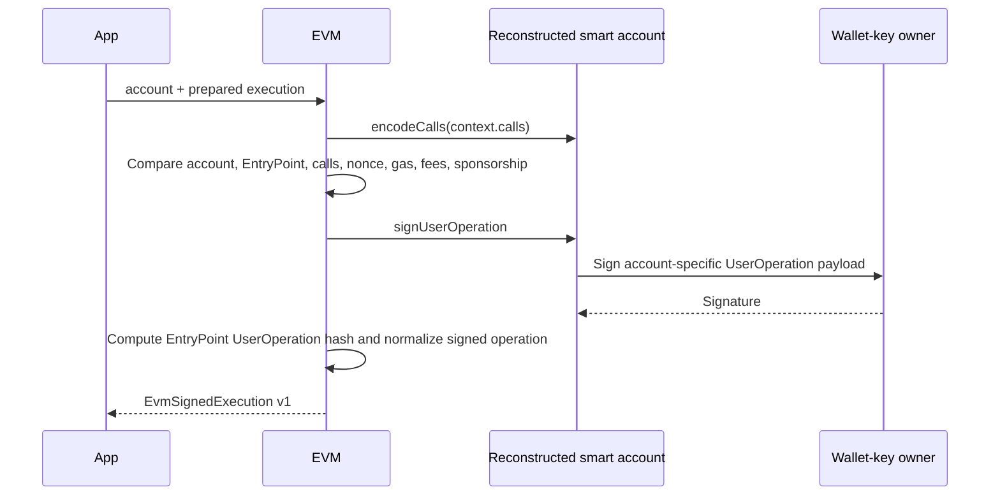

# Sign and submit

Signing proves the prepared context still matches the reconstructed account and serialized UserOperation. Submission proves the signed object hashes to the expected UserOperation hash and that the bundler returns the same hash.

## Sign integrity checks

Before calling the owner signer, the adapter reconstructs the account and compares:

- prepared chain ID with context chain ID;
- context account and serialized sender with reconstructed address;
- EntryPoint address and version with reconstructed account;
- account-encoded calls with serialized `callData`;
- context nonce with serialized nonce;
- every context gas/fee field and paymaster address with the serialized UserOperation.

Any mismatch returns `SIGNING_FAILED`; no signature is produced.

`prepared-account.ts` owns these checks for both managed signing and detached
owner approval. `signed-operation.ts` builds the shared signed envelope without
decoding already-decoded billing bigint/date fields as wire JSON a second time.

## Detached passkey owner approval

`evm.execution.ownerApprovalChallenge` accepts a public-key-only passkey account
and the server's prepared execution. It reconstructs and checks the account,
then returns the EIP-191 hash of its exact ERC-4337 UserOperation digest. No
owner signing function is called.

After the application verifies the browser response through `Passkeys`,
`evm.execution.completeOwnerApproval` repeats those checks, binds the verified
assertion's challenge to the prepared operation, normalizes its DER signature,
and encodes the WebAuthn validator signature. It returns the same signed envelope
as managed signing, including the original billing quote. It does not broadcast.

The application must load the prepared operation from durable storage, verify
credential/origin/RP/user-verification, consume its one-time approval and advance
the authenticator counter atomically before persisting the signed payload. The
EVM encoder is not a replacement for that authentication boundary. No HTTP
authentication or persistence is performed inside this adapter.

The local Anvil test deploys and executes with this detached signature using a
public-key-only reconstruction adapter. It also rejects mismatched challenges
and changed prepared gas fields. This verifies contract encoding, not browser
authenticator UX or hosted bundler sponsorship.

## Detached local session execution

Preparation can select a persisted single-signer installation instead of the
root validator. The adapter first reconstructs and checks the wallet address,
requires deployed code, then reconnects with the installation's signer address,
entity ID and global-validation flag. That public-only account throws if asked
to sign and cannot deploy or replace the wallet owner.

`sessionSigningMessage` returns the ERC-4337 digest. The client signs its raw
32 bytes with EIP-191 `signMessage`, not as UTF-8 hexadecimal text.
`completeSessionExecution` verifies that EOA signature against the persisted
session signer and packs it through Alchemy's `packUOSignature`. The completed
envelope preserves the prepared billing quote and deterministic operation hash.

Both phases repeat prepared-account/context checks. The nonce key must select
the exact stored entity and global flag in its low 40 bits. Viem's parallel nonce
lanes occupy the upper 152 bits; the full nonce remains bound by the signature.
Session executions cannot contain deployment factory data. Passkey
owner completion refuses a session-selected operation. Grant/lifecycle checks,
API policy reservations, one-time completion and persistence remain application
responsibilities; the adapter alone is not an authorization API.

## Submission

The adapter reconstructs the Viem UserOperation and independently computes
`getUserOperationHash` from chain ID, EntryPoint address/version, and signed
fields. It rejects a mismatch before RPC. For `alchemy-bso`, the signed payload
must contain zero `maxFeePerGas`, `maxPriorityFeePerGas`, and
`preVerificationGas`; submission uses the dedicated Rundler transport with the
configured `x-alchemy-policy-id` header. Unsponsored operations use the regular
Rundler transport. Neither path calls an EIP-7677 paymaster. Rundler
`sendUserOperation` must return the exact expected hash; a different result is
`SUBMISSION_HASH_MISMATCH`.

## Error classification

| Error                      | Meaning                                                              | Reservation behavior                                               |
| -------------------------- | -------------------------------------------------------------------- | ------------------------------------------------------------------ |
| `SUBMISSION_REJECTED`      | Provider returned an ERC-7769 validation rejection for this request. | Application may release/fail after status logic.                   |
| `SUBMISSION_UNKNOWN`       | Transport/provider failure leaves acceptance ambiguous.              | Keep reservations and reconcile the canonical hash.                |
| `SUBMISSION_HASH_MISMATCH` | Stored/signed/bundler hash integrity violation.                      | Keep reservations; a response mismatch can occur after acceptance. |

This classification is critical. Treating a timeout as rejection can double-spend a periodic budget if the bundler actually accepted the operation.

Only the validation codes documented by [ERC-7769](https://eips.ethereum.org/EIPS/eip-7769#eth_senduseroperation)
are classified as rejection: `-32602`, `-32500` through `-32505`, `-32507`, and
`-32508`. Internal RPC errors, unknown server codes and rate-limit responses stay
ambiguous. Adapter tests exercise these codes through Viem's actual error wrapping
with a substituted transport; they do not call a live provider.

## Durable transition order

1. Persist signed execution and mark submission prepared.
2. Call external bundler.
3. On success or observed provider acceptance, mark submitted and write `execution.submitted` audit transactionally. An ambiguous response with no observed acceptance retains the prepared row and schedules recovery.
4. For definitive rejection confirmed by the lifecycle's status checks, release reservations and write `execution.failed` transactionally.

The signed execution is persisted before submission so reconciliation can safely retry or query status after process failure.

The signed envelope also persists the EVM-owned billing measurement selected at
preparation. Successful and reverted receipts calculate micro-USD from
`actualGasCost` using that exact quote. A pre-inclusion rejection releases the
gas hold; an uncertain or included failure keeps it until a receipt is available.

## Pending before production

- Test provider error classification against actual Alchemy Rundler/HTTP failure shapes.
- Add alerting for hash mismatch; it indicates a severe integration or data-integrity problem.
- Document retry/backoff and provider idempotency behavior for repeated `sendUserOperation`.
