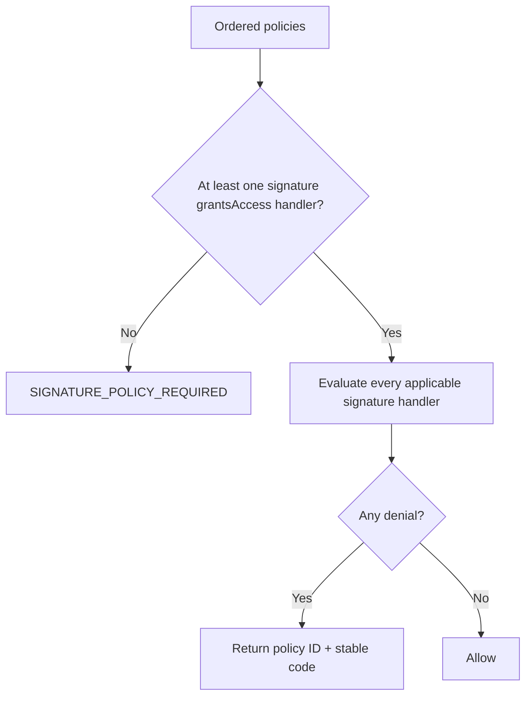

# EVM policy engine

Policies are immutable session-key definitions evaluated by a deterministic registry. Every applicable policy must allow an operation; no policy can override another denial. Policy handlers live in `packages/evm`, while application code owns database locking, state persistence, reservations, audit, and operation lifecycle.

## Registry metadata

Each type defines:

- **applicability**: `execution`, `signature`, or `both`;
- **cardinality**: `singleton` or `repeatable`;
- **priority**: deterministic evaluation order;
- **execution operation**: stateless, stateful, or not applicable;
- **signature operation**: stateless with `grantsAccess` metadata, or not applicable.

Application materialization copies code-owned applicability into the persisted protocol policy and validates it on read/evaluation. The registry—not a switch in application code—owns dispatch, initial state seeds, decoding, reservations, settlement, and release.

## Deterministic order

| Priority | Policy                   | Applicability | Cardinality | Stateful                      |
| -------: | ------------------------ | ------------- | ----------- | ----------------------------- |
|      100 | `evm.time-window`        | both          | singleton   | No                            |
|      200 | `evm.chain-allowlist`    | both          | singleton   | No                            |
|      400 | `evm.gas-budget`         | execution     | singleton   | Yes                           |
|      500 | `evm.native-spend-limit` | execution     | singleton   | Yes for non-operation periods |
|      600 | `evm.signature`          | signature     | singleton   | No                            |

Equal-priority instances sort by policy ID. This makes the first denial stable across processes and retries.

## Execution evaluation

1. Order policy instances.
2. Skip not-applicable operations.
3. Run stateless evaluation for fast denials.
4. For the selected candidate transaction, derive state seeds, insert missing rows, and lock scopes in policy ID/state-key order.
5. Call registry reserve; any denial returns no state changes/reservations.
6. Apply optimistic-revision state changes and insert operation-owned reservations atomically with submission.
7. Settle or release through the same registered handler after result.

## Signature evaluation

Signature operations require at least one applicable stateless handler with `grantsAccess: true`. Currently only `evm.signature` does so. `evm.time-window` and `evm.chain-allowlist` narrow signature authority but cannot accidentally grant it on their own.

## Adding a policy

1. Define create/persisted policy schema, policy ID, applicability, state/reservation/result schemas, and decision codes in protocol.
2. Implement a focused `PolicyHandler` in `packages/evm/src/policy/policies`.
3. Register type, applicability, cardinality, priority, and operation adapters.
4. Keep state keys deterministic and derived only from policy/context.
5. Make reserve pessimistic, settlement monotonic, and release exactly invert the reservation.
6. Add protocol/handler/application concurrency tests.
7. Add dashboard editor and shared summary display.
8. Update [the catalog](catalog.md) and [state model](state-reservations.md).

## Pending before production

- Add comprehensive handler law tests: deterministic decision, reserve atomicity, settle bounds, and release inverse.
- Add policies for contract/selector allowlists and token spend only after simulation context semantics are fixed across chains.
- Define stable external policy-code documentation for SDK/MCP consumers.
