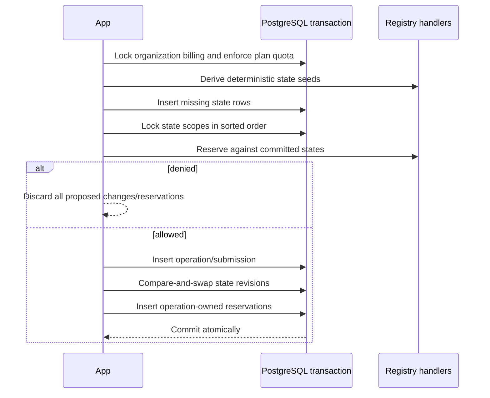

# Policy state and reservations

Stateful policies require committed accumulators plus in-flight reservations. Without reservations, two concurrent transactions can both read the same spent amount and exceed a limit even if each request is individually valid.

The exact tables are [`core.session_key_policy_state`](../../database/core-wallets-operations.md#coresession_key_policy_state) and [`core.session_key_policy_reservation`](../../database/core-wallets-operations.md#coresession_key_policy_reservation).

## Generic operation ownership

Each reservation belongs to exactly one operation:

```text
operation =
  | { type: "execution", id: ExecutionSubmissionId }
  | { type: "signature", id: SignatureOperationId }
```

PostgreSQL represents this as two nullable typed foreign keys plus `num_nonnulls(...) = 1`. Partial unique indexes prevent duplicate policy/state-scope reservations for one operation.

## Initialization without application switches

For every ordered stateful handler, the registry asks `initialStates(policy, context)`. The application inserts missing seeds generically, then loads/locks the returned scopes. A new stateful policy therefore does not require an application-layer policy-type switch.

## Lock order

Scopes are deduplicated and sorted by policy ID, then state key, before `FOR UPDATE`. Settlement and release lock the operation/submission before the same sorted state scopes. This provides a consistent cross-request lock order and makes background reconciliation safe alongside the HTTP request.

## Reservation transaction



Handlers return no partial changes when one scope denies. Application applies state changes with expected revision; a concurrent mismatch is treated as an invariant failure and transaction rollback.

## Settlement and release laws

- **Reserve pessimistically** for the maximum authorized resource exposure.
- **Settle monotonically** using the authoritative successful result and remove the reservation.
- **Release exactly** removes reserved exposure without incrementing spent.
- A reservation is terminally settled or released at most once.
- Missing/malformed state or an authoritative result exceeding reservation is an `EvmPolicyError`, not an allow fallback.

## Expiry and recovery

Reservations carry expiry and status indexes so interrupted operations can be found. Execution lifecycle currently releases or settles them through request/reconciliation logic. Signature operations use the generic operation reference and can adopt analogous recovery for future stateful signature-count policies.

## Pending before production

- Add an explicit expired-reservation sweeper with operation-status-aware decisions.
- Test deadlock freedom and compare-and-swap behavior under high concurrency.
- Add a state-repair operator tool that is audited and cannot silently widen policy limits.
- Add signature stateful handlers before enabling per-period signature policies.
