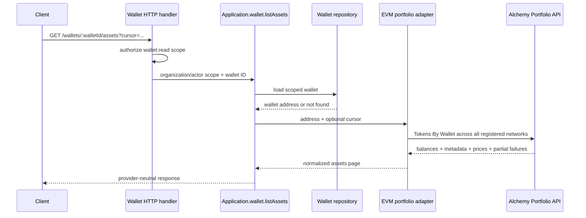

# Fungible wallet portfolio

Namera exposes an account-scoped, provider-neutral view of native and ERC-20
balances through `GET /wallets/:walletId/assets`. The route always queries every
network in the launch registry. Its only query input is an opaque `cursor` from
the previous response.

## Flow

The application never constructs Alchemy URLs or decodes provider payloads.
The EVM package owns network-slug mapping, upstream response validation, exact
hex-balance formatting, and error normalization.

## Response model

Each item contains:

| Field              | Required | Description                                                             |
| ------------------ | -------- | ----------------------------------------------------------------------- |
| `namespace`        | Yes      | Always `eip155` for the current adapter.                                |
| `chainId`          | Yes      | Supported CAIP-2 chain identifier.                                      |
| `type`             | Yes      | `native` or `erc20`.                                                    |
| `tokenAddress`     | Yes      | ERC-20 contract address, or `null` for a native asset.                  |
| `rawBalance`       | Yes      | Exact provider balance as a `0x`-prefixed integer.                      |
| `formattedBalance` | Yes      | Exact decimal-unit string when token decimals are available, else null. |
| `metadata`         | Yes      | Nullable name, symbol, decimals, and logo URL.                          |
| `usdPrice`         | Yes      | Nullable USD unit price and quote timestamp.                            |

The page also returns `nextCursor` and a deduplicated `partialFailures` list.
Alchemy can return HTTP 200 while individual networks fail. Namera preserves
successful assets and maps each recognized failed network to its CAIP-2 ID with
`PROVIDER_UNAVAILABLE`. A transport failure or malformed provider response
fails the whole route with `WalletAssetsUnavailableError` (HTTP 502).

Zero balances are omitted. The route does not calculate a portfolio total
because the response can be paginated or partial; consumers may calculate a
display total only after collecting all pages and accounting for failures.

## Provider request

The live adapter calls Alchemy `assets/tokens/by-address` with one wallet,
every Alchemy slug in the Namera launch registry, and all four enrichment flags:
native tokens, ERC-20 tokens, metadata, and prices. The Alchemy API key remains
inside the server-side EVM layer.

NFT ownership and transaction history deliberately remain separate future
resources. Their response sizes, compute-unit costs, and pagination behavior
are materially different from fungible assets.

## Pending before production

- Add a short server-side cache with an explicit freshness contract if provider
  cost or account-page latency becomes material.
- Add bounded retries for only the networks reported in `partialFailures`.
- Define separate paginated NFT and transaction-history routes when their UI is
  scheduled.
