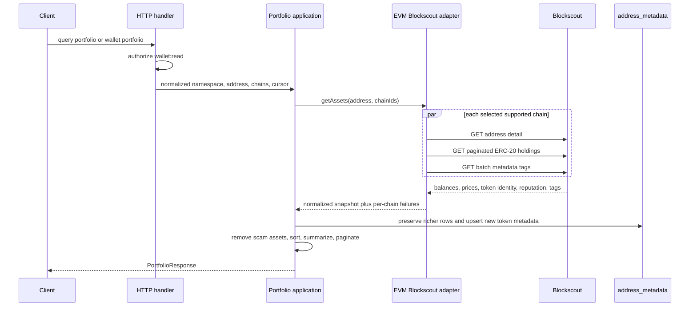

# Portfolio and address enrichment

Namera uses Blockscout PRO for provider-neutral address identity and fungible
portfolio reads. Alchemy remains responsible for RPC, Modular Account V2,
simulation, signing, Bundler submission, and sponsorship; its Portfolio API is
not used. The consumed and planned provider endpoint catalog, upstream shapes,
normalization rules, and security requirements are documented in the
[Blockscout provider integration](blockscout-data-enrichment.md).

## Public API

All routes require the normal authorization middleware and `wallet:read` access.
Provider credentials, response shapes, and raw failures never cross the EVM
adapter boundary.

| Method | Route                                            | Purpose                                                                        |
| ------ | ------------------------------------------------ | ------------------------------------------------------------------------------ |
| `GET`  | `/address-metadata/:namespace/:chainId/:address` | Resolve one canonical address, using the persistent cache first.               |
| `POST` | `/address-metadata/resolve`                      | Resolve up to 50 namespace-qualified addresses in one request.                 |
| `GET`  | `/address-metadata/search`                       | Search cached names, symbols, and addresses, then warm missing remote matches. |
| `POST` | `/portfolios/assets/query`                       | Query a paginated portfolio for an explicit namespace-qualified address.       |
| `GET`  | `/wallets/:walletId/portfolio`                   | Load a scoped wallet, then return the same portfolio contract for its address. |

The explicit query route currently accepts `namespace: "eip155"`, an EVM
address, optional supported CAIP-2 chain IDs, an opaque cursor, and a page size
from 1 through 100. The wallet route derives namespace and address from the
organization-scoped wallet instead of trusting client input.

## Portfolio flow

Every chain is isolated with `Effect.result`, so one provider failure does not
erase successful networks. A request fails with `PortfolioUnavailableError`
only when Blockscout is unavailable for every selected chain. Provider calls
have a 15-second bound. Zero balances and tokens explicitly marked as scams are
omitted in the EVM adapter; normalized scam metadata is filtered again at the
application boundary.

Token holdings already contain stable identity, decimals, logo, market, and
reputation data. The adapter combines those fields with one batch metadata-tag
request per chain and seeds the persistent metadata cache. It does not perform
one contract-detail request per portfolio row. Exact metadata routes remain the
deeper, on-demand enrichment path.

## Portfolio response

| Field             | Required | Description                                                      |
| ----------------- | -------- | ---------------------------------------------------------------- |
| `namespace`       | Yes      | Current namespace, presently `eip155`.                           |
| `address`         | Yes      | Canonical portfolio owner address.                               |
| `summary`         | Yes      | Total, priced, and unpriced asset counts plus current USD value. |
| `chains`          | Yes      | Per-chain asset counts, priced counts, and current USD value.    |
| `items`           | Yes      | Current cursor page of normalized native and ERC-20 balances.    |
| `nextCursor`      | Yes      | Opaque next-page cursor or `null`.                               |
| `partialFailures` | Yes      | Supported chains omitted because their provider read failed.     |

Each asset carries its CAIP-2 chain ID, exact raw balance, nullable formatted
balance, basic token metadata, optional normalized address metadata, and an
optional timestamped USD unit price. Totals are computed from the complete
point-in-time snapshot before pagination. They are not historical performance.

## Address metadata model

The normalized JSON payload is a namespace union. Its EVM variant records:

- canonical namespace, chain ID, and address;
- kind (`eoa`, `contract`, `fungible-token`, `nft-contract`, or `unknown`);
- display name, safe HTTPS icon URL, and description;
- reputation, scam/source-verification flags, and bounded trust signals;
- normalized name, protocol, category, information, classifier, and note tags;
- token standard/name/symbol/decimals/logo when applicable;
- contract/proxy/implementation identity when applicable;
- schema version and Blockscout observation timestamp.

Blockscout's `reputation: "ok"` means no known provider warning; it is not
treated as proof that a token is trusted. Namera assigns `credible` only from a
credible/official/verified metadata tag. Source verification remains a separate
field and does not imply safety.

## Persistent cache

Table: `core.address_metadata`

| Column          | Required | Description                                           |
| --------------- | -------- | ----------------------------------------------------- |
| `namespace`     | Yes      | Namespace discriminator; currently `eip155`.          |
| `chain_id`      | Yes      | Supported CAIP-2 chain identifier.                    |
| `address`       | Yes      | Canonical namespace address.                          |
| `data`          | Yes      | Versioned, typed, provider-neutral JSONB metadata.    |
| `observed_at`   | Yes      | Time represented by the provider data.                |
| `refresh_after` | Yes      | Earliest time a read should attempt provider refresh. |
| `created_at`    | Yes      | Database creation time.                               |
| `updated_at`    | Yes      | Last database replacement time.                       |

Constraints and indexes:

- primary key on `(namespace, chain_id, address)` prevents duplicate identity;
- `jsonb_typeof(data) = 'object'` rejects non-object payloads;
- B-tree index on `refresh_after` supports refresh/reconciliation scans;
- GIN trigram indexes on normalized display name and token symbol support local
  autocomplete;
- decoded JSON identity must equal the relational row key before repository data
  is returned.

Stable EOAs, verified contracts, and token identities refresh after 30 days.
Unknown addresses, proxies, suspicious addresses, and scam signals refresh after
24 hours because those classifications can change. Stale rows are returned when
Blockscout is temporarily unavailable. Portfolio token metadata never replaces
a cached row with richer tags or verification evidence.

No foreign key points from metadata to wallets or executions. The same address
may be used by many product entities, and the cache is keyed by onchain identity
rather than ownership.

## Dashboard

`/account/:walletId/assets` consumes the wallet portfolio contract. The page
shows current priced value, chain allocation, asset allocation, price coverage,
and enrichment coverage. Its reusable table supports search, rich token and
chain cells, trust/pricing/type/chain filters, chain grouping, sorting,
configurable columns, explorer actions, and ten-row pagination. The default
trust filter keeps credible assets and native balances visible while hiding
known-but-unverified token noise; clearing filters reveals the complete
non-scam response.

The chart palette comes from shared UIKit semantic chart variables so the page
does not own hard-coded colors.

## Pending before production

- Add a bounded refresh worker using `findStaleBefore`; read-through refresh is
  already safe without it.
- Persist portfolio snapshots only when historical value charts become a
  product requirement.
- Add NFT ownership and transaction history as separate paginated contracts;
  neither belongs in the fungible balance response.
- Add provider latency and partial-chain metrics after finalizing the bounded
  low-cardinality names in the telemetry registry.
