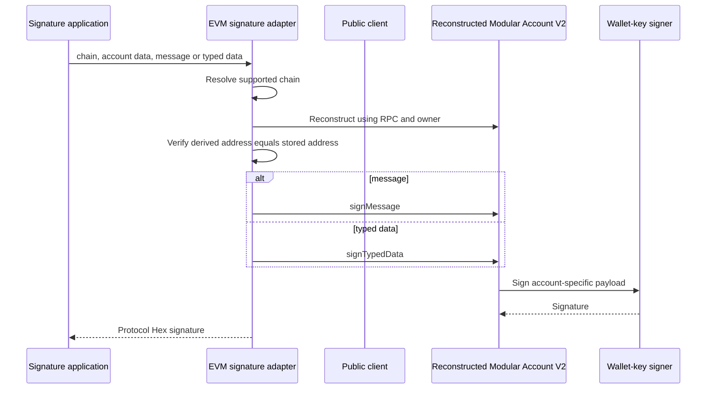

# EVM signatures and verification

The EVM adapter supports fully discriminated personal-message and EIP-712 typed-data operations. Application workflows apply session-key grants/policies, quota/idempotency, persistence, audit, and billing before calling the adapter.

## Digest

`digestEvmSignature` maps:

- message → Viem `hashMessage`;
- typed data → Viem `hashTypedData`.

The result is decoded as protocol `Bytes32`. Digesting is reusable for canonical request hashing/policy context and does not call a provider.

## Legacy owner signing

This is the old synchronous path, not the self-custodial beta signing flow.
Local passkey owners cannot sign silently through this adapter. The public
signature workflow still needs migration to the detached flow below.

Reconstruction errors map to `ACCOUNT_RECONSTRUCTION_FAILED` or `ACCOUNT_ADDRESS_MISMATCH`; owner signing failures map to `SIGNING_FAILED`.

## Detached session signing adapter

`Evm.sessionSignatures.prepare` reconstructs the public account and requires
explicit `allowSignatures` with the supported SingleSignerValidation module.
It hashes the original message/typed data, then builds Alchemy's `ReplaySafeHash`
typed data using the chain ID, module verifying contract and wallet address
left-padded to 32 bytes as domain salt. It never invokes an owner signer.

`complete` recomputes that payload from trusted persisted inputs, verifies the
local secp256k1 signature against the session's signer address, packs its non-root
entity ID using `pack1271Signature`, and calls ERC-1271 verification on the
account. An ECDSA signature alone is insufficient: uninstalled/revoked validators
must fail. No provider transaction is submitted and no signature is logged.

The adapter owns chain/account encoding only. Callers must resolve installation
data from persistence, validate actor/grant authority and lifetime, and own
idempotency, billing and audit transitions. This package-level implementation
does not yet expose detached signature API routes or SDK/CLI signing.

Actual-contract tests exercise both payload types with public-only account
reconstruction, rejection before installation and after removal, changed-payload
rejection, and the domain replay protections. Alchemy's time hook does not
expire ERC-1271 signatures; see [onchain sessions](accounts/onchain-sessions.md).

## ERC-1271-compatible verification

Verification is account-aware, not an EOA `recoverAddress` shortcut:

1. resolve chain and reconstruct the exact smart account;
2. read code at the account address;
3. when undeployed, obtain account factory/factoryData for counterfactual verification;
4. call Viem `publicClient.verifyMessage` or `verifyTypedData` with address, signature, payload, and optional factory args;
5. return boolean validity; provider/contract errors map to `VERIFICATION_FAILED`.

This supports deployed ERC-1271 accounts and counterfactual smart-account signatures. A signature may be cryptographically valid for the underlying owner but invalid for the smart account if its validator/account configuration differs.

## Application operation lifecycle

The application stores one [`core.signature_operation`](../database/core-wallets-operations.md#coresignature_operation) per idempotent attempt. It binds actor, wallet, session key/grant, policy hash, discriminated request data, lifecycle status, and failure code. Raw private key material is never present. The operation is the source owner for an anniversary-period billing reservation and supports historical inspection without using telemetry as billing evidence.

Signature policy evaluation requires at least one signature operation that explicitly `grantsAccess`; time-window and chain-allowlist policies can restrict signatures but do not independently enable them.

## Idempotency and quota

- SDK/CLI/MCP generate a key internally and reuse it for automatic retries of the same logical signature.
- Application canonical request hash rejects different input under the same actor/key.
- Monthly signature quotas count successful operations in the effective billing window.
- Reservation/failure lifecycle prevents an interrupted attempt from silently becoming unlimited free work.

## Pending before production

- Wire detached preparation/completion into persistence, API, SDK, CLI and local MCP.
- Enforce signature expiry/policies in API requests and disclose their offchain scope.
- Add conformance fixtures for popular ERC-1271 consumers and counterfactual verification paths.
- Define retention/redaction for signed message and typed-data content, especially personal data.
- Add optional domain/contract allowlist policies before broad typed-data production use.
- Add periodic signature-count policy if per-session-key daily limits are launched.
