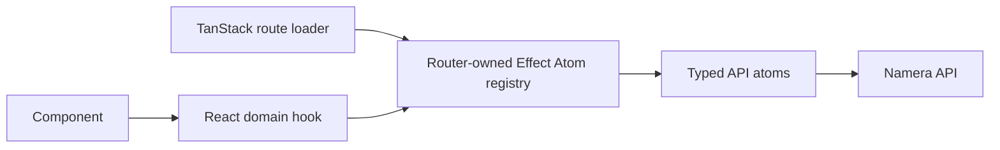

# Dashboard architecture

The dashboard is a Vite/React application using TanStack Router, Effect Atom,
React Hook Form, Tailwind CSS, Motion, Wagmi, and `@namera-ai/ui`.

## Data flow

Protected loaders prefetch the data a route needs and return it as initial route
data. Rendered hooks observe the same atom cache, so mutations update the screen
without a second state system. Query keys include active organization where
scope changes with tenant selection.

## Routing and authentication

All product routes live below the pathless `_authenticated` layout. Its loader
prefetches the current actor and redirects a missing actor to `/auth`. Auth,
invitation review, OAuth consent, CLI consent, and workspace creation use
sidebar-free layouts where appropriate. `/auth/verify` explicitly exchanges the
credential then replaces location with the server-approved return path.

Session bootstrap maps only the typed `Unauthorized` response to a missing
actor. Offline, server, permission, and decoding failures remain errors and
reach the retry boundary; they must not masquerade as a successful logout.

Account, session-key, and execution detail parents validate branded IDs,
prefetch detail once, and provide nested navigation. Invalid IDs use the router
not-found boundary. Account and session-key detail query failures render a local
`DataError` with atom refresh inside their shells, rather than leaving nested
pages loading indefinitely. Retry is disabled while that query is refreshing;
provider exception details are never displayed.

The router has shared error and not-found fallbacks. Errors expose a reload
action (clearing failed in-memory atom results), and both states offer a return
to the overview. They never render exception messages or request URLs. A child
route failure stays in that route's boundary under its loaded parent layout;
failure of the authentication layout itself cannot retain that layout's sidebar.
Component-owned query errors still need their own local feedback states.
Execution details, workspace settings, notification preferences and session-key
creation also use local retry feedback when their initial data request fails.
Already-loaded form data is retained on background refresh failure so unsaved
edits are not discarded.

Profile form initialization and refresh normalize absent avatar/name fields to
controlled values. React Hook Form otherwise introduces an explicit undefined
avatar, which the optional-key protocol schema rejects and prevents autosave.
The default avatar matches the displayed fallback and is persisted with the
first profile edit. Avatar validation errors are visible. Resolver regressions
cover an image-free profile and preservation of an existing image.

Account and session-key creation share `OptionalFormDescription`: an empty or
undefined controlled description decodes to an absent key before reaching the
strict public DTO. Nonempty text retains the protocol length checks. The account
textarea keeps an empty string when cleared; neither creation flow requires a
description. Form resolver tests exercise blank and populated descriptions and
verify that the decoded session request can be encoded by the public API schema.

Account creation also requires a form-only recovery acknowledgement before the
passkey ceremony starts. The shared passkey recovery notice remains visible on
local account overviews; it never claims that email login or a session key can
restore owner access. The acknowledgement is not sent to the API or persisted.

## State and mutations

- Atoms own typed API calls, query keys, invalidation, and loader-prefetch
  helpers.
- Hooks adapt atoms through shared query/mutation helpers and expose
  `onSuccess`, `onError`, and `onSettled` callbacks.
- Components use `mutate` and the shared feedback registry for expected
  failures. `mutateAsync` is reserved for sequencing such as serialized
  autosave.
- Active-organization changes invalidate tenant-scoped wallet, key,
  authorization, member, billing, and execution data.

## Forms

Forms use one Effect Schema converted with `Schema.toStandardSchemaV1`, the
standard-schema React Hook Form resolver, a native `form`, `Controller`, and
UIKit `Field` primitives. UIKit selection controls adapt value/change props
explicitly. Permission-aware route data decides whether a form is interactive;
read-only forms do not autosave or block navigation.

## Shared UI ownership

- `src/routes/**/-components`: one route or route-group composition.
- `src/components`: UI shared by unrelated routes.
- `src/components/common/table`: compact filter/order/group/display controls and
  pure facet helpers.
- `src/components/display`: semantic wallet, address, chain, actor, status,
  metadata, date, and copy displays.
- `src/components/policy/evm`: policy catalog, cards, summaries, and editors.
- `@namera-ai/ui`: cross-application primitives, icons, hooks, and theme.

Shared copy controls transition to a check state with reduced-motion support.
Tooltip exits hide as soon as an anchor is released, avoiding detached overlays
at the viewport origin. Interactive controls retain accessible names and
keyboard/focus behavior.

## Tables

Reusable fixed-column data grids separate declarative columns/cells/sorters from
query and view state. Accounts, session keys, API keys, invitations, members,
and executions share compact controls where the domain needs them. Active rows
are the default for revocable resources; lifecycle history remains available in
status filters. Columns stretch to full width with minimum sizes and are not
resizable. Pinned action columns contain navigation and copy/revoke actions.

Execution and session-key tables are reusable across organization, account, and
session-key scoped routes. Scoped usage pages prefetch server-filtered history
and remove redundant filter/grouping facets. List endpoints intentionally
return compact row contracts; detail pages load expanded relations.

## Implemented product routes

Identity and Templates are not beta features: their empty routes and the Identity
sidebar group are removed. Direct navigation uses the shared not-found boundary.

- organization overview with compact resource KPIs, namespace operation totals,
  configurable activity trends, and a shared recent-executions summary;
- magic-link sign-in and invitation recipient review;
- accounts list/create and account Overview/Session Keys/Usage views;
- session-key list/create/revoke and Overview/Policies/Usage views;
- activity list and expanded execution detail;
- profile, notification preferences, sessions/security, workspace, members and
  invitations, API keys, MCP authorizations, CLI authorizations, and billing
  usage;
- MCP and CLI authorization consent with account-grouped active session-key
  selection.

## Local MCP setup

MCP settings include local listener setup above the authorization table. The
start command targets the configured API origin; the agent connects to the CLI's
loopback HTTP endpoint, not a server-hosted MCP route. Instructions distinguish
MCP OAuth consent from CLI login/API keys, require local encrypted session-key
imports for signing, and disclose reauthorization after listener restarts.

## Browser telemetry

Dashboard document security is owned by `tooling/document-security.ts`, not the
API middleware. Production HTML includes a CSP fallback and no-referrer metadata;
builds emit an `_headers` file containing CSP framing denial, nosniff, frame
denial, no-referrer and a Permissions-Policy permitting first-party WebAuthn but
disabling camera, microphone, geolocation and payment. Hosts without `_headers`
support must apply those values themselves. Vite preview applies the full policy;
development omits CSP to allow HMR. Scripts must be same-origin; API/RPC/telemetry
connections may only use self and the configured API origin. Inline styles remain
necessary for the shared UI. External token/avatar images are HTTPS-only.
The document meta fallback cannot enforce `frame-ancestors` or browser permissions.
Actual hosted-header and critical-browser-journey verification remain required.

The Vite resolver preserves its default client conditions alongside
`namera-source`. Replacing those defaults can select Node transports from
browser-compatible dependencies. Dashboard chain data and owner review use
`@namera-ai/evm/chains` and `@namera-ai/evm/session-review`; they do not import the
EVM server service/configuration barrel. The production build is checked for
Node-module externalization warnings and unwanted provider configuration code.

The shared atom runtime installs the dashboard OTLP Layer. The browser exports
only through server `/t/*` endpoints with a dashboard service identity; provider
credentials never enter the bundle.

## Organization overview

The authenticated index route prefetches `GET /dashboard/overview` into the
router-owned atom registry, while its component subscribes to the same atom so
the page shell remains visible during refreshes. The response keeps global
resource totals at the root and places operation totals, activity, and execution
source distribution inside a namespace-discriminated array. Each namespace
provides daily, weekly, and monthly series; `eip155` currently returns 14 daily,
12 weekly, and 12 monthly buckets plus confirmed execution counts grouped by
bounded actor type. A future Solana member can be added without changing the
page-level contract.

The overview deliberately excludes plan limits, remaining quotas, and attention
states. Four independent KPI cards summarize accounts, active session keys,
all-time executions, and all-time signatures. Actual active-resource ratios and
recent operation trends provide context without representing billing quotas.
The primary chart compares executions and signatures at the selected
granularity, while the execution-source chart shows the API key, MCP, CLI, and
member composition for confirmed executions. Limits and period consumption
belong to Billing, while recent activity
subscribes to the same executions atom as the Activity page and renders the
shared execution table in a five-row summary mode. The overview always renders
the active organization's live projections.

## Pending

- Identity, templates and audit-history browsing are future product surfaces,
  not empty beta navigation destinations. Inbox and account assets are implemented.
- Add browser interaction and accessibility regression tests.
- Measure route/chunk splitting before optimizing large bundles.
