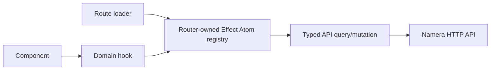

# Dashboard architecture

The dashboard is a Vite/React application using TanStack Router, Effect Atom,
React Hook Form, Tailwind CSS, Motion, Wagmi and `@namera-ai/ui`.

## Queries and authority

Protected loaders prefetch into the same registry observed by rendered hooks.
Query keys and invalidation preserve organization/account scope. Atoms own API
calls and invalidation; hooks expose `onSuccess`, `onError` and `onSettled`.
Components use `mutate` with the shared feedback registry. `mutateAsync` is used
for sequencing, such as serialized autosave.

The pathless `_authenticated` loader resolves the current actor. Only typed
`Unauthorized` becomes a missing actor and redirects to `/auth`; network/server
and decoding failures reach retry feedback. Detail parents validate IDs and
prefetch their data. Query failures use local `DataError` boundaries where the
surrounding shell can remain useful. Feedback never exposes raw exceptions.

Denied `Unauthorized`/`Forbidden` query results expose no cached data, including
while retrying. Denied queries/mutations refresh current-user authority. Ordinary
network failures retain already-loaded data. The current-user atom revalidates
on document visibility. When user/session/organization/membership/role/permissions
change, the layout unmounts protected content, resets the registry and invalidates
loaders. Profile presentation changes do not reset dirty forms. This is a UI
safeguard; server authorization remains authoritative.

Autosave captures the original authority and checks it before validation and
dispatch, including unmount/pagehide flushes. It cannot cancel a write already
accepted by the server. There is no push channel for remote role changes.

## Product routes

- Sign-in through email or Google, beta-invite admission, invitation review,
  workspace creation, OAuth and CLI consent.
- Organization overview, accounts and account Overview/Assets/Session Keys/Usage.
- Session-key creation, installation/removal and Overview/Policies/Usage.
- Activity and execution detail, and the notification inbox.
- Profile, notification preferences, login sessions, workspace, members,
  invitations, API keys, MCP/CLI authorizations and billing usage.

Overview prefetches `GET /dashboard/overview`. Its namespace-discriminated
response contains resource totals, execution/signature series and execution
source distribution. The current EVM series has daily, weekly and monthly
buckets. When the execution-source distribution is empty, the overview shows
permission-aware quick-action links for account/session-key creation, MCP setup,
API-key management, and member invitations instead of the source chart. Recent executions reuse the Activity table; quota and period consumption
belong to Billing. The billing page presents the Free plan, anniversary date,
resource capacity and settled/reserved meters with permission-aware access.

## Account creation and portfolio

Successful account creation opens `/accounts/created/$accountId`, a protected,
refresh-safe next-steps page loaded through the shared wallet atom. It shows the
same account identity and properties as the account overview, followed by a
permission-aware session-key shortcut. The shortcut preselects only an eligible
account from the current workspace's wallet list; invalid or unavailable search
IDs do not select an account. Normal account links still open the overview.

Account creation requires a form-only recovery acknowledgement before the browser
passkey ceremony. WebAuthn display labels use the account name; the challenge,
user handle and RP ID remain server-issued. No private owner key enters API or
form state. See [accounts](../wallets/accounts.md).

Assets prefetches the account's paginated portfolio into the shared registry and
loads all pages. Token rows display the token icon with a chain badge, balance,
USD price and USD value. The total, chain allocation and asset chart derive from
the same exact-valued response and network visibility filters. Unpriced assets
remain visible and are excluded from USD allocation; small slices group into
Other. The tertiary refresh icon requests a fresh server snapshot and invalidates
the account query. Failures retain the displayed snapshot and show feedback.
The server's five-minute cache is independent of frontend query lifetime; see
[portfolio](../evm/portfolio.md) for cache keys, paging and provider limits.

## Session authority and local keys

Creation presents six capabilities: Contract access, Token spending, Native
spending limit, Gas budget, Signatures and Unrestricted account access. Contract
access covers one contract/all functions, one contract/selected functions, or
selected functions on any contract. Native/gas amounts serialize exact base
units; token allowances use explicit token base units. Budgets are lifetime per
network. Networks and Lifetime appear as required, non-removable policy cards
with dialog editors, still mapped to the existing onchain configuration fields.
Dialog edits apply on Save; cancelling leaves the form unchanged.
New forms select Ethereum mainnet, start immediately, and expire 30
days after opening the form. Editing dates selects local midnight at the start
of the chosen date. At least one network and an expiry remain required.

Root requires acknowledgement and is exclusive with other transaction
permissions. Limits alone do not grant access. Signatures adds the API rule and
explicit owner-reviewed `onchain.allowSignatures` together. Optional EIP-712
rules restrict network, verifying contract, exact domain name/version and primary
types. Omitted rules permit any typed data within the selected signature policy.
API content/expiry restrictions cannot constrain direct local signing; onchain
removal is required to remove installed signature authority.

The SDK draft holds the private scalar in a ref, not in form or API state.
Registration is checked against the original wallet, signer, networks and
permissions before constructing local export bindings. Encrypted export/import
is followed by network approval and then login/grant setup. Pending sessions are
not available to delegated-client selectors. Navigation warns until the local
key is acknowledged as saved. See [local key storage](../clients/local-keystore.md).

After import acknowledgement, the network approval step offers Skip for now (or
Continue once active), opening `/session-keys/created/$sessionKeyId`. This
refresh-safe page reads the shared session atom, shows confirmed network state,
and links to permission-aware MCP/API-key setup. Pending keys retain an enable
networks action; skipping never activates a key.

Approval independently checks the prepared operation against the reviewed
installation before opening WebAuthn. Completion and receipt polling update the
session; no optimistic activation occurs. Public operation lookup recovers after
navigation. API revocation immediately denies delegated use, while onchain
removal proceeds per network and can have partial failures. Installed authority
is read-only; replacing permissions requires a new session.

Paused networks remain visible but cannot receive new sessions or passkey
approvals. Existing signed operations keep polling. Server guards protect stale
browser builds. See [session lifecycle](../wallets/session-keys.md).

## Forms and shared components

Forms use Effect Schema via `Schema.toStandardSchemaV1`, the Standard Schema
React Hook Form resolver, native forms, `Controller` and UIKit fields. Controls
adapt selection/value handlers explicitly. Read-only forms do not autosave or
block navigation. Optional descriptions and missing profile/logo values are
normalized at the form boundary before strict DTO encoding.

Route-only UI stays in `src/routes/**/-components/`. Cross-route components live
in `src/components`, table controls in `components/common/table`, value displays
in `components/display`, and policy editors in `components/policy/evm`.
`@namera-ai/ui` owns shared primitives, semantic styles, icons and hooks. Controls
retain accessible names, keyboard/focus behavior and reduced-motion support.

Tables separate declarative columns from query/view state. Organization,
account and session-scoped execution/session tables share a body while loading
server-scoped records. Revocable resources default to active rows with history
available through filters. Detail pages fetch expanded relations separately.

## MCP setup

Settings provides local CLI stdio setup and authorization management. The agent
launches `namera mcp serve`; browser OAuth consent is separate from CLI device
login and API keys. Imported local keys provide signing. Credentials persist in
the OS keyring across process restarts; see [local MCP](../clients/local-mcp.md).
The setup selector includes Codex, Claude Code and Gemini CLI with
add-server commands. Each uses a distinct
MCP profile. These presets do not imply end-to-end signing verification in every
client. Client logos are locally served SVGs from theSVG with source attribution.

## Browser boundary

Vite preserves browser resolution conditions alongside `namera-source`. Browser
chain metadata and owner review use `@namera-ai/evm/chains` and the lazy
`session-review` entry point, not the server provider/configuration barrel.
Browser OTLP goes only through the server `/t/*` proxy; provider secrets never
enter the bundle. See [telemetry](../platform/telemetry.md).

`tooling/document-security.ts` owns dashboard CSP and document headers. Static
hosts must apply `_headers` or equivalent host configuration; HTML metadata
cannot enforce framing denial or Permissions-Policy. Production permits
first-party WebAuthn, HTTPS external images and connections to the configured
API origin. Development permits HMR.

Route metadata keeps private routes noindex and canonical/social URLs pointed
to `/auth`. Loaded account names affect tab titles only, never social metadata.
Nginx and Vite preview enforce `X-Robots-Tag`. Shared OG/icon assets use the public
CDN; app manifests remain same-origin. The manifest provides no offline cache.
