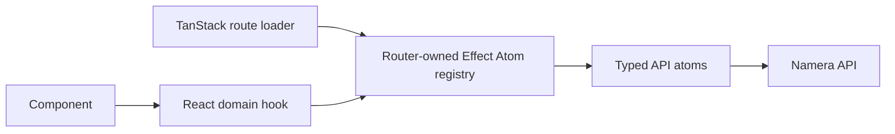

# Dashboard architecture

The dashboard is a Vite/React application using TanStack Router, Effect Atom,
React Hook Form, Tailwind CSS, Motion, Wagmi, and `@namera-ai/ui`.

## Data flow

Protected loaders prefetch the data a route needs and return it as initial route
data. Rendered hooks observe the same atom cache, so mutations update the screen
without a second state system. Query keys include active organization where
scope changes with tenant selection.

## Routing and authentication

All product routes live below the pathless `_authenticated` layout. Its loader
prefetches the current actor and redirects a missing actor to `/auth`. Auth,
invitation review, OAuth consent, CLI consent, and workspace creation use
sidebar-free layouts where appropriate. `/auth/verify` explicitly exchanges the
credential then replaces location with the server-approved return path.

Account, session-key, and execution detail parents validate branded IDs,
prefetch detail once, map missing resources to the router not-found boundary,
and provide nested navigation.

## State and mutations

- Atoms own typed API calls, query keys, invalidation, and loader-prefetch
  helpers.
- Hooks adapt atoms through shared query/mutation helpers and expose
  `onSuccess`, `onError`, and `onSettled` callbacks.
- Components use `mutate` and the shared feedback registry for expected
  failures. `mutateAsync` is reserved for sequencing such as serialized
  autosave.
- Active-organization changes invalidate tenant-scoped wallet, key,
  authorization, member, billing, and execution data.

## Forms

Forms use one Effect Schema converted with `Schema.toStandardSchemaV1`, the
standard-schema React Hook Form resolver, a native `form`, `Controller`, and
UIKit `Field` primitives. UIKit selection controls adapt value/change props
explicitly. Permission-aware route data decides whether a form is interactive;
read-only forms do not autosave or block navigation.

## Shared UI ownership

- `src/routes/**/-components`: one route or route-group composition.
- `src/components`: UI shared by unrelated routes.
- `src/components/common/table`: compact filter/order/group/display controls and
  pure facet helpers.
- `src/components/display`: semantic wallet, address, chain, actor, status,
  metadata, date, and copy displays.
- `src/components/policy/evm`: policy catalog, cards, summaries, and editors.
- `@namera-ai/ui`: cross-application primitives, icons, hooks, and theme.

Shared copy controls transition to a check state with reduced-motion support.
Tooltip exits hide as soon as an anchor is released, avoiding detached overlays
at the viewport origin. Interactive controls retain accessible names and
keyboard/focus behavior.

## Tables

Reusable fixed-column data grids separate declarative columns/cells/sorters from
query and view state. Accounts, session keys, API keys, invitations, members,
and executions share compact controls where the domain needs them. Active rows
are the default for revocable resources; lifecycle history remains available in
status filters. Columns stretch to full width with minimum sizes and are not
resizable. Pinned action columns contain navigation and copy/revoke actions.

Execution and session-key tables are reusable across organization, account, and
session-key scoped routes. Scoped usage pages prefetch server-filtered history
and remove redundant filter/grouping facets. List endpoints intentionally
return compact row contracts; detail pages load expanded relations.

## Implemented product routes

- organization overview with a compact resource summary, namespace usage,
  rolling operation activity, derived attention states, and recent executions;
- magic-link sign-in and invitation recipient review;
- accounts list/create and account Overview/Session Keys/Usage views;
- session-key list/create/revoke and Overview/Policies/Usage views;
- activity list and expanded execution detail;
- profile, notification preferences, sessions/security, workspace, members and
  invitations, API keys, MCP authorizations, CLI authorizations, and billing
  usage;
- MCP and CLI authorization consent with account-grouped active session-key
  selection.

## Browser telemetry

The shared atom runtime installs the dashboard OTLP Layer. The browser exports
only through server `/t/*` endpoints with a dashboard service identity; provider
credentials never enter the bundle.

## Organization overview

The authenticated index route prefetches `GET /dashboard/overview` into the
router-owned atom registry, while its component subscribes to the same atom so
the page shell remains visible during refreshes. The response keeps global
resource totals at the root and places operation usage and activity inside a
namespace-discriminated array. The current `eip155` projection can therefore be
extended with a Solana member without changing the page-level contract.

The server derives attention items and their destinations. The dashboard only
chooses their visual severity and does not duplicate billing thresholds. In
development, `/?preview=true` swaps the fetched projection for schema-decoded
fixture data so empty local organizations can be used for visual QA. The query
parameter has no effect in production builds.

## Pending

- Build notification inbox, audit history, and remaining asset/identity/template
  product surfaces as their backend contracts stabilize.
- Add browser interaction and accessibility regression tests.
- Measure route/chunk splitting before optimizing large bundles.
