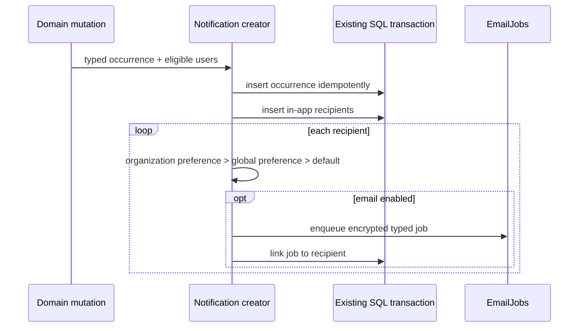

# Notifications

Notifications separate an immutable business occurrence from per-user inbox
state and optional email delivery. In-app delivery is mandatory for selected
recipients; email respects sparse user preferences.

## Persistence

Complete notification, recipient, preference, and email-job table definitions
are in the
[notification and jobs database catalog](../database/notifications-jobs.md).
Missing preference overrides fall back to the code-owned notification policy;
email preferences never remove in-app recipient state.

## Creation

The occurrence, recipient state, email outbox, and domain mutation share one
transaction. Duplicate business attempts converge on the occurrence
idempotency key. In-app recipients are not disabled by email preferences.

## Implemented occurrences

Current typed payloads include new sign-in, organization invitation, wallet
created, session key created/revoked, API key created/revoked, execution
confirmed, and corresponding resource context. Recipient selection is
permission-aware for organization resources.

Invitation terminal transitions expire the actionable occurrence and cancel a
still-pending email. New-sign-in is user scoped. Preferences are grouped by
product, account, organization, and billing categories with closed topic unions.

## Inbox and preference API

Authenticated notification routes provide stable cursor pagination, unread
count, mark-read/archive mutations, preference reads, and scoped overrides.
Preference mutations append user audit events and skip duplicate side effects
for no-op values.

The dashboard inbox consumes the same paginated notification DTOs. It keeps a
compact notification rail beside a typed detail view, marks a notification read
when it is selected, and supports mark-all-read and archive mutations. Search,
read state, and notification-category filters are applied to the loaded cursor
pages without changing persisted recipient state. Each notification payload is
rendered by its own detail component so links, identifiers, and domain displays
remain type-safe as new occurrence types are added. On narrow screens, the rail
and detail become a list-to-detail navigation flow.

## Pending

- Add email-delivery webhook, bounce, and suppression handling when required by
  operational volume.
- Verify preference resolution and delivery in production.
