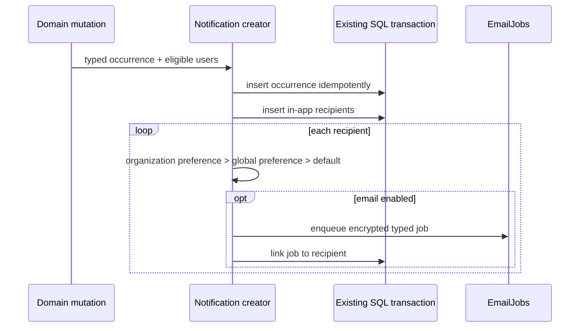

# Notifications

Notifications separate an immutable business occurrence from per-user inbox
state and optional email delivery. In-app delivery is mandatory for selected
recipients; email respects sparse user preferences.

## Tables

### `notification.notifications`

Stores typed occurrence, optional organization/actor context, resource identity,
business idempotency key, correlation ID, optional expiry, and creation time.
The idempotency key is unique. A composite actor/organization foreign key and
check prevent an actor without organization scope. Indexes support organization,
type, resource, and expiry queries.

### `notification.notification_recipients`

Composite primary key `(notification_id, user_id)` represents one inbox item.
It stores optional linked email job, read/archive timestamps, and received time.
Email job is unique so one durable delivery cannot belong to two recipient
rows. User newest-first and partial unread indexes serve the inbox.

### `notification.notification_preferences`

Sparse email overrides keyed by user, category, topic, channel, and optional
organization. Separate partial unique indexes handle global null scope and
organization scope correctly. Missing override falls back to the code-owned
notification policy default.

## Creation

The occurrence, recipient state, email outbox, and domain mutation share one
transaction. Duplicate business attempts converge on the occurrence
idempotency key. In-app recipients are not disabled by email preferences.

## Implemented occurrences

Current typed payloads include new sign-in, organization invitation, wallet
created, session key created/revoked, API key created/revoked, execution
confirmed, and corresponding resource context. Recipient selection is
permission-aware for organization resources.

Invitation terminal transitions expire the actionable occurrence and cancel a
still-pending email. New-sign-in is user scoped. Preferences are grouped by
product, account, organization, and billing categories with closed topic unions.

## Inbox and preference API

Authenticated notification routes provide stable cursor pagination, unread
count, mark-read/archive mutations, preference reads, and scoped overrides.
Preference mutations append user audit events and skip duplicate side effects
for no-op values.

## Pending

- Build the dashboard inbox UI.
- Add email-delivery webhook, bounce, and suppression handling when required by
  operational volume.
- Verify preference resolution and delivery in production.
