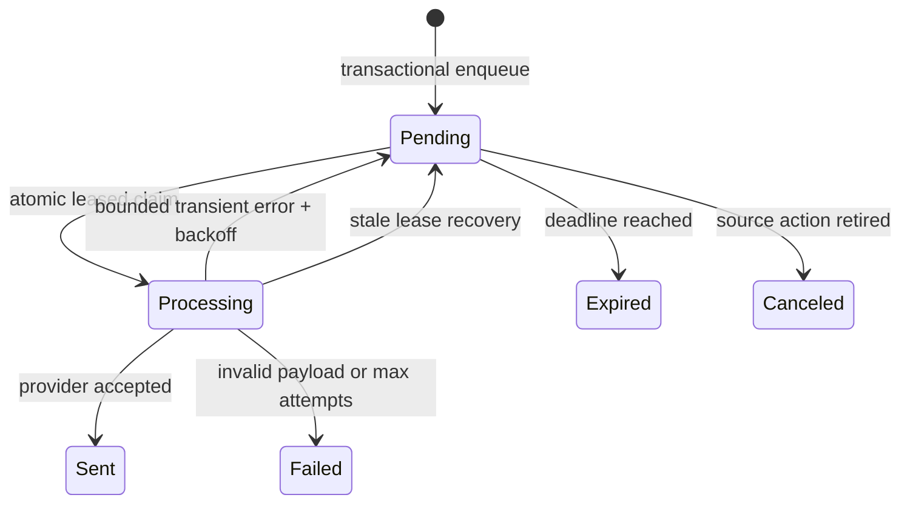

# Durable email delivery

`@namera-ai/emails` owns a typed encrypted outbox, React Email templates, the
Resend provider adapter, and delivery processing. Domain workflows enqueue jobs
inside their existing transaction and never wait for the provider.

## Table: `jobs.email_jobs`

| Field                                              | Purpose                                                           |
| -------------------------------------------------- | ----------------------------------------------------------------- |
| `id`, `type`, `idempotency_key`                    | Typed job identity and unique business delivery.                  |
| `encrypted_payload`                                | Versioned authenticated ciphertext, cleared at terminal outcomes. |
| `status`, `attempts`, `available_at`, `expires_at` | Queue lifecycle and scheduling.                                   |
| `lease_token`, `lease_expires_at`                  | Atomic worker ownership and stale-lease recovery.                 |
| `provider_message_id`, `sent_at`                   | Successful provider projection.                                   |
| `last_error_code`                                  | Bounded terminal/retry classification.                            |
| timestamps                                         | Creation/update.                                                  |

Indexes serve due status, lease recovery, and expiry. Attempts are constrained
non-negative and idempotency key is unique.

## Payload security

The protocol owns a closed `EmailJobPayload` discriminated union. Enqueue
schema-encodes and AES-GCM encrypts the payload with version/key-ID metadata.
The worker decrypts and decodes again before rendering. Emails, magic-link
credentials, and template variables are never stored in plaintext job columns
or logs.

## Worker lifecycle

The worker retries up to five times with capped exponential backoff. Conditional
updates require the current lease token so stale workers cannot overwrite a
newer claim. Ciphertext is cleared after sent/failed/expired/canceled terminal
states.

## Templates and provider

Runtime React Email components live in `packages/emails/src/templates` and are
rendered directly by the Resend adapter. `apps/email-templates` is only a preview
harness and PNG asset generator. Templates use protocol-owned props, shared
Namera layout/theme primitives, responsive spacing, light/dark support, and CDN
PNG assets rather than embedded SVG.

Resend receives configured sender/reply-to, a bounded timeout, and the business
idempotency key. Development uses an explicit logger provider selected only when
`NODE_ENV=development`.

## Pending

- Configure and verify the production sender domain, reply-to, and spam
  placement.
- Add provider webhooks, bounce/suppression state, and operator alerts.
- Define encryption-key rotation before multiple active key IDs are introduced.
